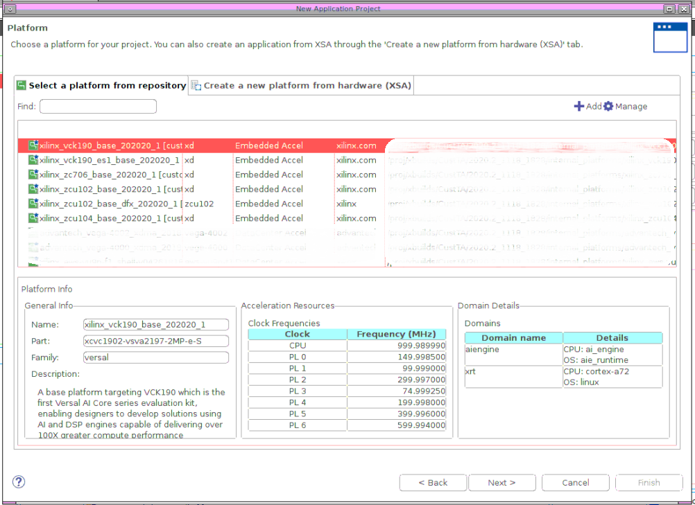
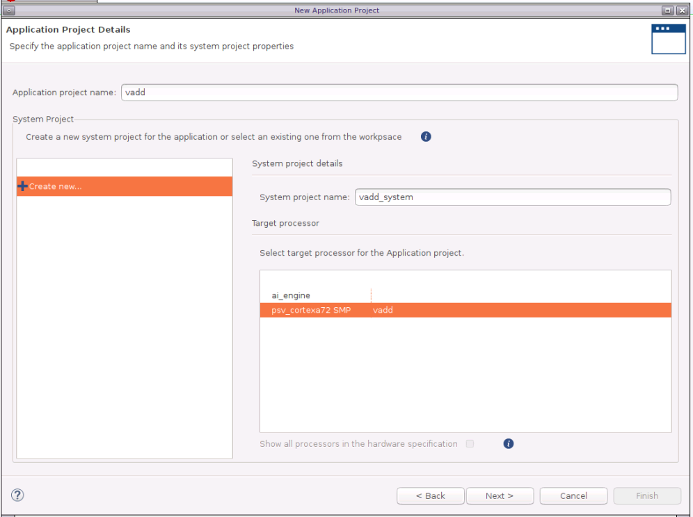
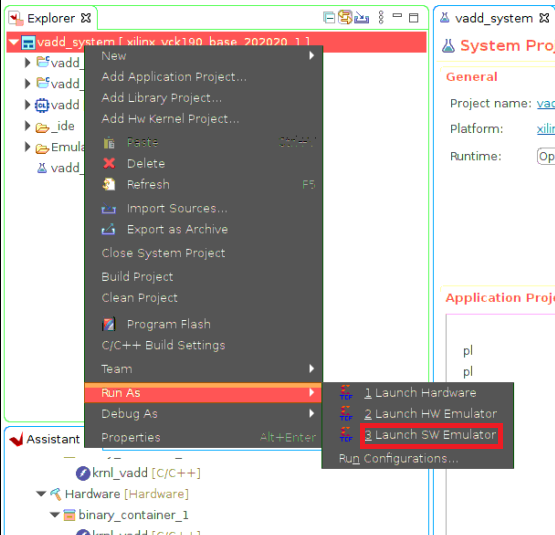
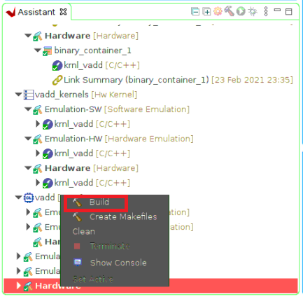

<table class="sphinxhide">
 <tr>
   <td align="center"><h1>2020.2 Vitis™ Getting Started Tutorial</h1>
   <a href="https://github.com/Xilinx/Vitis-Tutorials/tree/2020.1">See 2020.1 Tutorials</a>
   </td>
 </tr>
 <tr>
 <td>
 </td>
 </tr>
</table>

# Vitis Flow 101 – Part 4 : Build and Run the Example

 In this fourth part of the Introduction to Vitis tutorial, you will compile and run the vector-add example using each of three build targets supported in the Vitis flow (software emulation, hardware emulation and hardware).

* Software Emulation - The kernel code is compiled to run on the host processor. This allows iterative algorithm refinement through fast build-and-run loops. This target is useful for identifying syntax errors, performing source-level debugging of the kernel code running together with application, and verifying the behavior of the system.

* Hardware Emulation - The kernel code is compiled into a hardware model (RTL), which is run in a dedicated simulator. This build-and-run loop takes longer but provides a detailed, cycle-accurate view of kernel activity. This target is useful for testing the functionality of the logic that will go in the FPGA and getting initial performance estimates.

* Hardware - The kernel code is compiled into a hardware model (RTL) and then implemented on the FPGA, resulting in a binary that will run on the actual FPGA.


##### IMPORTANT: This tutorial requires Vitis 2020.2 or later to run.

### Setting up the environment

* To configure the environment to run Vitis, source the following scripts:


```bash
source <VITIS_install_path>/settings64.sh
source <XRT_install_path>/setup.sh
unset LD_LIBRARY_PATH
source $XILINX_VITIS/data/emulation/qemu/unified_qemu_v5_0/environment-setup-aarch64-xilinx-linux
```

* Then make sure the following environment variables are correctly set to point to the your VCK190 platform, rootfs and sysroot directories respectively.

```bash
export PLATFORM_REPO_PATHS=<path to the VCK190 platform install dir>
export ROOTFS=<path to the Versal common image directory, containing rootfs>
export SYSROOT=$ROOTFS/sysroots/aarch64-xilinx-linux
```
*NOTE: The Versal common image file can be downloaded from the [Vitis Embedded Platforms](https://www.xilinx.com/support/download/index.html/content/xilinx/en/downloadNav/embedded-platforms.html) page, and contains the Sysroot, Rootfs, and boot Image for Xilinx Versal boards.*


### Create Vector Addtion Application Project


* Launch Vitis GUI

```bash
vitis &
```
It will pop up a window asking for workspace selection. Choose an appropriate folder for this tutorial and click **Launch**.

* Create vector addition application project

1. In the Welcome window, click **Create Application Project** to create a new application project. You may also do it by clicking the **File** menu and select **New** -> **Application project**.

2. The first page of the wizard is a brief introduction, click **Next** and go to the next page.


3. In the platform selection page, the VCK190 platform should appear in the list if the environment was set up correctly just now. If it is not shown, click the ```+Add``` button on the upper right window to add it into the project workspace. After selecting the VCK190 platform, click **Next**.



4. In the application project page, set application name as ```vadd``` and target processor as **psv_cortexa72_SMP**. By default, it will create a new system project tied to the application project. Keep the default name and click **Next**.



5. Input Sysroot path, RootFS path and Kernel Image. Those paths are pointing to the folder and files of common linux package that you downloaded in previous steps.
For the usage of these files, you will find more detailed in the Vitis Doc: https://www.xilinx.com/html_docs/xilinx2020_2/vitis_doc/vitis_embedded_installation.html?hl=sdk.sh#rvu1542160683426

 - Sysroot path (xilinx-versal-common-v2020.2/sysroots/aarch64-xilinx-linux)
 - Root FS (xilinx-versal-common-v2020.2/rootfs.ext4)
 - Kernel Image (xilinx-versal-common-v2020.2/Image)

Click **Next**.


6. In the templates page, select **Vector Addition** template. Click **Finish** to complete the application project creation stage.


### Targeting Software Emulation

1. Now we are going to run the project in software emulation flow. Firstly, double click the 'vadd_system.sprj' file from the Explorer window to open up the system project settings page and make sure that **Software Emulation** is selected as active build.


2. Right click the **Emulation-SW** run in Assistant window and click **Build**. This will build all the necessary underlying projects.


3. After building process completes, right click the vadd system project and select **Run As** -> **Launch SW Emulator** from the pop up window.



4. If Emulator was not started before, there will be a window notifying about launching emulator. Select **Start Emulator and Run**.


5. Pay attention to the Emulation Console window in the right bottom which will display the ARM processor booting messages. After ARM system is up and running, host application will start automatically and you should see ```Test Passed``` message printed out in the main console window if everything goes well.


### Targeting Hardware Emulation

1. Now we are going to run the project in hardware emulation flow. Firstly, open up the system project page and make sure that **Hardware Emulation** is selected as target.


2. Right click the **Emulation-HW** run in Assistant window and click **Build**.


3. After building process completes, right click the vadd system project and select **Run As** -> **Launch HW Emulator** from the pop up menu.


4. If Emulator was not started before, there will be a window notifying about launching emulator. Click **Start Emulator and Run**. Note that you can also check the **Launch Emulator in GUI mode to display waveforms** and this will open up Vivado simulator to view the signals waveform.  


5. Pay attention to the Emulation Console window in the bottom right which will display the ARM processor booting messages. After ARM system is up, host application will start automatically and you should see ```Test Passed``` message printed out in the main console window.

### Targeting Hardware

There are two methods to run the application on VCK190 board.

#### Method 1 - Run from Vitis GUI

This is a relatively direct and easy way and it is suitable for the scenario that your board is directly connected to the server that the design is build and run. The way is quite similar to launching emulation runs.

1. Firstly, open up the system project page and make sure that **Hardware** is selected as target.


2. Right click the **Hardware** run in Assistant window and click **Build**.



3. Before running the design on hardware, make sure your board is connected and powered on. Then right click the vadd system project and select **Run As** -> **Launch Hardware** from the pop up menu. You should be able to see the **Test Passed** message after application finishes running.


#### Method 2 - Run from SD card

1. Copy **vadd_system/Hardware/package/sd_card** folder to a physical SD card.

2. Insert the SD card into the VCK190 platform and boot the card with SD boot mode (SW6[4:1]=0001).

3. Connect the board with your UART software.

4. Launch the test application by entering following commands.

```bash
cd /mnt/sd-mmcblk1p1
./vadd binary_container_1.xclbin
```

5. And you should be able to see the **Test Passed** information in UART console.

## Next Step

Now that you ran your first example, proceed to [**Part 5**](./Part5.md) of this tutorial to learn how to visualize and profile your application with Vitis Analyzer.

<p align="center"><sup>Copyright&copy; 2020 Xilinx</sup></p>
