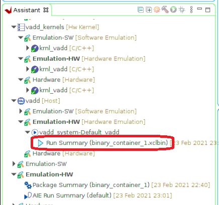
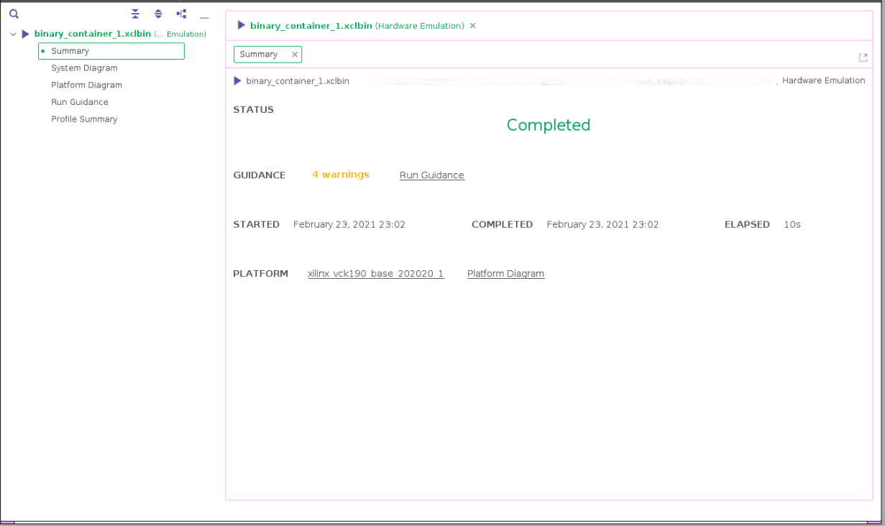
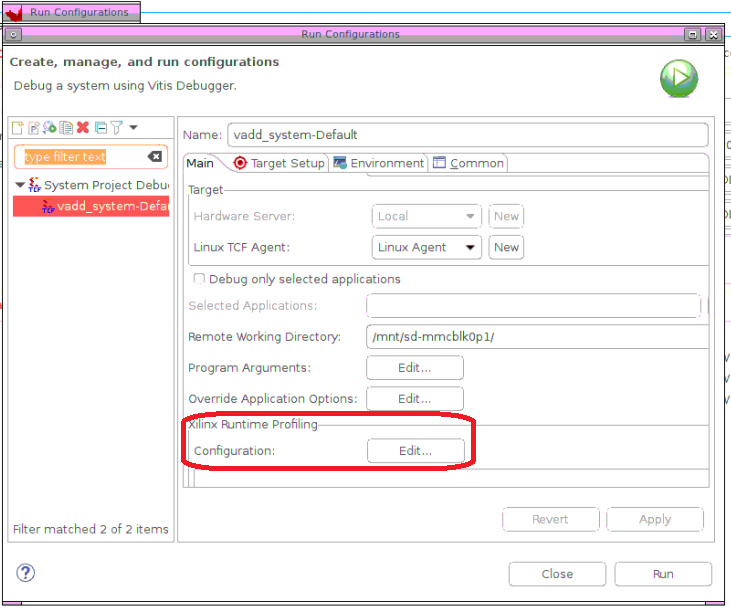
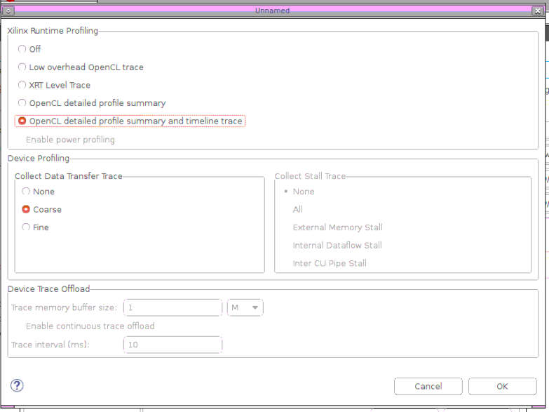
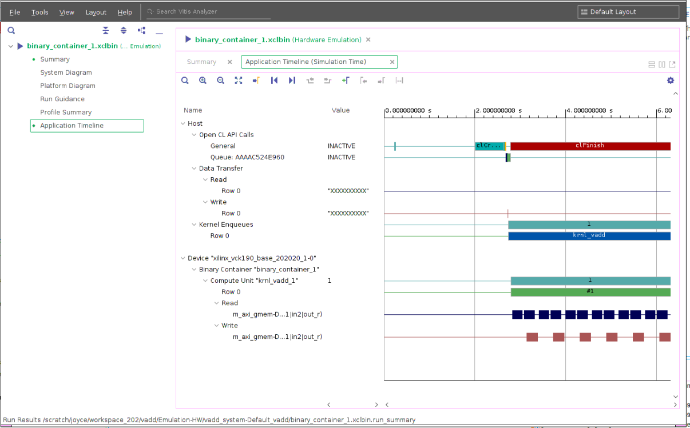

<table class="sphinxhide">
 <tr>
   <td align="center"><h1>2020.2 Vitis™ Getting Started Tutorial</h1>
   <a href="https://github.com/Xilinx/Vitis-Tutorials/tree/2020.1">See 2020.1 Tutorials</a>
   </td>
 </tr>
 <tr>
 <td>
 </td>
 </tr>
</table>

# Vitis Flow 101 – Part 5 : Visualizing Results and Analyzing Reports

Now that you successfully built and ran the vector-add example, let's look at the results and reports generated along the way.

## Opening the Run Summary with Vitis Analyzer

When working with Vitis GUI, the tool will automatically configure to generate the basic reports allowing user to view and analyze. For three runs(sw emulation, hw emulation and hardware), they all have a couple of reports created. Now let's take the hardware emulation report as an example but you are also free to open up other reports to get familiar with them.

1. Double click the **Run Summary** under vadd host project in Assistant Window to open up the host application run summary report.

* This opens the Vitis Analyzer tool and loads the various reports and displays the run summary. You can navigate to the various reports using the left pane of the Vitis Analyzer or by clicking on the links provided in the run summary.

* Open the System Diagram.
  * The System Diagram is a graphical view of the contents of the Xilinx device. It shows the various hardware accelerators, how they are connected to platform resources such a global memory banks.
  * Notice the profiling information displayed next to the vadd hardware accelerator.
  * Click on the "Settings" icon located in the top right corner of the diagram and check the "Show Profile Info" box. Notice that the diagram now displays the mapping of kernel arguments to kernel ports and shows bandwidth information for each port.
  * Click on each of the three tabs (Compute Units, Kernels and Memories) located at the bottom of the diagram and look at the information displayed in each of them.
* Open the Run Guidance report
  * The Guidance report flags suboptimalities in your application and provides actionable feedback on how to improve it.
  * This simple example is not fully optimized and Guidance reports several warnings. Inspect each of these warnings to learn more about optimization opportunities and design best practices.
  * What can you learn about the width of the kernel ports?
* Open the Profile Summary report
  * The Profile Summary provides annotated details regarding the overall application performance. All data generated during the execution of the application is grouped into categories.
  * Use the left pane of the report to navigate through the various categories and explore all the metrics reported in the Profile Summary.

2. Close the Vitis Analyzer tool. Now we are going to modify the run configuration to enable application timeline report generation. Right click the vadd system project and select **Run As** -> **Run Configurations**. This will bring up the run configuration menu.

Click **Edit** button under the **Xilinx Runtime Profiling** category and select **OpenCL detailed profile summary and timeline trace** option. Click **OK** and then click **Run*** to launch it. After emulation process completed, double click the run summary report to open it once again. In the new report, you should see the Application Timeline report tab is shown in the navigation panel.

* Open the Application Timeline
  * The Application Timeline collects displays host and kernel events on a common timeline to help visualize the overall health and performance of your system. The graphical representation is very useful to see issues regarding kernel synchronization and efficient concurrent execution.
  * Zoom in and scroll to the far right of the timeline trace to visualize the point where the host program transfers the buffers and executes of the kernel.
  * Mouse over the various activity events to get more details about each of them.
  * Can you relate the timeline activity to the sequence of API calls in the `host.cpp` file?

## Homework

Now that you have learned the basics of the Vitis flow, you can try some experiments on your own. A good place to start is to try making changes to the host program. If you only change the `host.cpp` file, then you do not need to rebuild the FPGA binary,  which makes for very quick build-and-run iterations.

* In the host program, the size of the vectors is hardcoded to 4096 elements (through the DATA_SIZE macro).
  * What happens if you increase this size to a much larger value?
  * What do you see in Vitis Analyzer?
* The host program only calls the accelerator once.
  * What happens if you put a loop around Step 4 in `host.cpp` to iterate a few more times?
  * How does the Application Timeline trace now look like?
  * Now can you make it so that the programs sends different vectors to the accelerator each time it calls it?

## Wrap-Up and Next Steps

Congratulations for completing the **Vitis Flow 101** tutorial. You should now have an understanding of all the essential concepts of the Vitis programming and execution model, including coding considerations and how to build, run and visualize reports.

The vector-add example is as simple as it gets, yet it offers a lot to learn and it is a very good sandbox to dig deeper into key aspects of the flow. The [Get Moving with Alveo tutorial](https://developer.xilinx.com/en/articles/acceleration-basics.html) leverages the same vector-add example and takes it several steps further by illustrating common optimization techniques. Be sure to check it out.

Return to the [Vitis Tutorials](https://github.com/Xilinx/Vitis-Tutorials) home page.

Copyright&copy; 2020 Xilinx

