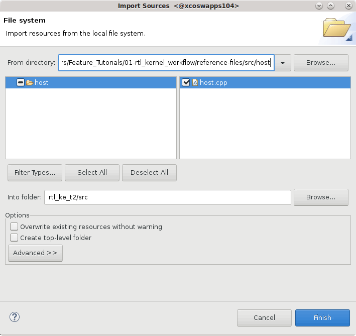
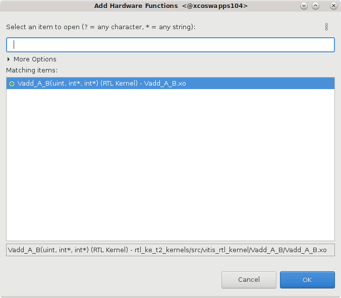

<table class="sphinxhide">
 <tr>
   <td align="center"><h1>2020.2 Vitis™ Application Acceleration Development Flow Tutorials</h1>
   <a href="https://github.com/Xilinx/Vitis-Tutorials/tree/2020.1">See 2020.1 Vitis Application Acceleration Development Flow Tutorials</a>
   </td>
 </tr>
 <tr>
 <td>
 </td>
 </tr>
</table>

# Using the RTL Kernel in a Vitis IDE Project

>**TIP**: You can also use the RTL kernel you created in the Package IP lab in the Vitis IDE.

## Delete and Import Host Code

After exiting the Vivado tool, the following files are added to the HW kernel project (`rtl_ke_t2_kernels`) displayed in the Project Explorer in the Vitis IDE:

- `Vadd_A_B.xo`: Compiled kernel object file.
- `host_example.cpp`: Example host application file.  

1. In the Project Explorer view, expand the `rtl_ke_t2_kernels/src` folder as shown in the following figure.  


   > **NOTE**: `Vadd_A_B.xo` is displayed with a lightning bolt icon. In the Vitis IDE, this indicates a hardware function. The IDE recognizes the RTL kernel and marks it as an accelerated function.

2. Select and delete `host_example.cpp`.

   At this point, import the host application provided for this tutorial.  

2. In the Project Explorer view, right-click the Processor project (`rtl_ke_t2`) and click **Import Sources** to add the host code.

3. In the From directory field, click **Browse...**, navigate to `01-rtl_kernel_workflow/reference-files/src`, select the `host` folder, and click **Open**.

4. Select `host.cpp` to add the host application code to your project.



5. Check that the `Into folder` field displays `rtl_ke_t2/src`, and click **Finish**.

   The `host.cpp` file is added to the host project.

6. In the Project Explorer view, right-click and select `Open` (or double-click `host.cpp`), which opens it in the Code Editor window.

## Host Code Structure

Examine the host application in the Code Editor window. The structure of the host code is divided into three sections:

1. Setting up the OpenCL runtime environment
2. Execution of kernels
3. Post-processing and release of FPGA device

Here are some of the important OpenCL API calls allowing the host application to interact with the FPGA:

- A handle to the kernel is created (line 239).

   ```C
    clCreateKernel(program, "Vadd_A_B", &err);
    ```

- Buffers are created to transfer data back and forth between the host and the FPGA (line 256).

  ```C
  clCreateBuffer(context, CL_MEM_READ_WRITE,sizeof(int) * number_of_words, NULL, NULL);
  ```

- Values (A and B) are written into the buffers, and the buffers transferred to the FPGA (lines 266 and 274).

  ```C
  clEnqueueWriteBuffer(commands, dev_mem_ptr, CL_TRUE, 0,sizeof(int) * number_of_words, host_mem_ptr, 0, NULL, NULL);
  ```

- After A and B have been transferred to the device, the kernel can be executed (line 299).

  ```C
  clEnqueueTask(command_queue, kernel, 0, NULL, NULL);
  ```

- After the kernel completes, the host application reads back the buffer with the new value of B (line 312).

  ```C
  clEnqueueReadBuffer(command_queue, dev_mem_ptr, CL_TRUE, 0, sizeof(int)*number_of_words,host_mem_output_ptr, 0, NULL, &readevent );
  ```

The structure and requirements of the host application are discussed in greater detail in [Developing Applications](https://www.xilinx.com/cgi-bin/docs/rdoc?v=2020.2;t=vitis+doc;d=lhv1569273988420.html) in the Application Acceleration Development flow of the Vitis Unified Software Platform Documentation (UG1416).

## Add the Hardware Function

With the host application code (`host.cpp`) added to the host project, and the RTL kernel code (`Vadd_A_B.xo`) added to the kernel project, you need to specify the hardware function in order to generate the device binary or `.xclbin` file.

1. Right-click the HW Kernel project, `rtl_ke_t2_kernels/rtl_ke_t2_kernels.prj`, and use the **Open** command to open the project.

2. In the Project Editor, in the **Hardware Functions** window, click  to add hardware functions into the project.
3. Select the `Vadd_A_B` function.

   

4. Click **OK**.

## Build the Project

With the host application code (`host.cpp`) and the RTL kernel code (`Vadd_A_B.xo`) added to the project, you are ready to build and run the project.

>**TIP**: You can also use the RTL kernel you created in the Package IP/Package XO lab in the Vitis IDE. Import the kernel `.xo` file into the `rtl_ke_t2_kernels/src` folder, and specify it as the hardware function.

1. In the Hardware Kernel Project Settings, change **Active build configuration** to **Emulation-HW**.  
The Hardware Emulation target is useful for:
   - Verifying the functionality of the logic that will go into the FPGA.
   - Retrieving the initial performance estimates of the accelerator and host application.

    >**TIP**: For Software Emulation, the RTL kernel flow requires a C/C++ software model of the kernel. In this tutorial, you have not been provided such a model, so you will not be able to run the Software Emulation build.

1. In the Assistant view, select the top-level system project 'rtl_ke_t2_system` and click the Build command  to build the active Emulation-HW build configuration.

   The different elements of the Vitis application project are built: the processor code (`host.cpp`), the HW link project to link the RTL kernel (.xo) to the target platform, and the top-level system project to package the design.

    >**TIP**: Because the RTL kernel is imported as an `.xo` file, the kernel does not need to be compiled.  

2. In the Assistant view, select the **Run** button, and select **Run Configurations**.


3. Select the `System Project Debug` configuration and click the **New launch configuration** command  to create a new configuration for the run.

   The `SystemDebugger_rtl_ke_t2_system` configuration is created.

4. Select **Edit** next to `Program Arguments`.

The Vitis IDE can automatically search and include the `xclbin` file when the **Automatically update arguments** is enabled. However, in this case you will disable this checkbox because you need to add two arguments.

Disable the checkbox, and enter **.../binary_container_1.xclbin xilinx_vck190_base_202020_1** in the `Program Arguments` field of the `Edit Program Arguments` dialog box as shown in the image below.

   

5. Click **OK** to add the arguments.

6. In the `Run Configurations` dialog box click **Apply** and then click **Run** to run the configuration, and then verify the results.

The Console window in the Vitis IDE displays **INFO: Test Completed**. You have built and run the application using your RTL kernel.

### (Optional) Build and Run the Hardware on the Target Platform

1. In the Vitis Application Project Settings, change **Active build configuration** to **Hardware**.  
In the system configuration, the kernel code is implemented onto the FPGA, resulting in a binary that will run on the selected platform card.  

2. If you have an available hardware platform, build and run the hardware build, and then verify the results.

# Summary

In this tutorial you have used the **Package IP/Package_XO** flow to create an RTL kernel, and you have also used the **RTL Kernel wizard**. You packaged the RTL IP project into the compiled XO file needed by the Vitis tool. You then added the RTL kernel to an application project, coupled with the host code, and built and run the Hardware Emulation configuration.  In the Vitis IDE, a binary container was created using the XO file, and a `xclbin` file was compiled.

</br>
<hr/>
<p align="center" class="sphinxhide"><b><a href="/README.md">Return to Getting Started Pathway</a> — <a href="./README.md">Return to Start of Tutorial</a></b></p>

<p align="center" class="sphinxhide"><sup>Copyright&copy; 2020 Xilinx</sup></p>
