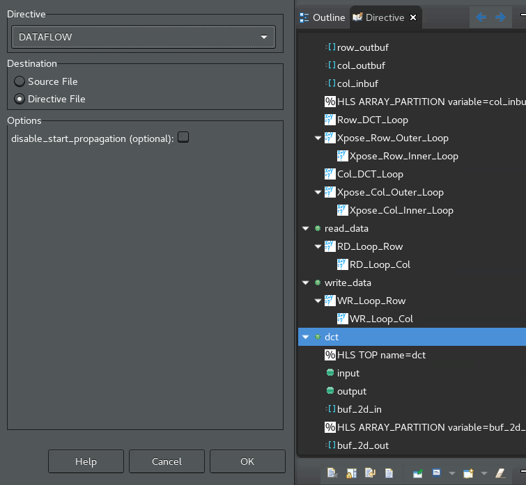
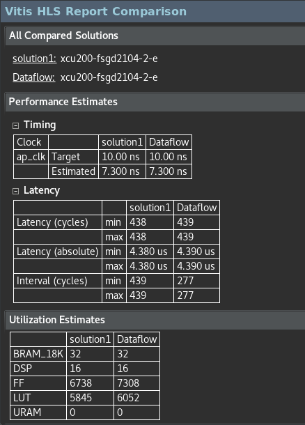
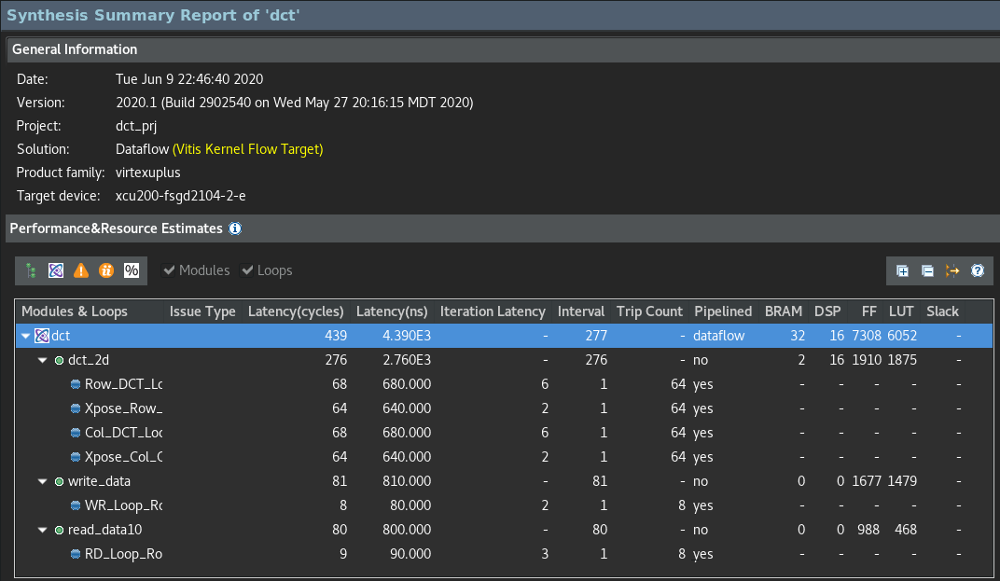
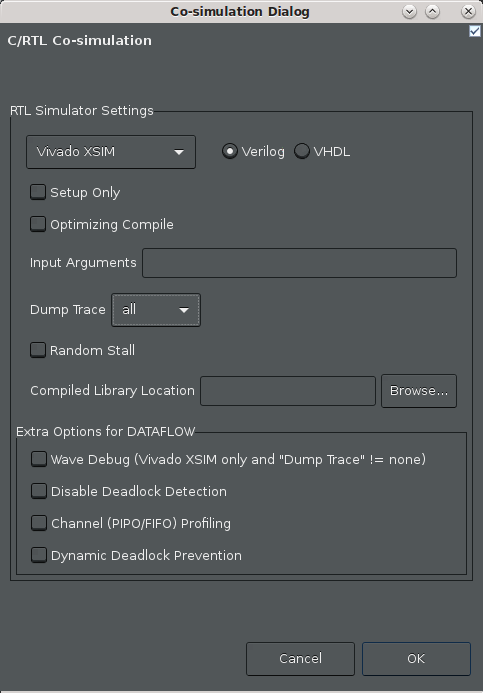
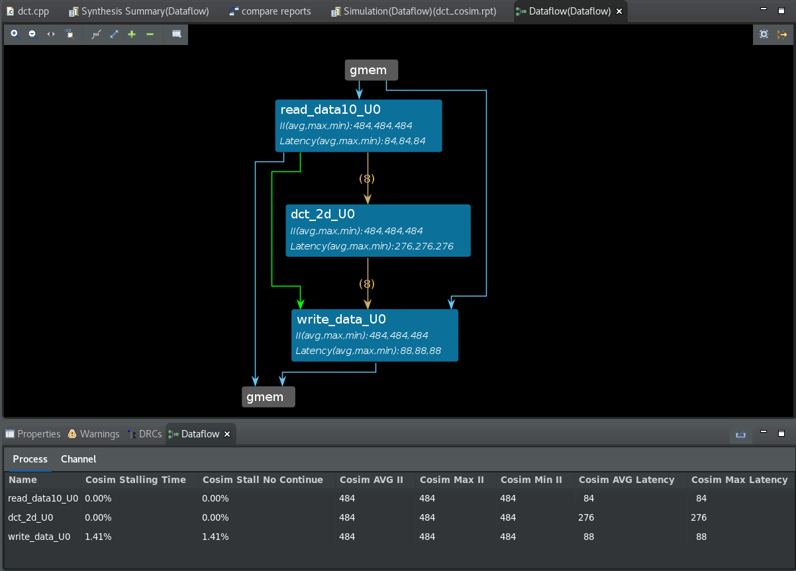

<table class="sphinxhide">
 <tr>
   <td align="center"><h1>2020.2 Vitis™ アプリケーション アクセラレーション チュートリアル</h1><a href="https://github.com/Xilinx/Vitis-Tutorials/tree/2020.1">2020.1 チュートリアルを参照</a></td>
 </tr>
</table>
<!--
# Copyright 2021 Xilinx Inc.
#
# Licensed under the Apache License, Version 2.0 (the "License");
# you may not use this file except in compliance with the License.
# You may obtain a copy of the License at
#
#     http://www.apache.org/licenses/LICENSE-2.0
#
# Unless required by applicable law or agreed to in writing, software
# distributed under the License is distributed on an "AS IS" BASIS,
# WITHOUT WARRANTIES OR CONDITIONS OF ANY KIND, either express or implied.
# See the License for the specific language governing permissions and
# limitations under the License.
-->

### 4\.DATAFLOW 最適化の確認

前の手順では、DCT アルゴリズムを最適化して、パイプライン処理済みループを使用して II=1 を達成するさまざまな方法について説明しました。この手順では、DATAFLOW 指示子を使用して関数またはループのタスク レベルの並列処理をイネーブルにします。詳細は、『Vitis 統合ソフトウェア プラットフォームの資料』 (UG1416) の Vitis HLS フローの [set\_directive\_dataflow](https://japan.xilinx.com/html_docs/xilinx2020_2/vitis_doc/rdd1585343102486.html) を参照してください。

DATAFLOW 最適化では、ループ レベルの並列処理に加え、コード内のさまざまな関数間にタスク レベルの並列処理が可能な限り作成されます。

#### 新規ソリューションの作成

Vitis 統合ソフトウェア プラットフォームの資料 (UG1416) の Vitis HLS フローの[追加のソリューションの作成](https://japan.xilinx.com/html_docs/xilinx2020_2/vitis_doc/optimizinghlsproject.html#wmt1584281647955)に示すように、複数のソリューションを作成することで、さまざまなデザイン最適化方法を試すことができます。この演習では、新しいソリューションを作成して DATAFLOW 最適化を使用してみます。

1. \[Explorer] ビューで最上位プロジェクト (`dct_prj`) を選択します。

2. 右クリックし、**\[New Solution]** をクリックします。

   \[Solution Wizard] ダイアログ ボックスが開きます。

3. 次のように選択します。

   1. \[Solution Name] フィールドに `DATAFLOW` と入力します。

   2. \[Options] で、\[Copy directives and constraints from solution] チェック ボックスをオンにして、`solution1` を選択します。

   3. その他の設定は、デフォルトのままにします。

      

   4. **\[Finish]** をクリックして新しいソリューションを作成します。

   > **ヒント:** 新規ソリューションを作成すると、それがアクティブ ソリューションとして設定され、シミュレーション、合成、その他のコマンドすべてがそのソリューションを使用して実行されます。アクティブ ソリューションは、\[Explorer] ビューでソリューションを右クリックし、**\[Set Active Solution]** をクリックすると変更できます。

#### DATAFLOW 最適化の追加

1. `dct.cpp` タブをクリックしてコード エディターをアクティブにします。

2. \[Directive] ビューで最上位の `dct` 関数を選択して右クリックし、**\[Insert Directive]** をクリックします。

   \[Vitis HLS Directive Editor] が開きます。  

3. 次のように選択します。

   1. \[Directive] フィールドで **\[DATAFLOW]** を選択します。
   2. \[Destination] フィールドで **\[Directive File]** を選択します。
   3. **\[OK]** をクリックして閉じて、指示子を適用します。

4. **\[Solution]** → **\[Run CSynthesis]** → **\[All Solutions]** をクリックして合成を再実行します。すべてのソリューションに対して合成が実行され、結果を比較できます。

   ![[All Solutions]](./images/synthesis-all_solutions.png)

   合成が終了すると、アクティブ ソリューション (この場合は DATAFLOW ソリューション) の合成サマリ レポートが表示されます。次の図に示す \[Vitis HLS Report Comparison] も表示され、合成されたすべてのソリューションの合成結果が表示されます。

   

   この比較結果から、DATAFLOW ソリューションの開始間隔 (II) が最初のソリューションの約 65% になったことがわかります。これは、DATAFLOW 最適化によるタスク レベルの並列処理の主な利点です。また、デザインの FF および LUT の使用量の見積もりが増加しています。これらはあくまでも見積もりなので、Vivado 合成およびインプリメンテーションのいずれかまたは両方を実行して、より正確なリソース使用量を取得する必要があります。

   次の図に、DATAFLOW ソリューションの合成サマリ レポートを示します。

   

#### データフロー グラフの表示

Vitis HLS には、\[Analysis] パースペクティブの機能の 1 つとしてデータフロー グラフも提供されています。DATAFLOW 最適化は、必要なパフォーマンス データを提供する C/RTL 協調シミュレーション完了後にのみ理解可能になる動的最適化です。合成後は、協調シミュレーションを実行する必要があります。詳細は、『Vitis 統合ソフトウェア プラットフォームの資料 』(UG1416) の Vitis HLS フローの [Vitis HLS での C/RTL 協調シミュレーション](https://japan.xilinx.com/html_docs/xilinx2020_2/vitis_doc/cosimulationinvitishls.html)を参照してください。

1. メニューから **\[Solution]** → **\[Run C/RTL Co-Simulation]** をクリックします。\[Co-simulation Dialog] ダイアログ ボックスが表示されます。

2. 次のように選択します。

   1. **\[Channel (PIPO/FIFO) Profiling]** をオンにします。
   2. **OK** をクリックします。

   

   協調シミュレーションが終了すると、協調シミュレーション レポートが開き、シミュレーション テストベンチが問題なく実行されたかどうかが表示されます。データフロー解析では、テストベンチが合成済み関数を複数回呼び出して、複数のイテレーションからパフォーマンス データを取得し、FIFO をフラッシュします。パフォーマンスに関しては、1 つの関数呼び出しでレイテンシ、その関数への 2 つ以上の呼び出しで II (開始間隔) が計算されます。

3. シミュレーションが終了したら、画面の右上で **\[Analysis]** を選択し、\[Analysis] パースペクティブに切り替えます。

4. 左上の \[Module Hierarchy] ビューで `dct` 関数を右クリックし、**\[Open Dataflow Viewer]** をクリックします。

   ![[Open Dataflow Viewer]](./images/open_dataflow_viewer.png)

   > **ヒント:** デザインにデータフロー グラフが含まれるかどうかは、\[Module Hierarchy] ビューに  アイコンがあるかどうかでわかります。

   \[Dataflow] ビューには、関数とその関数を介するフローが表示されます。C/RTL 協調シミュレーションを実行すると、グラフのパフォーマンス データが書き込まれ、グラフの下の \[Process] および \[Channel] の表にもデータが挿入されます。協調シミュレーションからのパフォーマンス データがない場合、グラフおよび表には値が存在しないことを示す「NA」と表示されます。詳細は、Vitis 統合ソフトウェア プラットフォームの資料 (UG1416) の Vitis HLS フローの [[Dataflow] ビュー](https://japan.xilinx.com/cgi-bin/docs/rdoc?v=2020.1;t=vitis+doc;d=analyzingresultssynthesis.htmla=twx1584322463297)を参照してください。

   

   データフロー ビューアーでは、次のスループット解析オプションが使用されます。

   * グラフには、DATAFLOW 領域の全体的なトポロジが表示され、どのタイプのチャネル (FIFO/PIPO) が DATAFLOW 領域のタスク間通信のために推論されたかが示されます。各チャネルおよびプロセスを解析すると、デッドロックや FIFO のサイズが適切でないためにスループットが小さいなどの問題を解決するのに役立ちます。
   * 協調シミュレーションのデータがあると、シミュレーション過程で FIFO の最大サイズを確認することにより、FIFO のサイズを決定する際の基準となるので、FIFO サイズの問題を解決できます。また、協調シミュレーションでは、自動デッドロック検出により、デッドロックに関係するプロセスおよびチャネルがハイライトされるので、問題をすばやく見つけて修正できます。
   * 協調シミュレーション後にレポートされるデータには、FIFO のサイズだけでなく、プロセスおよびチャネルごとに、入力を待っていたり出力の書き込みがブロックされたりしているストールする時間も示されます。このグラフがあると、これらの問題を理解し、プロデューサーが高速でコンシューマーが高速 (またはその逆) の状況に対処するためチャネルのサイズをどのように管理すればよいかを判断するのに役立ちます。また、DATAFLOW 領域の真ん中で入力から読み出すことがパフォーマンスにどのように影響するかを理解するのにも有益です。これがパフォーマンスに影響する状況はよくあります。

#### 指示子のプラグマへの変換

デザインを最適化したので、Tcl スクリプトの指示子 (Vitis HLS ツールが実行) をソース コードのプラグマに変換して、その他のユーザーやデザイン チームと共有し、Vitis 統合ソフトウェア プラットフォーム内で使用できるようにします。\[Directive] ビューで指示子を選択し、次のプロセスを使用してプラグマに変更します。

1. `dct.cpp` タブをクリックしてコード エディターをアクティブにするか、必要であればソース コードを開きます。

2. \[Directive] ビューをスクロールダウンして指示子を右クリックし、**\[Modify Directive]** をクリックします。\[Vitis HLS Directive Editor] が表示されます。

3. \[Vitis HLS Directive Editor] で \[Destination] を **\[Source File]** に変更し、**\[OK]** をクリックします。これで指示子がプラグマに変更されてソース コード ファイルに記述されます。これは、`dct.cpp` ソース ファイルで確認できます。

   `col_inbuf` 変数の `ARRAY_PARTITION` 指示子を変更すると、`col_inbuf` 変数が見つからないので、関数の 1 行目にプラグマを挿入することを示す警告メッセージが表示されます。**\[OK]** をクリックしてプラグマを挿入します。

   プラグマの配置は、`dct.cpp` ファイルの `#pragma HLS ARRAY_PARTITION...` 行を切り取って、71 行目の `col_inbuf` 変数の定義の後に貼り付けて、手動で修正する必要があります。プラグマは変数の後に定義しないと、コンパイラで正しく関連付けられません。このようにしておかないと、Vitis HLS でコードをコンパイルする際にエラー メッセージが表示されます。

   指示子をプラグマに変換したので、最適化がコードに含まれるようになり、`dct.cpp` コードが移植可能になりました。

4. **\[File]** → **\[Save As]** をクリックして、プラグマを含む `dct.cpp` ファイルを `./vitis_hls_analysis/reference-files` フォルダーに保存します。このファイルは次の演習で使用できます。

#### Vitis カーネルのエクスポート

最後に、高位合成の結果を合成済みカーネル (`.xo`) ファイルとしてエクスポートできます。

1. メイン メニューから **\[Solution]** → **\[Export RTL]** をクリックします。\[Export RTL] ダイアログ ボックスが開きます。
2. \[Format Selection] で **\[Vitis Kernel (.xo)]** を選択します。
3. \[Output location] フィールドで `dct.xo` ファイルを書き込む `./vitis_hls_analysis/reference-files` フォルダーを指定します。
4. **\[OK]** をクリックしてカーネルをエクスポートします。

## まとめ

このチュートリアルでは、次のことを学びました。

1. Vitis HLS ツールで C/C++ コードを最適化し、Vitis アプリケーション アクセラレーション開発フローで使用できるように RTL コードに合成しました。
2. コードを最適化した後、Vitis アプリケーション プロジェクトで使用できるよう、コンパイル済みカーネル オブジェクト (`.xo`) をエクスポートしました。

これらは、Vitis および Vitis HLS ツールを使用してアプリケーションおよび関数をビルドしてアクセラレーションする要素です。Vitis アプリケーション プロジェクトでは、RTL カーネル オブジェクト (`.xo`) を含む Vitis HLS カーネルとコンパイルされていない C/C++ カーネル コード (`.c`/`.cpp`) を混合して、より複雑なアクセラレーション アプリケーションを作成できます。

このチュートリアルでは、前の演習で最適化したコンパイルされていない C++ コード (`dct.cpp`) を作成しました。必要に応じて HLS カーネル オブジェクトを削除し、Vitis アプリケーション プロジェクトにこの最適化済み C++ コードを追加できます。その場合、Vitis IDE で C++ カーネル コードをコンパイルする際に、ビルド プロセスの一部として Vitis HLS が呼び出されます。

 

<b><a href="/README.md">メイン ページに戻る</a> &mdash; <a href="./README.md">チュートリアルの初めに戻る</a></b>

Copyright&copy; 2021 Xilinx

この資料は 2021 年 1 月 22 日時点の表記バージョンの英語版を翻訳したもので、内容に相違が生じる場合には原文を優先します。資料によっては英語版の更新に対応していないものがあります。
日本語版は参考用としてご使用の上、最新情報につきましては、必ず最新英語版をご参照ください。

