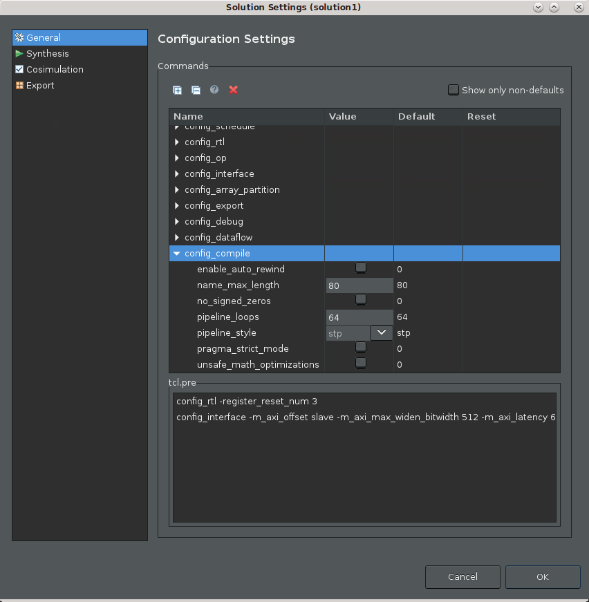
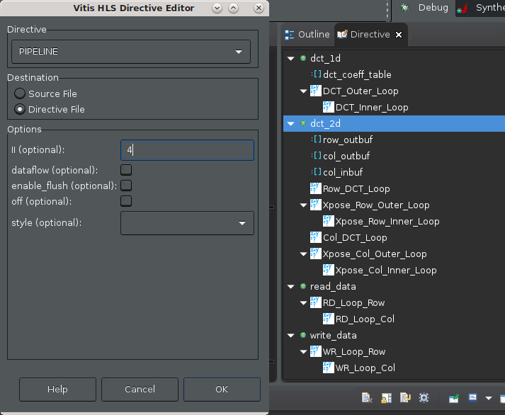
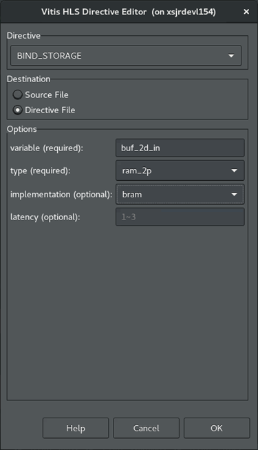
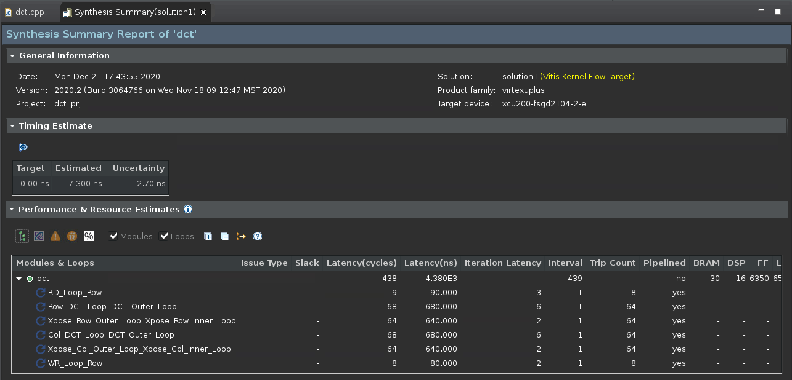

<table class="sphinxhide">
 <tr>
   <td align="center"><h1>2020.2 Vitis™ アプリケーション アクセラレーション チュートリアル</h1><a href="https://github.com/Xilinx/Vitis-Tutorials/tree/2020.1">2020.1 チュートリアルを参照</a></td>
 </tr>
</table>
<!--
# Copyright 2021 Xilinx Inc.
#
# Licensed under the Apache License, Version 2.0 (the "License");
# you may not use this file except in compliance with the License.
# You may obtain a copy of the License at
#
#     http://www.apache.org/licenses/LICENSE-2.0
#
# Unless required by applicable law or agreed to in writing, software
# distributed under the License is distributed on an "AS IS" BASIS,
# WITHOUT WARRANTIES OR CONDITIONS OF ANY KIND, either express or implied.
# See the License for the specific language governing permissions and
# limitations under the License.
-->

# 3\.最適化テクニックの使用

この演習では、デザインに関するパフォーマンス上の懸念を調整するために使用可能なさまざまな最適化手法について説明します。

## パイプライン ループのしきい値の設定

1. \[Explorer] ビューでプロジェクト ソリューションまたは `solution1` を右クリックして **\[Solution Settings]** をクリックします。\[Solution Settings] ダイアログ ボックスが開きます。

2. **\[General]** を選択し、次の図に示すように **config\_compile** を展開します。

   

3. **\[Configuration Settings]** ダイアログ ボックスで `pipeline_loops` を `6` に指定します。これにより、ループの反復が 6 回以下の場合に自動的に内部ループが展開されます。デフォルト値は 64 です。

4. **\[OK]** をクリックして `config_compile` コマンドを追加し、ループの自動パイプライン処理の設定を変更します。

5. ツールバーから **\[C Synthesis]** をクリックして合成コマンドを再実行し、結果を表示します。

   この設定は、ループがデザインのクリティカル パスにない場合や、必ず解決する必要のある大きな問題でない場合などには無難な方法かもしれません。すべての違反を必ずしも解決する必要はなく、解決するのが不可能な場合もあります。これらは、パフォーマンスのアーチファクトにすぎません。

## パイプライン開始間隔の設定

> **アクション**: 先に進む前に変更を元に戻しておきます。ソリューションを右クリックし、**\[Solution Settings]** を選択し、`config_compile pipeline_loop` コマンドをデフォルト値にリセットします。

また、別のサンプルを処理する前に特定のクロック サイクル数 (たとえば、2 クロック サイクルまたは 4 クロック サイクルなど) が許容されるようにすることもできます。これにより、レイテンシがユーザーの指定と同じになるので、II 違反が表示されなくなります。アプリケーションの全体的なレイテンシは、一部のループが II=4 であっても、たいした問題ではないことを示しています。

前のセクションで、**config\_compile** コマンドがデザイン全体のコンパイルに影響するツール設定コマンドであることがわかりました。この最適化は、ツール自体ではなく、ソース コードの特定の部分に適用されるコード指示子です。

1. 関数をソース コード エディターで開きます。

   プロジェクトの `Source` フォルダーを展開し、`dct.cpp` ファイルをダブルクリックして \[Explore] ビューを開きます。

   ソース コード エディターが開くと、IDE の右側にコードの \[Outline] ビューと \[Directive] ビューも表示されます。

   * **\[Outline] ビュー**: 表示されているソース コード ファイルのアウトラインを表示します。領域または関数を選択すると、コードをすばやく移動できます。
   * **\[Directives] ビュー**: コードの演算または要素を選択して `HLS pragmas` をソース コードに割り当てたり、アクティブ ソリューションに関連付けられた Tcl スクリプトに `set_directive` コマンドを割り当てたりできます。詳細は、『Vitis 統合ソフトウェア プラットフォームの資料』 (UG1416) の Vitis HLS フローの[プラグマおよび指示子の追加](https://japan.xilinx.com/cgi-bin/docs/rdoc?v=2020.2;t=vitis+doc;d=optimizinghlsproject.html;a=gip1583519972576)を参照してください。

2. \[Directive] ビューで `dct_2d` 関数を右クリックし、**\[Insert Directive]** をクリックします。

   \[Vitis HLS Directive Editor] が表示されます。

   

3. \[Directive] で **\[Pipeline]** 指示子を選択します。

4. \[Destination] で **\[Directive File]** を選択します。これがデフォルトです。

   指示子を使用すると、異なるソリューションを異なる指示子ファイルで作成し、さまざまな方法でパフォーマンスを最適化して、最適なソリューションを見つけることができます。HLS プラグマを直接ソース ファイルに追加すると、すべてのソリューションに同じ最適化が使用されます。

   > **ヒント:** デザイン プロセスの後半では、安定した最適化を指示子ファイルから C/C++ コード HLS プラグマに変更して、最適化がコードに含まれるようにすることをお勧めします。これは、この後の演習で実行します。

5. \[II (optional)] に `4` を入力します。これにより、使用可能なパフォーマンスのレベルが定義され、II 違反がなくなります。

6. **\[OK]** をクリックして指示子を適用します。\[Directive] ビューに `HLS PIPELINE II=4` が追加されました。

7. **\[C Synthesis]** をクリックして合成を再実行します。

   `dct_2d` 関数の \[Interval] 列には 4 と表示されますが、問題としてレポートされません。

   

## BIND\_STORAGE を使用したデュアル ポート RAM の割り当て

> **アクション**: 先に進む前に変更を元に戻しておきます。ソース コードのタブをクリックしてアクティブにし、\[Directive] ビューを表示します。**HLS PIPELINE II=4** を右クリックし、**\[Remove Directive]** をクリックします。

デザインによっては、「`Unable to schedule load operation...`」というガイダンス メッセージ表示され、メモリ トランザクションに関して load/load (または read/read 競合) 問題があることを示します。こういった場合、レイテンシを許容する代わりに、インプリメンテーションを最適化して最適なパフォーマンス (II=1) を達成してみることもできます。

メモリの読み出しまたは書き込みに関する問題は、読み出しまたは書き込みに使用するメモリ ポートを増やすことで解決できることがあります。BIND\_STORAGE プラグマまたは指示子を使用して、ストレージのインプリメントに使用するデバイス リソースのタイプを指定するのが、1 つの方法です。BIND\_STORAGE は、RTL で変数に関連付けられたストレージ構造のインプリメントに使用する特定のデバイス リソースを定義します。詳細は、『Vitis 統合ソフトウェア プラットフォームの資料』 (UG1416) の Vitis HLS フローの [BIND\_STORAGE](https://japan.xilinx.com/html_docs/xilinx2020_2/vitis_doc/hls_pragmas.html#chr1584844747152) を参照してください。

1. **dct.cpp** タブをクリックしてコード エディターをアクティブにします。

2. \[Directive] ビューで `dct_2d` 関数の `col_inbuf` 変数を右クリックし、**\[Add Directive]** をクリックします。

   \[Vitis HLS Directive Editor] が表示されます。

3. \[Directive] には **\[BIND\_STORAGE]** を選択します。

4. \[Destination] で **\[Directive File]** を選択します。

5. **\[Options]** には、選択した変数がリストされます。変数に使用するメモリのタイプをデュアル ポート RAM (`ram_2p`) に指定して、インプリメンテーションを `bram` に指定します。

   レイテンシはオプションで指定できますが、現時点では空白のままにしておきます。

6. **OK** をクリックします。

7. 最上位 `dct` 関数の `buf_2d_out` 変数に対しても同じ処理を繰り返します。

   1. \[Directive] ビューで `buf_2d_out` 変数を選択し、**BIND\_STORAGE** プラグマを追加してデュアル ポート RAM (`ram_2p`) とインプリメンテーション (`bram`) を指定します。

8. **\[Run C Synthesis]** をクリックして合成を再実行して、結果を確認します。

## 配列パーティションの割り当て

> **アクション**: 先に進む前に変更を元に戻しておきます。ソース コードのタブをクリックしてアクティブにし、\[Directive] ビューを表示します。**HLS BIND\_STORAGE** プラグマを右クリックし、**\[Remove Directive]** をクリックします。

メモリ ポートの競合を回避するには、ARRAY\_PARTITION 指示子を使用して配列の構造を再設定する方法もあります。ARRAY\_PARTITION では、1 つの大きな配列を使用する代わりに、配列をより小さな配列に分割したり、個別のレジスタに分割したりできます。これにより、ストレージの読み出しおよび書き込みポートの量が増加し、デザインのスループットを改善できる可能性があります。

ただし、ARRAY\_PARTITION にはより多くのメモリ インスタンスまたはレジスタが必要となるので、エリアおよびリソース使用量が増加します。詳細は、Vitis 統合ソフトウェア プラットフォームの資料 (UG1416) の Vitis HLS フローの [ARRAY\_PARTITION](https://japan.xilinx.com/html_docs/xilinx2020_2/vitis_doc/hls_pragmas.html#gle1504034361378) を参照してください。大きな配列を分割する場合、コンパイル時間が長くなることもあります。

1. \[Directives] ビューで関連する II 違反から配列変数 **col\_inbuf** および **buf\_2d\_out** を選択します。

2. 右クリックして **\[Add Directive]** をクリックします。

   次の図に示す \[Vitis HLS Directive Editor] が開きます。

   

3. \[Vitis HLS Directive Editor] で次のようにオプションを指定します。

   1. \[Directive] には **\[ARRAY\_PARTITION]** を選択します。
   2. \[Destination] で **\[Directive File]** を選択します。
   3. \[Options] には、選択した変数がリストされます。\[dimension] はデフォルト値の 1 に設定します。
   4. \[factor] を **8** に指定します。
   5. \[type] には **\[cyclic]** を選択します。

4. **\[OK]** をクリックして閉じて、指示子を適用します。

5. `buf_2d_out` 変数に対しても上記の手順を繰り返します。

6. **\[C Synthesis]** をクリックして合成を再実行して結果を確認します。

7. 合成サマリ レポートで、合成したデザインの詳細を確認します。

   

   係数 8 でサイクリック分割を選択した理由は、コードの構造に関係しています。ループは 8x8 行列 (外側ループに 8、内側ループに 8 必要) を処理します。係数 8 のサイクリック配列分割を選択すると、8 つの配列が作成され、それぞれが反復ごとに 1 回読み出されます。これにより、ループのパイプライン中にメモリ アクセスが競合しなくなります。

## 次の手順

ここまでで、デザインのさまざまな問題のさまざまな最適化方法について検証したので、次はもう 1 つの最適化方法である [DATAFLOW 最適化](./dataflow_design.md)について学びます。 

<b><a href="/README.md">メイン ページに戻る</a> &mdash; <a href="./README.md">チュートリアルの初めに戻る</a></b>

Copyright&copy; 2021 Xilinx

この資料は 2021 年 1 月 22 日時点の表記バージョンの英語版を翻訳したもので、内容に相違が生じる場合には原文を優先します。資料によっては英語版の更新に対応していないものがあります。
日本語版は参考用としてご使用の上、最新情報につきましては、必ず最新英語版をご参照ください。

