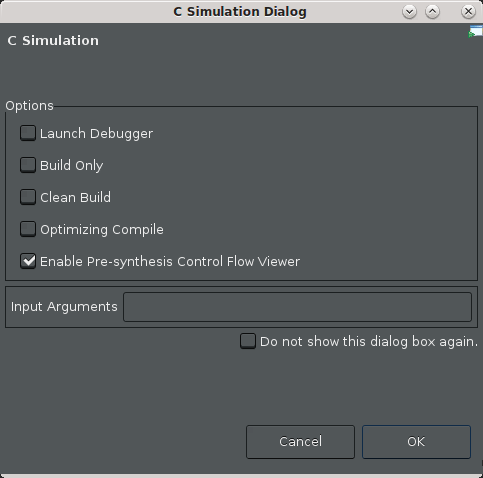
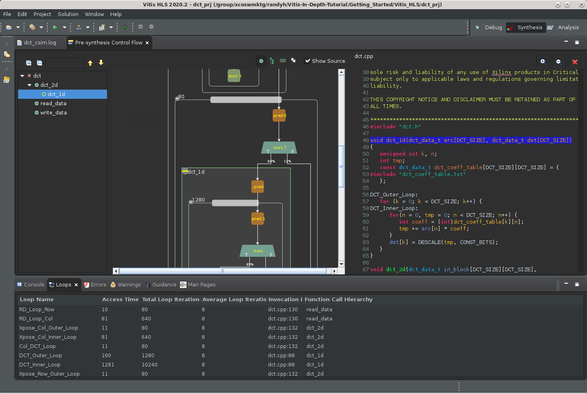
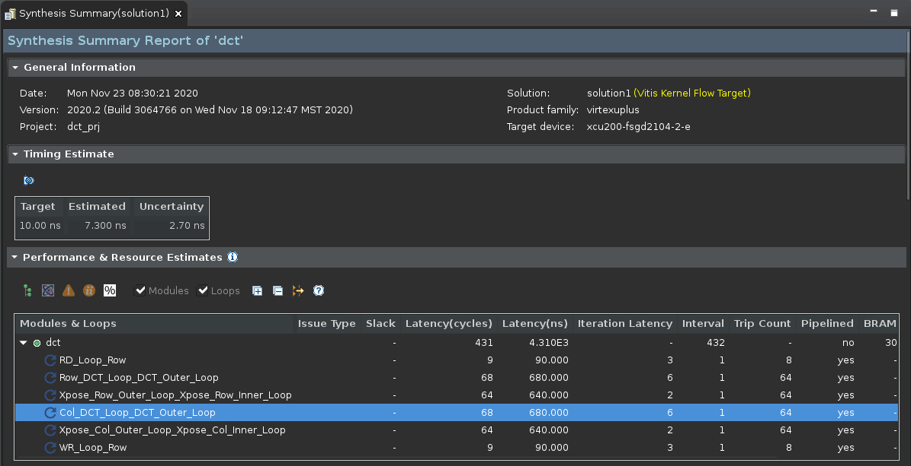

<table class="sphinxhide">
 <tr>
   <td align="center"><h1>2020.2 Vitis™ アプリケーション アクセラレーション チュートリアル</h1><a href="https://github.com/Xilinx/Vitis-Tutorials/tree/2020.1">2020.1 チュートリアルを参照</a></td>
 </tr>
</table>
<!--
# Copyright 2021 Xilinx Inc.
#
# Licensed under the Apache License, Version 2.0 (the "License");
# you may not use this file except in compliance with the License.
# You may obtain a copy of the License at
#
#     http://www.apache.org/licenses/LICENSE-2.0
#
# Unless required by applicable law or agreed to in writing, software
# distributed under the License is distributed on an "AS IS" BASIS,
# WITHOUT WARRANTIES OR CONDITIONS OF ANY KIND, either express or implied.
# See the License for the specific language governing permissions and
# limitations under the License.
-->

# 2\.シミュレーション、合成の実行および結果の解析

## C シミュレーションの実行

プロジェクトにソース コードおよびテストベンチを追加したので、C シミュレーションを実行できるようになりました。

> ヒント: テストベンチの機能の詳細は、『Vitis 統合ソフトウェア プラットフォームの資料』 (UG1416) の Vitis HLS フローの[テストベンチの記述](https://japan.xilinx.com/cgi-bin/docs/rdoc?v=2020.2;t=vitis+doc;d=verifyingcodecsimulation.html;a=sav1584759936384)を参照してください。

1. メイン メニューから **\[Project]** → **\[Run C Simulation]** をクリックします。

   \[C Simulation Dialog] ダイアログ ボックスが表示されます。

   

2. **\[Enable Pre-synthesis Control Flow Viewer]** チェック ボックスをオンにして、C シミュレーション後にデザインの制御フロー ビューが生成されるようにします。

3. **[OK]** をクリックします。

   シミュレーションが終了すると、シミュレーション結果を含む `dct_sim.log` ファイルが表示され、合成前の制御フロー グラフも表示されます。ログ ファイルには、テストで問題が検出されなかったこと以外の情報は表示されません。これは、良い兆候です。

   制御フロー グラフには、次の図に示すように、コードの制御構造がわかりやすく表示されます。Vitis HLS でコードがどのように解釈されるかを確認してください。

   > **注記**: この制御構造は、`if` および `switch` 文のなどのさまざまなループおよび条件文によるコード内の分岐を示します。

   

4. グラフを拡大し、DCT 関数の構造を確認します。これには、次の要素が含まれます。

   * **read\_data**: DDR からのデータを配列として読み出し、行列に変換します。
   * **関数 dct\_1d 内にネストされた dct\_2d**: 行列値にコサイン変換を適用して値の行列を処理します。
   * **write\_data**: 行列を配列に変換して、DDR に結果を戻します。

5. グラフの下の \[Loops] ビューを確認します。

   このビューには、コード内で見つかったループと、ループ反復に関連する基本的な統計およびタイミングが表示されます。ラベルのないループには Vitis HLS により自動的に名前が付けられ、これらの名前がループに関連付けられます。これで、\[Console] ビューでループを指定する際に、これらの名前を使用できるようになります。ビューでループを選択すると、そのループが制御フロー グラフおよびソース コードでも選択されます。

   制御フロー グラフの主な機能は、次のとおりです。

   * C/C++ コードの制御パス (赤の矢印で示されるコード プロファイリングのアーチファクト) を表示します。

     * 赤い矢印の % は、特定の分岐とほかの分岐にかかる時間の割合を示します。これにより、注目すべき時間のかかる部分がわかります。

     > **注記**: このパスは、テストベンチの実行で生成されるので、テスト特定です。

   * メモリ読み出し/書き込みが表示されるので、メモリ ポートの競合問題を理解しやすくなります。

     * メモリ アクセスが異なる分岐にある場合、これらのアクセスは同時に発生しないので、競合は発生しません。
     * メモリ アクセスが同じ分岐にある場合、コードの同じシーケンシャル部分に複数のメモリ アクセスがあるので、ループ II 違反が発生することがあります。

## C 合成の実行

1. 合成を実行するには、**\[C Synthesis]** ツールバー ボタンをクリックします。合成コマンドが実行され、\[Console] ビューに実行された処理が表示されます。この出力で合成中にツールで実行された動作を確認します。表示される処理の一部を次に示します。

   * プロジェクトおよびソリューションの初期化でソースおよび制約ファイルを読み込み、合成のアクティブ ソリューションを設定。
   * コンパイル開始でソース ファイルをメモリに読み込み。
   * インターフェイス検出とセットアップで関数のポートおよびブロック インターフェイスを確認して生成。
   * ポート/インターフェイスのバースト読み出しおよび書き込み解析。
   * コンパイラがコードを演算に変換。
   * 合成可能性チェックを実行。
   * トリップカウントのしきい値でループを自動的にパイプライン処理。
   * 自動およびユーザー指定の両方でループを展開。
   * 関連性および接続性を考慮して演算を調整。
   * ループをフラット化してループ階層を削減。
   * 部分的な書き込み検出 (メモリ ワードの一部を書き込み)。
   * アーキテクチャ合成を終了し、スケジューリングを開始。
   * スケジューリングを終了し、RTL コードを生成。
   * FMax およびループの制約ステータスをレポート。

   Vitis HLS ツールでは、小さな関数は自動的にインライン展開され、ロジックが上位の呼び出し関数に統合され、反復回数が少ない小さなループがパイプライン処理されます。これらの機能は、ユーザー指示子またはプラグマで設定できます。

2. 合成が終了すると、次の図のように合成サマリ レポートが表示されます。結果を確認してください。

   

   合成結果を見ると、合成前の制御フロー図にあったさまざまなサブ関数がレポートされなくなっています。これは、ツールがこれらの関数を自動的にインライン展開したからです。特定の関数がインライン展開されないようにするには、その関数に INLINE OFF プラグマまたは指示子を追加するか、デザインに DATAFLOW 最適化を追加します (このチュートリアルの後半で実行)。

   Vitis HLS では、指定した反復数よりも少ないループも自動的にパイプライン処理されます。デフォルトでは、反復数が 64 未満のループがパイプライン処理されます。パイプライン処理では、II が 1 になるように試みられます。II は、ループが処理されてから次の反復までのクロック サイクル数です。`II=1` でループをパイプライン処理する場合、次の反復は次のクロック サイクルで開始されるのが理想ですが、

## 結果の解析

合成サマリ レポートには、パフォーマンスおよび使用率の見積もり、およびデザイン内のインターフェイスおよびデータ転送に関するデータなど、合成の結果が表示されます。これで、デザインを解析して、レポートされた問題を検証できるようになりました。

1. IDE 下部の \[Console] ビューの横にある **\[Guidance]** ビューをクリックします。このビューには、次の図に示すように見つかった問題に関する詳細が表示されます。

   > **ヒント**: \[Guidance] ビューが表示されていない場合は、**\[Window]** → **\[Show View]** → **\[Guidance]** をクリックします。

   

   ガイダンス メッセージには、合成中に検出された問題がレポートされ、可能な対処方法が提案され、詳細情報へのリンクが提供されます。

2. Vitis HLS IDE の右上で **\[Analysis]** パースペクティブをクリックし、\[Schedule Viewer] ビューを表示ます。

   \[Analysis] パースペクティブでは、プロジェクト内のさまざまな要素を表示して、現在のソリューションの合成結果およびパフォーマンスを確認できます。\[Analysis] パースペクティブにすると、\[Schedule Viewer] ビューがデフォルトで開きます。

   スケジュール ビューアーの左側には、合成された機能の各操作が時系列順にリストされます。デザインの制御段階が、ステップ 0 から完了までのタイムラインとして水平に表示されます。リストで操作を選択すると、それらの接続関係が表示されます。

   デフォルト ビューには、すべての操作が表示されます。ただし、スケジュール ビューアーの上部にあるドロップダウン リストでは、特定の関数、ループ、または要素を選択できます。

   

## 次の手順

次の手順では、必要なパフォーマンスを達成する[最適化テクニック](./optimization_techniques.md)を学びます。 

<b><a href="/README.md">メイン ページに戻る</a> &mdash; <a href="./README.md">チュートリアルの初めに戻る</a></b>

Copyright&copy; 2021 Xilinx

この資料は 2021 年 1 月 22 日時点の表記バージョンの英語版を翻訳したもので、内容に相違が生じる場合には原文を優先します。資料によっては英語版の更新に対応していないものがあります。
日本語版は参考用としてご使用の上、最新情報につきましては、必ず最新英語版をご参照ください。

