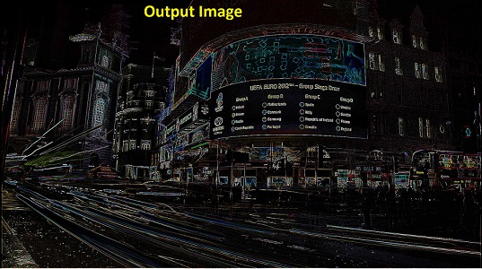

<p align="right"><a href="../../../../README.md">English</a> | <a>日本語</a></p>
<table class="sphinxhide">

 <tr>
   <td align="center"><h1>2020.2 Vitis™ アプリケーション アクセラレーション開発フロー チュートリアル</h1><a href="https://github.com/Xilinx/Vitis-Tutorials/tree/2020.1">2020.1 Vitis アプリケーション アクセラレーション開発フロー チュートリアル</a></td>
 </tr>
</table>

# 2-D たたみ込みカーネルとホスト アプリケーションのビルド

この演習では、ザイリンクス Alveo U200 アクセラレータ カードをターゲットに、Vitis アプリケーション アクセラレーション開発フローを使用したハードウェア カーネルのビルドに焦点を当てます。ホスト側アプリケーションは、カーネルを呼び出すためのすべてのデータ移動と実行トリガーを調整するためにインプリメントされます。この演習では、実際のパフォーマンスを測定し、見積もりのパフォーマンスと CPU のみのパフォーマンスと比較します。

## ホスト アプリケーション

このセクションでは、たたみ込みカーネルの実行を調整るためにホスト アプリケーションがどのように記述されるかについて簡単に説明します。前の演習では、1080p HD ビデオを処理する 60 FPS パフォーマンス目標を満たすため、複数の計算ユニットが必要になると見積もられていました。ホスト アプリケーションは、計算ユニット数に依存しないように設計されています。具体的には、計算ユニットが対称である場合 (同じカーネルのインスタンスおよびメモリのデバイス DDR バンクへの接続が同一である場合)、ホスト アプリケーションは計算ユニットを何個でも処理できます。

**ヒント**: ホスト プログラミングおよび Vitis ツールに関するその他の[チュートリアル](https://github.com/Xilinx/Vitis-Tutorials)および[例](https://github.com/Xilinx/Vitis_Accel_Examples)もあります。

### さまざまなホスト アプリケーション

たたみ込みチュートリアルの最上位フォルダーに移動し、ディレクトリを `src` に変更して、ファイルをリストします。

```bash
cd  $CONV_TUTORIAL_DIR/src
ls
```

**host.cpp** と **host\_randomized.cpp** の 2 つのファイルがあります。これらは、ホスト アプリケーションの 2 つの異なるバージョンをビルドするために使用できます。カーネル計算ユニットとのやり取りは、**pgm** 画像ファイルを入力として使用する点を除き、まったく同じです。このファイルは、画像シーケンス (ビデオ) をエミュレートするために複数回繰り返されます。ランダム化されたホストは、ランダムに生成された画像シーケンスを使用します。ランダムな入力画像生成をするホストには、依存関係がありません。一方、**host.cpp** のホスト コードは OpenCV ライブラリを使用します。特に、**OpenCV 2.4** ライブラリを使用して、RAW 画像形式のロード、アンロード、変換をします。

### ホスト アプリケーションの詳細

ホスト アプリケーションは、コマンド ライン引数の解析から開始します。次は、入力画像を受け取り、OpenCV を使用するホストによって提供されるコマンド ライン オプションです (`src/host.cpp` ソース ファイルを参照)。

```cpp
  CmdLineParser parser;
  parser.addSwitch("--nruns",   "-n", "Number of times the image is processed", "1");
  parser.addSwitch("--fpga",    "-x", "FPGA binary (xclbin) file to use");
  parser.addSwitch("--input",   "-i", "Input image file");
  parser.addSwitch("--filter",  "-f", "Filter type (0-6)", "0");
  parser.addSwitch("--maxreqs", "-r", "Maximum number of outstanding requests", "3");
  parser.addSwitch("--compare", "-c", "Compare FPGA and SW performance", "false", true);
```

`host_randomized.cpp` ファイルには、これらのオプションがすべて含まれるほか、`width` および `height` オプションも追加されています。

```cpp
  parser.addSwitch("--width",   "-w", "Image width",  "1920");
  parser.addSwitch("--height",  "-h", "Image height", "1080");
```

アプリケーションの起動とパフォーマンス測定には、別のオプションを使用できます。この演習では、これらのアプリケーションへのコマンド ライン入力のほとんどを最上位ディレクトリの `make_options.mk` という makefile を使用して設定します。このファイルを使用すると、これらのオプションのほとんどを設定できます。

ホスト アプリケーションはコマンドライン オプションを解析したら、OpenCL コンテキストを作成し、`.xclbin` を読み取ってロードし、プロファイリングをイネーブルした順不同の実行を含むコマンド キューを作成します。その後、メモリ割り当てが実行され、入力画像が読み込まれます (またはランダムに生成されます)。

設定が完了すると、アプリケーションは `Filter2DDispatcher` オブジェクトを作成し、それを使用して複数の画像でフィルタリング要求を出します。タイマーは、ソフトウェアとハードウェアの両方の実行の実行時間測定値を取得するために使用されます。最後に、ホスト アプリケーションがパフォーマンス結果のサマリを表示します。大変な部分のほとんどは、`Filter2DDispatcher` および `Filter2DRequest` で実行されます。これらのクラスは、複数の計算ユニットでのフィルタリング演算の実行を管理および調整します。ホスト アプリケーションのバージョンはどちらも、これらのクラスに基づいています。

### 2D フィルタリング要求

`Filter2DRequest` クラスは、フィルタリング要求ディスパッチャー クラスにより使用されます。このクラスのオブジェクトは、特定の画像の単一カラー チャンネル (YUV) を処理する単一の要求をカプセル化します。基本的に、2-D たたみ込みフィルタリング要求のエンキューに必要な OpenCL リソースにハンドルを割り当てて保持します。これらのリソースには、OpenCL バッファー、イベント リスト、カーネルおよびコマンド キューへのハンドルが含まれます。アプリケーションは、カーネルのすべてのエンキュー コマンドに渡される単一のコマンド キューを作成します。

`Filter2DRequest` クラスのオブジェクトを作成したら、そのオブジェクトを使用して `Filter2D` メソッドを呼び出せるようになります。この呼び出しは、入力データまたはフィルター係数の移動、カーネル呼び出し、出力データのホストへの読み戻しなど、すべての操作をキューに入れます。同じ API 呼び出しは、これらの転送間の依存関係のリストを作成し、ホストへの出力データ転送の完了を知らせる出力イベントも作成します。

### 2D フィルター ディスパッチャー

`Filter2DDispatcher` クラスは、カーネル呼び出すスケジュールするためのエンドユーザー API を提供する最上位クラスです。すべての呼び出しは、前述のように、`Filter2DRequest` オブジェクトを使用してカーネル エンキューと関連データの転送をスケジュールします。  `Filter2DDispatcher` は基本的に要求オブジェクトのベクターを保持するコンテナー クラスです。インスタンシエートされる `Filter2DRequest` オブジェクトの数は、構築時にディスパッチャー クラスの **max** パラメーターとして定義されます。このパラメーターの最小値は、計算ユニットの数と同じくらい小さくでき、計算ユニットごとに少なくとも 1 つのカーネル エンキュー呼び出しを並行して実行できます。ただし、ホストとデバイス間で発生する入力データと出力データの転送を重複させることができるので、値は大きい方が適しています。

## アプリケーションのビルド

ホスト アプリケーションは、チュートリアルに含まれる `Makefile` を使用してビルドできます。前述のように、ホスト アプリケーションには、入力画像を処理するバージョンと、ランダム データを生成して画像として処理するバージョンの 2 つのバージョンがあります。

最上位の `Makefile` には、`make_options.mk` というファイルが含まれます。このファイルには、エミュレーション モード用に異なるホスト ビルドとカーネル バージョンを生成するために使用可能なオプションのほとんどが含まれます。また、特定数のテスト画像を使用してエミュレーションを起動する方法も含まれます。このファイルに含まれるオプションの詳細は、次のとおりです。

### カーネルのビルド オプション

- TARGET: カーネルのビルド ターゲットを選択。選択肢は、`hw`、`sw_emu`、`hw_emu`。
- PLATFORM: ビルドに使用されるターゲット ザイリンクス プラットフォーム。
- ENABLE\_STALL\_TRACE: ストール データを生成するためにカーネルをイネーブル。選択肢は `yes`、`no`。
- TRACE\_DDR: トレース データを格納するメモリ バンクを選択。選択肢は、u200 カードの場合 DDR\[0]-DDR\[3]。
- KERNEL\_CONFIG\_FILE: カーネル コンフィギュレーション ファイル。
- VPP\_TEMP\_DIRS: Vitis カーネル コンパイラ (`v++`) の一時的なログ ディレクトリ。
- VPP\_LOG\_DIRS: `v++` のログ ディレクトリ。
- USE\_PRE\_BUILT\_XCLBIN: このチュートリアルをスピードアップするために使用可能なプリビルドの FPGA バイナリ ファイルの使用をイネーブル。

### ホストのビルド オプション

- ENABLE\_PROF: ホスト アプリケーションの OpenCL プロファイリングをイネーブルにします。
- OPENCV\_INCLUDE: OpenCV インクルード ディレクトリ パス。
- OPENCV\_LIB: OpenCV ライブラリ ディレクトリ パス。

### アプリケーションのランタイム オプション

- FILTER\_TYPE: 6 つの異なるフィルター タイプから選択。選択肢は、0-6 (Identity、Blur、Motion Blur、Edges、Sharpen、Gaussian、Emboss)。
- PARALLEL\_ENQ\_REQS: 並列エンキュー要求のアプリケーション コマンドライン引数
- NUM\_IMAGES: 処理する画像の数
- IMAGE\_WIDTH: 使用する画像の幅
- IMAGE\_HEIGHT: 使用する画像の高さ
- INPUT\_TYPE: ホスト バージョンを選択
- INPUT\_IMAGE: 画像ファイルのパスと名前
- PROFILE\_ALL\_IMAGES: CPU と FPGA を比較する際にすべての画像を使用するかどうか
- NUM\_IMAGES\_SW\_EMU: sw\_emu に使用する画像の数を設定
- NUM\_IMAGES\_HW\_EMU: hw\_emu に使用する画像の数を設定

ランダム化されたデータを使用してホスト アプリケーションをビルドするには、次の手順に従います。

1. makefile オプションを編集します。

```bash
cd  $CONV_TUTORIAL_DIR/
vim make_options.mk
```

2. **INPUT\_TYPE** オプションが `random` に設定されていることを確認します。これにより、`host_randomized.cpp` アプリケーションがビルドされます。

```makefile
############## Host Application Options
INPUT_TYPE :=random
```

**ヒント**: `host.cpp` をビルドするには、**OpenCV 2.4** のインストール パスを示す次の 2 つの変数を `make_options.mk` ファイルに含める必要があります。

```makefile
############## OpenCV Installation Paths
OPENCV_INCLUDE :=/**OpenCV2.4 User Install Path**/include
OPENCV_LIB :=/**OpenCV2.4 User Install Path**/lib
```

3. Vitis アプリケーション アクセラレーション開発フローおよびザイリンクス ランタイム ライブラリを設定するためのインストール用のスクリプトを呼び出します。

```bash
source /**User XRT Install Path**/setup.sh
source /**User Vitis Install Path**/settings64.sh
```

4. パスを正しく設定したら、次のように makefile コマンドを使用してホスト アプリケーションをビルドします。

```bash
make compile_host
```

`build` フォルダー内に `host.exe` がビルドされます。カーネル コードとは別にホスト アプリケーションをビルドすることで、ホスト コードが正しくコンパイルされ、すべてのライブラリ パスが設定されたことを確認できます。

### ソフトウェア エミュレーションの実行

ソフトウェア エミュレーション モードでカーネルをビルドして実行するには、次の bash コマンドを実行します。

```bash
make run TARGET=sw_emu
```

ソフトウェア エミュレーション モードでのみ使用される xclbin ファイルがビルドされ、エミュレーション実行が開始されます。エミュレーションが終了すると、次のようなコンソール出力が表示されます。次は、ランダム入力画像の場合の出力です。

```bash
----------------------------------------------------------------------------

Xilinx 2D Filter Example Application (Randomized Input Version)

FPGA binary       : ./fpgabinary.sw_emu.xclbin
Number of runs    : 1
Image width       : 1920
Image height      : 1080
Filter type       : 5
Max requests      : 12
Compare perf.     : 1

Programming FPGA device
Generating a random 1920x1080 input image
Running FPGA accelerator on 1 images
  finished Filter2DRequest
  finished Filter2DRequest
  finished Filter2DRequest
Running Software version
Comparing results

Test PASSED: Output matches reference
----------------------------------------------------------------------------
```

入力画像を処理に使用する場合は、OpenCV パスと INPUT\_TYPE を `make_options.mk` ファイル内の空の文字列として設定し、再度実行します。コンソール出力は次のようになります。

```bash
----------------------------------------------------------------------------

Xilinx 2D Filter Example Application

FPGA binary       : ./fpgabinary.sw_emu.xclbin
Input image       : ../test_images/picadilly_1080p.bmp
Number of runs    : 1
Filter type       : 3
Max requests      : 12
Compare perf.     : 1

Programming FPGA device
Running FPGA accelerator on 1 images
  finished Filter2DRequest
  finished Filter2DRequest
  finished Filter2DRequest
Running Software version
Comparing results

Test PASSED: Output matches reference
----------------------------------------------------------------------------
```

次の入力および出力画像は、フィルター タイプの選択でエッジ検出を実行する 3 を設定した場合のものです。

 

### ハードウェア エミュレーションの実行

アプリケーションは、ソフトウェア エミュレーションと同様の方法を使用して、ハードウェア エミュレーション モードで実行できます。必要な変更は TARGET のみで、`hw_emu` に設定する必要があります。

**注記**: ハードウェア エミュレーションには時間がかかる場合があります。`Makefile` のデフォルト設定では、単一の画像のみがシミュレーションされますが、ランダム入力画像の場合は、画像の高さを 30 ～ 100 ピクセルの範囲に維持することで、画像サイズを小さく設定することをお勧めします。画像の高さと幅は、`make_options.mk` ファイルで指定できます。

1. 次のコマンドを使用してハードウェア エミュレーションを起動します。

```bash
make run TARGET=hw_emu
```

ハードウェア カーネルをエミュレーション モードでビルドし、ホスト アプリケーションを起動します。コンソール ウィンドウに表示される出力は、`sw_emu` の場合と同じようになります。ただし、ハードウェア エミュレーション後には、Vitis アナライザーを使用して異なる合成レポートを解析し、異なる波形を表示できます。

## システム実行

このセクションでは、FPGA ハードウェアを使用してホスト アプリケーションを実行し、Vitis アナライザーおよびホスト アプリケーションのコンソール出力を使用してシステム全体のパフォーマンスを解析します。

### カーネル (xclbin) のビルド

**注記**: このセクションでは、システム実行用に独自の `xclbin` をビルドするために必要なオプションの手順について説明します。このチュートリアルに含まれるプリビルドの `xclbin` は使用しません。

カーネルの機能が検証され、そのリソースの使用率に (前の演習で合成したように単一モジュールとして) 問題がなければ、カーネル ビルド プロセスを開始できます。カーネルのビルド プロセスでは、xclbin ファイルが作成されます。これは FPGA 実行ファイルであり、ホストが FPGA カードに読み取ってロードできます。xclbin のビルドには数時間かかるので、これを回避するため、ビルトインの xclbin ファイルを用意してあります。これは xclbin というフォルダーにあります。デフォルトのハードウェア実行では、プリビルドの xclbin ファイルが使用されます。ただし、新しい xclbin を作成する必要がある場合は、次のように make\_options.mk ファイルで次のオプションを設定してください。

1. `xclbin` ファイルを作成するには、次のように `make_options.mk` ファイルで次のオプションを設定します。

```bash
USE_PRE_BUILT_XCLBIN := 0
```

2. 次のようにビルドを開始します。

```bash
make build TARGET=hw
```

### FPGA カーネルを使用したアプリケーション実行

プリビルドの `xclbin` ファイルを使用する場合は、**USE\_PRE\_BUILT\_XCLBIN := 1** が 1 に設定されていることを確認します。使用しない場合は、前の手順で説明したように xclbin をビルドし、**USE\_PRE\_BUILT\_XCLBIN := 0** のままにします。ENABLE\_PROF?=yes に設定すると、CPU とのパフォーマンス比較をイネーブルにすることもできます。

```bash
.
.
ENABLE_PROF?=yes
.
.
USE_PRE_BUILT_XCLBIN :=0
```

1. アプリケーションを実行するには、次の手順に従います。

```bash
make run TARGET=hw
```

次のようなコンソール ログが生成されます。

```bash
----------------------------------------------------------------------------

Xilinx 2D Filter Example Application (Randomized Input Version)

FPGA binary       : ../xclbin/fpgabinary.hw.xclbin
Number of runs    : 60
Image width       : 1920
Image height      : 1080
Filter type       : 3
Max requests      : 12
Compare perf.     : 1

Programming FPGA device
Generating a random 1920x1080 input image
Running FPGA accelerator on 60 images
Running Software version
Comparing results

Test PASSED: Output matches reference

FPGA Time         :     0.4240 s
FPGA Throughput   :   839.4765 MB/s
CPU  Time         :    28.9083 s
CPU  Throughput   :    12.3133 MB/s
FPGA Speedup      :    68.1764 x
----------------------------------------------------------------------------
```

コンソール出力から、CPU と比較して 68 倍のアクセラレーションが達成できたことがわかります。達成されたスループットは 839 MB/s で、見積もりのスループット 900 MB/s に近い値で、6.66% の差しかありません。

### プロファイル サマリ

このセクションでは、Vitis アナライザーを使用してさまざまなパフォーマンス パラメーターとトレースを解析し、システム パフォーマンスを解析します。

アプリケーションが実行されると、エミュレーション モードであろうが実際のハードウェアであろうが、ランタイム アクティビティのトレース ファイルを生成できます。このトレース ファイルは、Vitis アナライザーで表示できます。詳細は、[Vitis 暗ライザーの使用 ](https://japan.xilinx.com/html_docs/xilinx2020_2/vitis_doc/jfn1567005096685.html)を参照してください。

アプリケーション実行中に生成されるトレース情報は、ホスト アプリケーションと同じディレクトリにある `xrt.ini` ファイル内で異なるオプションを指定すると制御できます。詳細は、[xrt.ini ファイル](https://japan.xilinx.com/html_docs/xilinx2020_2/vitis_doc/obl1532064985142.html)を参照してください。演習で使用した `xrt.ini` ファイル (このチュートリアルの一番上のフォルダーにあります) を見てみてください。

1. デザインを実行したら、次の手順を使用してランタイム プロファイル サマリ レポートを開くことができます。

```bash
vitis_analyzer ./build/fpgabinary.xclbin.run_summary
```

2. Vitis アナライザー ツールが開いたら、左側のメニューから **\[Profile Summary]** をクリックし、右側に表示されるウィンドウから **\[Compute Unit Utilization]** を選択します。

   このレポートには、計算ユニットの測定されたパフォーマンスに関する統計が表示されます。3 つの計算ユニットを使用して `.xclbin` をビルドしたので、次のように表示されます。

   

   この表から、**\[Avg Time]** 列に表示されるカーネル計算時間が約 7 ms で、前の演習のカーネル レイテンシの見積もりとほぼ同じであることがわかります。

   もう 1 つの重要な測定値は、**\[CU Utilization]** 列で、100% に非常に近い値になっています。これは、ホストが PCIe を介して計算ユニットにデータを継続的に供給できることを意味します。つまり、ホスト PICe の帯域幅は十分であり、計算ユニットが飽和状態になることはありませんでした。これは、ホストの帯域幅使用率からも確認できます。これを表示するには、レポートで **\[Host Data Transfers]** を選択します。次の図のような表が表示されます。この表から、ホスト帯域幅が完全には使用されていないことがわかります。

   

   同様に、レポートで **\[Kernel Data Transfers]** を選択すると、カーネルとデバイスの DDR メモリ間で使用される帯域幅を確認できます。次に示すように、すべての計算ユニットに対して 1 つのメモリ バンク (DDR\[1]) を使用しました。


### アプリケーション タイムライン

アプリケーション タイムラインを使用すると、起動ごとの CU レイテンシや帯域幅使用率などのパフォーマンス パラメーターを確認することもできます。

1. 左側のメニューから **\[Application Timeline]** をクリックします。

   次に示すように、右側のウィンドウにアプリケーション タイムラインが表示されます。

   

   見やすいように拡大し、デバイス側のトレースに進みます。CU の場合は、0 行目のトランザクションにカーソルを置くと、計算の開始時間と終了時間、およびレイテンシがツール ヒントに表示されます。これは、前のセクションで見たものと類似しているはずです。

次に示すように、ホスト データ転送トレースも重要です。このレポートからは、ホストの読み出しおよび書き込み帯域幅がギャップがあるために十分に利用されていないことがわかり、読み出しおよび書き込みトランザクションが発生していない時間が表示されます。これらのギャップは重要で、ホスト PCIe 帯域幅が一部しか使用されていないことを意味します。


このことに加え、Alveo U200 アクセラレータ カードには複数の DDR バンクがあることがわかっているので、アプリケーションの全体的なスループットはさらに向上できます。さらに多くの計算ユニットを使用すると、1 つのビデオ ストリームをアクセラレーションしてスループットを向上させたり、複数のビデオス トリームを同時に処理したりできます。

この演習では、次のことを学びました。

- ビデオ フィルターをビルドして実行し、パフォーマンスを解析する方法
- 複数 CU のデザイン用に最適化されたホスト側アプリケーションを記述する方法
- カーネルのパフォーマンスを見積もって測定したパフォーマンスと比較する方法

## まとめ

お疲れさまでした。これで、このチュートリアルのすべての演習を終了しました。このチュートリアルでは、Vitis カーネルのハードウェア インプリメンテーションのパフォーマンスとアクセラレーション要件を見積もる方法を学びました。異なるツールを使用してカーネルのパフォーマンスを解析し、パフォーマンスの見積もりと実際の測定値を比較して、両方のパフォーマンスの数値がどれだけ近いかを確認しました。また、FPGA ベースのインプリメンテーション用に最適化されたメモリ キャッシュまたは階層を簡単に作成して、アプリケーションのパフォーマンスを大幅に向上可能なことも確認しました。最後に、特定のカーネルの複数 CU から最高のパフォーマンスを達成できるよう最適化されたホスト コードを記述する方法を学びました。

---------------------------------------


<p align="center"><sup>Copyright&copy; 2020 Xilinx</sup></p></b></p>
<p align="center"><sup>この資料は 2021 年 2 月 8 日時点の表記バージョンの英語版を翻訳したもので、内容に相違が生じる場合には原文を優先します。資料によっては英語版の更新に対応していないものがあります。
日本語版は参考用としてご使用の上、最新情報につきましては、必ず最新英語版をご参照ください。</sup></p>
