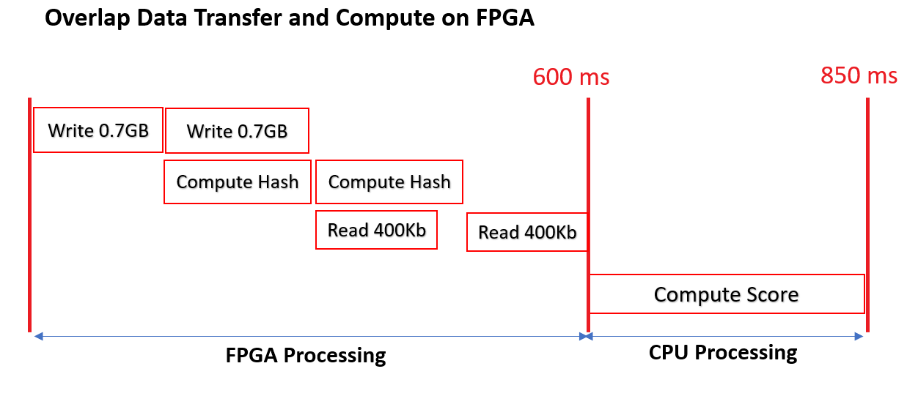
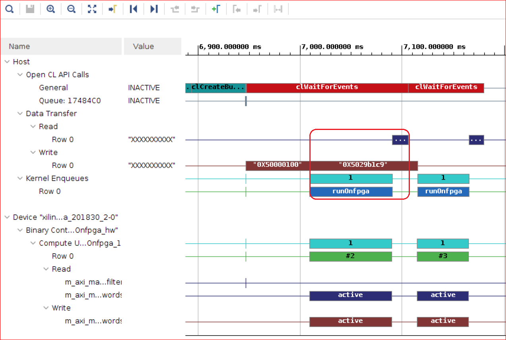
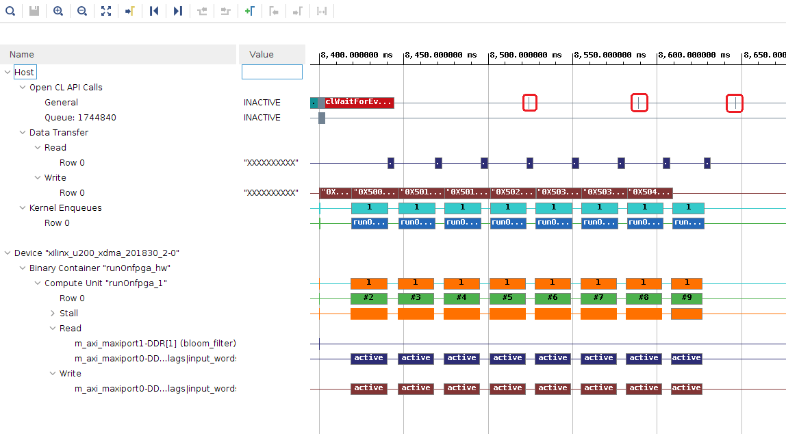

<p align="right"><a href="../../../../README.md">English</a> | <a>日本語</a></p>
<table class="sphinxhide">
 <tr>
   <td align="center"><h1>2020.2 Vitis™ アプリケーション アクセラレーション開発フロー チュートリアル</h1><a href="https://github.com/Xilinx/Vitis-Tutorials/tree/2020.1">2020.1 Vitis アプリケーション アクセラレーション開発フロー チュートリアル</a></td>
 </tr>
</table>

# ホストとカーネル間のデータ移動

前の手順では、ホストからワードを書き込み、FPGA 上でハッシュ関数を計算し、ホストがフラグを読み出す順次実行をインプリメントしました。

計算は入力全体が FPGA に読み出されるまで開始せず、また FPGA からホストへの読み出しは FPGA 上での計算が完了するまで開始しませんでした。

この演習では、次を実行します。

- 2 つのバッファーを使用して、ホストからのデータ転送と FPGA 上での計算をオーバーラップ
  - ドキュメントを分割し、2 回に分けて FPGA に送信します。
  - カーネルは、1 回分のデータが FPGA に転送されるとすぐに計算を開始できます。
- 複数のバッファーを使用して、ホスト データ転送と計算をオーバーラップ
  - ドキュメントを 2、4、8、16、32、64、および 128 個に分割し、それがアプリケーションのパフォーマンスにどのように影響するかを調べます。
- ホストからのデータ転送、FPGA 上での計算、CPU 上でのスコアの計算をオーバーラップ
  - ホストがフラグを受信したらすぐにスコアの計算を開始できるようにします。

## 2 つのバッファーを使用したホスト データ転送と計算のオーバーラップ

次の図に、入力データを 2 つのサブバッファーに分割したユース ケースを示します。



### ホスト コードの変更

`$LAB_WORK_DIR/reference_files` に移動し、ファイル エディターで `run_split_buffer.cpp` を開きます。

データ転送とアクセラレータでの実行をオーバーラップできるように、ホスト コードの 64 ～ 148 行目を変更して入力バッファーを 2 回に分けて送信できるようにしています。次の手順で、このプロセスを説明します。

1. `input_doc_words` および `output_inh_flags` 用に次の 2 つのサブバッファーが作成されています。

   ```cpp
   // Make buffers resident in the device
   q.enqueueMigrateMemObjects({buffer_bloom_filter, buffer_input_doc_words, buffer_output_inh_flags}, CL_MIGRATE_MEM_OBJECT_CONTENT_UNDEFINED);

   // Specify size of sub-buffers, one for each transaction
   unsigned subbuf_doc_sz = total_doc_size/2;
   unsigned subbuf_inh_sz = total_doc_size/2;

   // Declare sub-buffer regions to specify offset and size of sub-buffer   
   cl_buffer_region subbuf_inh_info[2];
   cl_buffer_region subbuf_doc_info[2];

   // Declare sub-buffers
   cl::Buffer subbuf_inh_flags[2];
   cl::Buffer subbuf_doc_words[2];

    // Specify offset and size of sub-buffers
   subbuf_inh_info[0]={0, subbuf_inh_sz*sizeof(char)};
   subbuf_inh_info[1]={subbuf_inh_sz*sizeof(char), subbuf_inh_sz*sizeof(char)};
   subbuf_doc_info[0]={0, subbuf_doc_sz*sizeof(uint)};
   subbuf_doc_info[1]={subbuf_doc_sz*sizeof(uint), subbuf_doc_sz*sizeof(uint)};

   // Create sub-buffers from buffers based on sub-buffer regions
   subbuf_inh_flags[0] = buffer_output_inh_flags.createSubBuffer(CL_MEM_WRITE_ONLY, CL_BUFFER_CREATE_TYPE_REGION, &subbuf_inh_info[0]);
   subbuf_inh_flags[1] = buffer_output_inh_flags.createSubBuffer(CL_MEM_WRITE_ONLY, CL_BUFFER_CREATE_TYPE_REGION, &subbuf_inh_info[1]);
   subbuf_doc_words[0] = buffer_input_doc_words.createSubBuffer (CL_MEM_READ_ONLY,  CL_BUFFER_CREATE_TYPE_REGION, &subbuf_doc_info[0]);
   subbuf_doc_words[1] = buffer_input_doc_words.createSubBuffer (CL_MEM_READ_ONLY,  CL_BUFFER_CREATE_TYPE_REGION, &subbuf_doc_info[1]);

   printf("\n");
    double mbytes_total  = (double)(total_doc_size * sizeof(int)) / (double)(1000*1000);
   double mbytes_block  = mbytes_total / 2;
   printf(" Processing %.3f MBytes of data\n", mbytes_total);
   printf(" Splitting data in 2 sub-buffers of %.3f MBytes for FPGA processing\n", mbytes_block);  
   ```

2. 読み出し、計算、および書き込みを調整するイベントのベクターを作成して 1 回分のデータの処理がほかのデータの処理に影響しないようにし、データ転送と計算をオーバーラップできるようにします。

   ```cpp
   // Create Events to co-ordinate read,compute and write for each iteration
   vector<cl::Event> wordWait;
   vector<cl::Event> krnlWait;
   vector<cl::Event> flagWait;

   printf("--------------------------------------------------------------------\n");

   chrono::high_resolution_clock::time_point t1, t2;
   t1 = chrono::high_resolution_clock::now();
   ```

3. カーネル引数を設定し、カーネルをエンキューしてブルーム フィルター係数を読み込みます。

   ```cpp
   // Only load the Bloom filter in the kernel
   cl::Event buffDone,krnlDone,flagDone;
   total_size = 0;
   load_filter = true;
   kernel.setArg(3, total_size);
   kernel.setArg(4, load_filter);
   q.enqueueMigrateMemObjects({buffer_bloom_filter}, 0, NULL, &buffDone);
   wordWait.push_back(buffDone);
   q.enqueueTask(kernel, &wordWait, &krnlDone);
   krnlWait.push_back(krnlDone);
   ```

4. 1 回目の処理では、カーネル引数が設定され、最初のワード セットを含む入力バッファーを FPGA に書き込み、カーネルを実行し、結果をホストに読み出すコマンドがエンキューされます。

   ```cpp
     //  Set Kernel Arguments, Read, Enqueue Kernel and Write for first iteration
     total_size = total_doc_size/2;
     load_filter=false;
     kernel.setArg(3, total_size);
     kernel.setArg(4, load_filter);
     kernel.setArg(0, subbuf_inh_flags[0]);
     kernel.setArg(1, subbuf_doc_words[0]);
     q.enqueueMigrateMemObjects({subbuf_doc_words[0]}, 0, &wordWait, &buffDone);
     wordWait.push_back(buffDone);
     q.enqueueTask(kernel, &wordWait, &krnlDone);
     krnlWait.push_back(krnlDone);
     q.enqueueMigrateMemObjects({subbuf_inh_flags[0]}, CL_MIGRATE_MEM_OBJECT_HOST, &krnlWait, &flagDone);
     flagWait.push_back(flagDone);
   ```

5. 2 回目の処理では、カーネル引数が設定され、2 つ目のワード セットを含む入力バッファーを FPGA に書き込み、カーネルを実行し、結果をホストに読み出すコマンドがエンキューされます。

   ```cpp
     //  Set Kernel Arguments, Read, Enqueue Kernel and Write for second iteration
     total_size = total_doc_size/2;
     load_filter=false;
     kernel.setArg(3, total_size);
     kernel.setArg(4, load_filter);
     kernel.setArg(0, subbuf_inh_flags[1]);
     kernel.setArg(1, subbuf_doc_words[1]);
     q.enqueueMigrateMemObjects({subbuf_doc_words[1]}, 0, &wordWait, &buffDone);
     wordWait.push_back(buffDone);
     q.enqueueTask(kernel, &wordWait, &krnlDone);
     krnlWait.push_back(krnlDone);
     q.enqueueMigrateMemObjects({subbuf_inh_flags[1]}, CL_MIGRATE_MEM_OBJECT_HOST, &krnlWait, &flagDone);
     flagWait.push_back(flagDone);
   ```

6. ホストは、FPGA から出力が読み出されるまで待ちます。

   ```cpp
   // Wait until all results are copied back to the host before doing the post-processing
    flagWait[0].wait();
    flagWait[1].wait();
   ```

### Bloom8x カーネルを使用したアプリケーションの実行

`makefile` ディレクトリに移動し、次の `make` コマンドを実行します。

```
 cd $LAB_WORK_DIR/makefile; make run STEP=split_buffer TARGET=hw PF=8
```

次の出力が表示されます。

```
Processing 1398.903 MBytes of data
Split_buffer : Splitting data in 2 sub-buffers of 699.452 MBytes for FPGA processing
--------------------------------------------------------------------
Executed FPGA accelerated version  |   734.0995 ms   ( FPGA 262.363 ms )
Executed Software-Only version     |   3246.2145 ms
--------------------------------------------------------------------
Verification: PASS
```

## Bloom8x カーネルのプロファイル サマリ レポートおよびタイムライン トレースの確認

1. 次のコマンドを使用して、Bloom8x カーネルのタイムライン トレース レポートを表示します。

   ```
   vitis_analyzer $LAB_WORK_DIR/build/split_buffer/kernel_8/hw/runOnfpga_hw.xclbin.run_summary
   ```

2. タイムライン トレース レポートの次の部分を拡大表示します。

   

   - このタイムライン トレースから、意図した実行スケジュールが達成されていることがわかります。
     * 1 回目と 2 回目の処理の間で、読み出しと計算が書き込みとオーバーラップしています。
     * 1 回目のカーネル実行と 1 回目のデータ読み出しの時間は、ホストからの書き込みデータの転送に事実上隠された形になります。これにより、実行が全体的に高速化されます。

3. プロファイル サマリ レポートの \[Host Data Transfer: Host Transfer] に、ホスト CPU からのデータ転送にカーネルでの計算よりも時間がかかっていることが示されます。

   - ホストからのグローバル メモリ書き込み転送に約 178 ms かかっており、これは 1 つのバッファーを使用したときよりも長くなっています。
   - ホストからのグローバル メモリ読み出し転送には約 38 ms かかります。

4. \[Kernels \& Compute Unit: Kernel Execution] には、カーネル実行時間 (両方の計算時間をエンキューすることにより計算) も 1 つのバッファーを使用したときより長くなっていることが示されます。ホスト データ転送とカーネルをオーバーラップさせると、DDR メモリへのアクセスはホストまたはカーネルのいずれかに限定されず、データ転送のパフォーマンスが低くなります。ただし、全体的なパフォーマンスは 1 つのバッファーを使用したときよりも向上しています。

Bloom8x カーネルを使用した場合、各計算のカーネル エンキュー時間も各ホスト転送時間よりも短くなることをレポートから確認できます。そのため、Bloom16x カーネルを使用しても、ホストからの転送時間に制限されるので、利点はありません。Bloom16x カーネルの実行時間は高速ですが、カーネルによりアプリケーション全体のパフォーマンスは向上しません。次の手順で Bloom16x カーネルを使用して、これを確認します。

### Bloom16x カーネルを使用したアプリケーションの実行

`makefile` ディレクトリに移動し、`make` コマンドを実行します。

```
cd $LAB_WORK_DIR/makefile; make run STEP=split_buffer TARGET=hw PF=16
```

次の出力が表示されます。

```
Processing 1398.903 MBytes of data
Split_buffer : Splitting data in 2 sub-buffers of 699.452 MBytes for FPGA processing
--------------------------------------------------------------------
Executed FPGA accelerated version  |   733.6324 ms   ( FPGA 233.314 ms )
Executed Software-Only version     |   3133.5186 ms
--------------------------------------------------------------------
Verification: PASS
```

ドキュメントを 2 つのバッファーに分割した場合、Bloom8x カーネルと Bloom16x カーネルの絶対的なアプリケーション実行時間はほぼ同じです。予測どおり、Bloom8x の代わりに Bloom16x カーネルを使用しても、利点はありません。

独自のアプリケーションを開発する際は、これらの属性を試してトレードオフを検討し、リソース/パフォーマンスに最適なカーネル インプリメンテーションを選択できます。

Bloom8x を使用して演習を続けます。

### まとめ

データ転送と実行をオーバーラップさせることにより、FPGA での合計実行時間が短縮されました。1 回目のカーネル実行と 1 回目のデータ読み出しの時間は、実質上削除されました。

## 複数のバッファーを使用したホスト データ転送と計算のオーバーラップ

前の手順では、入力バッファーを 2 つのサブバッファーに分割して、1 回目の計算と 2 回目のデータ転送をオーバーラップさせました。この手順では、入力データを任意の数で分割する汎用コードを記述し、実行時間が最短となる設定を調べます。

### ホスト コードの変更

ファイル エディターで `$LAB_WORK_DIR/reference_files` にある `run_generic_buffer.cpp` ファイルを開きます。

データ転送と計算をオーバーラップできるように、ホスト コードの 67 ～ 139 行目を変更して入力バッファーを複数に分けて送信できるようにしています。そのプロセスは次のとおりです。

1. `output_inh_flags` および `input_doc_words` 用に次の複数のサブバッファーが作成されています。

   ```cpp
     // Specify size of sub buffers for each iteration
     unsigned subbuf_doc_sz = total_doc_size/num_iter;
     unsigned subbuf_inh_sz = total_doc_size/num_iter;

     // Declare sub buffer regions to specify offset and size for each iteration
     cl_buffer_region subbuf_inh_info[num_iter];
     cl_buffer_region subbuf_doc_info[num_iter];

     // Declare sub buffers
     cl::Buffer subbuf_inh_flags[num_iter];
     cl::Buffer subbuf_doc_words[num_iter];

     // Define sub buffers from buffers based on sub-buffer regions
     for (int i=0; i<num_iter; i++)  {
       subbuf_inh_info[i]={i*subbuf_inh_sz*sizeof(char), subbuf_inh_sz*sizeof(char)};
       subbuf_doc_info[i]={i*subbuf_doc_sz*sizeof(uint), subbuf_doc_sz*sizeof(uint)};
       subbuf_inh_flags[i] = buffer_output_inh_flags.createSubBuffer(CL_MEM_WRITE_ONLY, CL_BUFFER_CREATE_TYPE_REGION, &subbuf_inh_info[i]);
       subbuf_doc_words[i] = buffer_input_doc_words.createSubBuffer (CL_MEM_READ_ONLY,  CL_BUFFER_CREATE_TYPE_REGION, &subbuf_doc_info[i]);
     }

     printf("\n");
     double mbytes_total  = (double)(total_doc_size * sizeof(int)) / (double)(1000*1000);
     double mbytes_block  = mbytes_total / num_iter;
     printf(" Processing %.3f MBytes of data\n", mbytes_total);
     if (num_iter>1) {
       printf(" Splitting data in %d sub-buffers of %.3f MBytes for FPGA processing\n", num_iter, mbytes_block);
     }
   ```

2. 読み出し、計算、および書き込みを調整するイベントのベクターを作成し、1 回分のデータの処理がほかのデータの処理に影響しないようにし、データ転送と計算をオーバーラップできるようにします。

   ```cpp
     // Create Events for coordinating read,compute and write for each iteration
       vector<cl::Event> wordWait;
       vector<cl::Event> krnlWait;
       vector<cl::Event> flagWait;

       printf("--------------------------------------------------------------------\n");

       chrono::high_resolution_clock::time_point t1, t2;
       t1 = chrono::high_resolution_clock::now();
   ```

3. カーネル引数を設定し、カーネルをエンキューしてブルーム フィルター係数を読み込みます。

   ```cpp
     // Set Kernel arguments and load the Bloom filter coefficients in the kernel
     cl::Event buffDone, krnlDone;
     total_size = 0;
     load_filter = true;
     kernel.setArg(3, total_size);
     kernel.setArg(4, load_filter);
     q.enqueueMigrateMemObjects({buffer_bloom_filter}, 0, NULL, &buffDone);
     wordWait.push_back(buffDone);
     q.enqueueTask(kernel, &wordWait, &krnlDone);
     krnlWait.push_back(krnlDone);
   ```

4. 各処理では、カーネル引数が設定され、入力バッファーを FPGA に書き込み、カーネルを実行し、結果をホストに読み出すコマンドがエンキューされます。

   ```cpp
     // Set Kernel arguments. Read, Enqueue Kernel and Write for each iteration
     for (int i=0; i<num_iter; i++)
     {
       cl::Event buffDone, krnlDone, flagDone;
       total_size = subbuf_doc_info[i].size / sizeof(uint);
       load_filter = false;
       kernel.setArg(0, subbuf_inh_flags[i]);
       kernel.setArg(1, subbuf_doc_words[i]);
       kernel.setArg(3, total_size);
       kernel.setArg(4, load_filter);
       q.enqueueMigrateMemObjects({subbuf_doc_words[i]}, 0, &wordWait, &buffDone);
       wordWait.push_back(buffDone);
       q.enqueueTask(kernel, &wordWait, &krnlDone);
       krnlWait.push_back(krnlDone);
       q.enqueueMigrateMemObjects({subbuf_inh_flags[i]}, CL_MIGRATE_MEM_OBJECT_HOST, &krnlWait, &flagDone);
       flagWait.push_back(flagDone);
     }
   ```

5. ホストは、各処理の出力が読み出されるまで待ちます。

   ```
     // Wait until all results are copied back to the host before doing the post-processing
     for (int i=0; i<num_iter; i++)
     {
       flagWait[i].wait();
     }
   ```

   コードは、データを任意の数のバッファーに分割できるように記述されています。

### Bloom8x カーネルを使用したアプリケーションの実行

この手順では、Bloom8x カーネルを使用して、100,000 ドキュメントを 2、4、8、16、32、64、および 128 個に分割し、どのオプションで最高のパフォーマンスが得られるかを調べます。

1. `makefile` ディレクトリに移動し、`make` コマンドを実行します。

   ```
   cd $LAB_WORK_DIR/makefile; make run STEP=generic_buffer TARGET=hw PF=8 ITER=8
   ```

   引数 `ITER` は、入力データの分割方法およびホストから FPGA に転送するバッファーの数を指定します。

2. 同じ `make` コマンドを、`ITER` の値を 1、2、4、8、16、32、64 に設定して実行します。

3. 複数の `ITER` 値を使用してアプリケーションを実行すると、プロファイル サマリ レポート、タイムライン トレースなどの出力ファイルが上書きされます。次のコマンドを使用して、それぞれのアーカイブ ファイルが保存されるように、archive\_summary 機能をイネーブルにします。

   ```
   archive_summary ../build/generic_buffer/kernel_8/hw/runOnfpga_hw.xclbin.run_summary runOnfpga_hw_8.xclbin.run_summary.archive
   ```

4. `vitis_analyzer` コマンドを使用し、すべてのレポートを表示して確認します。

   ```
   bash vitis_analyzer runOnfpga_hw_8.xclbin.run_summary.archive
   ```

   次の図に、異なる `ITER` 値を使用した場合の実行時間をグラフで示します。

   

   グラフから、`ITER=8` のパフォーマンスが最高であることがわかります。ご使用の CPU のパフォーマンス、サーバー負荷などによって、結果が異なる場合があります。

   次に、`ITER` を 8 に設定した場合の結果を示します。

   ```
   Processing 1398.907 MBytes of data
   Generic_Buffer : Splitting data in 8 sub-buffers of 174.863 MBytes for FPGA processing

   --------------------------------------------------------------------
   Executed FPGA accelerated version  |   664.6440 ms   ( FPGA 224.135 ms )
   Executed Software-Only version     |   3036.5323 ms
   --------------------------------------------------------------------
   Verification: PASS
   ```

### Bloom8x カーネルのプロファイル サマリ レポートおよびタイムライン トレースの確認

1. 次のコマンドを使用して、Bloom8x カーネルのタイムライン トレース レポートを表示します。

   ```
   vitis_analyzer $LAB_WORK_DIR/build/generic_buffer/kernel_8/hw/runOnfpga_hw.xclbin.run_summary
   ```

2. タイムライン トレース レポートの次の部分を拡大表示します。

   

- このレポートから、入力バッファーが 8 つのサブバッファーに分割され、読み出し、計算、書き込みがオーバーラップしているのがわかります。計算は 8 つに分割され、そのうち 7 つはデータ転送と同時に実行され、最後の 1 つの計算は合計 FPGA 実行時間に追加されます。これは、上のタイムライン トレースの図で 2 つの矢印を使用して示しています。

- 入力データを複数のバッファーに分割すると、データ転送と計算をさらにオーバーラップさせることにより、FPGA 上での合計実行時間も前の手順のものより短くなります。

このアプリケーションでは、最適な構成は次のとおりです。

- Bloom8x カーネルでワードを 8 つのサブバッファーに分割 (`ITER=8`)。

## ホスト CPU と FPGA のオーバーラップ

前の手順で、ホストから FPGA へのデータ転送と FPGA での計算をオーバーラップさせることにより、実行時間を最適化しました。FPGA での計算が完了した後、FPGA からの出力に基づいて、CPU でドキュメント スコアが計算されます。ここまでのところ、FPGA での処理と CPU での後処理は順次実行していました。

前のタイムライン トレース レポートを見ると、一番上の行に、ホスト アプリケーションによる OpenCL API 呼び出しが示されています。これは、ホストが待機中で、FPGA がハッシュおよびフラグを計算している間アイドル状態であるということです。この手順では、FPGA での処理と CPU での後処理をオーバーラップさせます。

計算は複数に分割されるので、ホスト CPU での後処理も、各計算が完了したらすぐに開始して、FPGA での処理と CPU での後処理をオーバーラップさせることができます。CPU での処理も FPGA と並列して実行されるのでパフォーマンスが向上し、実行時間を短縮できます。

### ホスト コードの変更

1. ファイル エディターで `$LAB_WORK_DIR/reference_files` にある `run_sw_overlap.cpp` ファイルを開きます。

   ホスト コードの 134 ～ 171 行目を変更し、CPU での処理が FPGA での処理とオーバーラップするようにします。そのプロセスは次のとおりです。

   FPGA で処理されたワードを把握するため、次の変数が作成されています。

   ```cpp
     // Create variables to keep track of number of words needed by CPU to compute score and number of words processed by FPGA such that CPU processing can overlap with FPGA
     unsigned int curr_entry;
     unsigned char inh_flags;
     unsigned int  available = 0;
     unsigned int  needed = 0;
     unsigned int  iter = 0;
   ```

2. FPGA でワードのハッシュ関数が計算されていない場合にのみホストをブロックし、CPU と FPGA での処理をオーバーラップさせます。

   ```cpp
     for(unsigned int doc=0, n=0; doc<total_num_docs;doc++)
     {
       unsigned long ans = 0;
       unsigned int size = doc_sizes[doc];

       // Calculate size by needed by CPU for processing next document score
       needed += size;

       // Check if flags processed by FPGA is greater than needed by CPU. Else, block CPU
       // Update the number of available words and sub-buffer count(iter)

       if (needed > available)
       {
         flagWait[iter].wait();
         available += subbuf_doc_info[iter].size / sizeof(uint);
         iter++;
       }

       for (unsigned i = 0; i < size ; i++, n++)
       {
         curr_entry = input_doc_words[n];
         inh_flags  = output_inh_flags[n];

         if (inh_flags)
         {
           unsigned frequency = curr_entry & 0x00ff;
           unsigned word_id = curr_entry >> 8;
           ans += profile_weights[word_id] * (unsigned long)frequency;
         }
       }
       profile_score[doc] = ans;
     }
   ```

### Bloom8x カーネルを使用したアプリケーションの実行

`makefile` ディレクトリに移動し、`make` コマンドを実行します。

```
cd $LAB_WORK_DIR/makefile; make run STEP=sw_overlap TARGET=hw PF=8 ITER=8
```

次の出力が表示されます。

```
  Processing 1398.905 MBytes of data
  Splitting data in 8 sub-buffers of 174.863 MBytes for FPGA processing
  --------------------------------------------------------------------
  Executed FPGA accelerated version  |   427.1341 ms   ( FPGA 230.345 ms )
  Executed Software-Only version     |   3057.6307 ms
  --------------------------------------------------------------------
  Verification: PASS
```

### Bloom8x カーネルのプロファイル サマリ レポートおよびタイムライン トレースの確認

1. 次のコマンドを使用して、Bloom8x カーネルのタイムライン トレースを表示します。

   ```
   vitis_analyzer $LAB_WORK_DIR/build/sw_overlap/kernel_8/hw/runOnfpga_hw.xclbin.run_summary
   ```

2. タイムライン トレース レポートの次の部分を拡大表示します。

   

   - \[Host] → \[OpenCL API Calls] に示されているように、赤の四角で示された部分の幅は短く、ホスト CPU での処理時間が FPGA での処理とオーバーラップしており、全体的なアプリケーションの実行時間が短縮されています。前の手順では、ホストは FPGA がすべての処理を完了するまで完全にアイドル状態でした。
   - \[Host] → \[Data Transfer] → \[Write] にはギャップがないように見えます。各処理でのカーネルの実行時間は、ホスト転送よりも短くなっています。
   - 各カーネル計算およびフラグの DDR への書き込みは、次のホストからデバイスへの転送とオーバーラップしています。

### Bloom8x カーネルのプロファイル サマリ レポートの確認

1. \[Kernels \& Compute Units: Kernel Execution] は、168 ms とレポートされています。これは、Bloom8x カーネルを ITER=8 で実行した場合と同じです。

2. \[Kernels \& Compute Unit: Compute Unit Stalls] セクションを見ると、\[External Memory Stalls] は約 20.045 ms です。1 つのバッファーを使用した場合には、ストールはありませんでした。これにより、1 つのバッファーを使用した場合と比べて、データ転送とカーネルの計算が遅くなります。

   

3. \[Host Data Transfer: Host Transfer] を見ると、ホストからの書き込み転送には 207.5 ms、読み出し転送には 36.4 ms かかっています。

   

* \[Kernels \& Compute Unit: Compute Unit Utilization] セクションに、CU 使用率が約 73% と示されています。これは、デバイスの実行時間中に CU がアクティブな時間を表すので重要です。

  

次の演習では、ホストのデータ転送レートと CU 使用率を比較します。

### 達成されたスループット

- これらの結果から、アプリケーションのスループットは 1399 MB/427 ms = 約 3.27 GBs であることがわかります。ソフトウェアのみの結果と比較して、7.2 倍 (3057 ms/427 ms) のパフォーマンスが得られました。

### パフォーマンス向上の可能性

ホストとカーネルが同じ DDR バンクに同時にアクセスしようとするので、外部メモリ ストールが 20.045 ms となりました。これらのアクセスがメモリ競合を引き起こし、アプリケーション実行の高速化を制限しています。次の演習では、[追加のバンクを使用](./6_using-multiple-ddr.md)してメモリ競合を最小限にします。

---------------------------------------


<p align= center class="sphinxhide"><b><a href="../../../README.md">メイン ページに戻る</a> &mdash; <a href="../../README.md/">ハードウェア アクセラレータ チュートリアルの初めに戻る</a></b></p></br><p align="center" class="sphinxhide"><sup>Copyright&copy; 2020 Xilinx</sup></p>
<p align="center"><sup>この資料は 2021 年 2 月 8 日時点の表記バージョンの英語版を翻訳したもので、内容に相違が生じる場合には原文を優先します。資料によっては英語版の更新に対応していないものがあります。
日本語版は参考用としてご使用の上、最新情報につきましては、必ず最新英語版をご参照ください。</sup></p>
