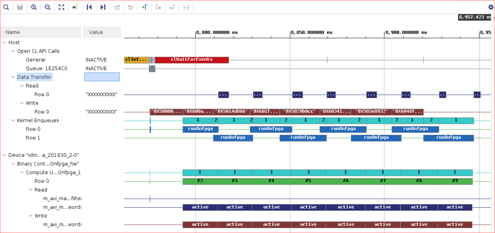

<p align="right"><a href="../../../../README.md">English</a> | <a>日本語</a></p>
<table class="sphinxhide">
 <tr>
   <td align="center"><h1>2020.2 Vitis™ アプリケーション アクセラレーション開発フロー チュートリアル</h1><a href="https://github.com/Xilinx/Vitis-Tutorials/tree/2020.1">2020.1 Vitis アプリケーション アクセラレーション開発フロー チュートリアル</a></td>
 </tr>
</table>

# 複数 DDR バンクの使用

前の手順では、FPGA に転送するドキュメントを複数のバッファーに分割してホストのデータ転送と FPGA での計算がオーバーラップするようにし、さらに FPGA からフラグをホストにすぐに送信して FPGA での計算と CPU でのスコアの計算がオーバーラップするようにしました。これにより、アプリケーションの実行時間が短縮されました。

ホストとカーネルが同じバンクに同時にアクセスしようとするため、メモリ競合が発生していることもわかりました。このセクションでは、複数の DDR バンクを設定して、カーネルのパフォーマンスを向上します。

Alveo カードには複数の DDR バンクがあり、複数のバンクを交互に使用することにより競合を最小限に抑えることができます。

* ホストは、ワードを DDR バンク 1 と DDR バンク 2 に交互に書き込みます。
* ホストがワードを DDR バンク 1 に書き込んでいるときに、カーネルは DDR バンク 2 からフラグを読み出します。
* ホストがドキュメントを DDR バンク 2 に書き込んでいるときに、カーネルは DDR バンク 1 からフラグを読み出します。

カーネルは DDR バンク 1 とバンク 2 から交互に読み出すので、`maxi` ポートは両方の DDR バンクに接続します。[カーネル ポートのメモリへのマッピング](https://japan.xilinx.com/html_docs/xilinx2020_2/vitis_doc/buildingdevicebinary.html#ejl1524519365386)で説明されるように、`v++ --link` コマンドでカーネル引数と DDR バンクの接続を構築する必要があります。この場合、`$LAB_WORK_DIR/makefile/connectivity.cfg` コンフィギュレーション ファイルで接続が指定されます。

    ```
    [connectivity]
    sp=runOnfpga_1.input_words:DDR[1:2]
    ```

- `-sp` オプションは、`input_words` が DDR バンク 1 と 2 の両方に接続されることを `v++` リンカーに指示します。接続が変更されたので、カーネルをビルドし直す必要があります。

## コードの変更

1. `$LAB_WORK_DIR/reference_files` に移動し、ファイル エディターで `run_sw_overlap_multiDDR.cpp` を開きます。

2. ホスト コードからワードを 2 つの DDR バンクに交互に送信する必要があります。ホスト コードでの DDR バンク割り当ては、OpenCL API へのザイリンクス ベンダー拡張でサポートされています。ザイリンクス拡張ポインター オブジェクト (`cl_mem_ext_ptr_t`) が 2 つ作成されます (`buffer_words_ext[0]` および `buffer_words_ext[1]`)。`flags` は、カーネルがアクセスできるように、バッファーが送信される DDR バンクを指定します。

   ```cpp
    cl_mem_ext_ptr_t buffer_words_ext[2];

    buffer_words_ext[0].flags = 1 | XCL_MEM_TOPOLOGY; // DDR[1]
    buffer_words_ext[0].param = 0;
    buffer_words_ext[0].obj   = input_doc_words;
    buffer_words_ext[1].flags = 2 | XCL_MEM_TOPOLOGY; // DDR[2]
    buffer_words_ext[1].param = 0;
    buffer_words_ext[1].obj   = input_doc_words;
   ```

3. 次のように、`DDR[1]` および `DDR[2]` に `buffer_doc_words[0]` および `buffer_doc_words[1]` を作成します。

   ```cpp
   buffer_doc_words[0] = cl::Buffer(context, CL_MEM_EXT_PTR_XILINX | CL_MEM_USE_HOST_PTR | CL_MEM_READ_ONLY, total_size*sizeof(uint), &buffer_words_ext[0]);
   buffer_doc_words[1] = cl::Buffer(context, CL_MEM_EXT_PTR_XILINX | CL_MEM_USE_HOST_PTR | CL_MEM_READ_ONLY, total_size*sizeof(uint), &buffer_words_ext[1]);
   buffer_inh_flags    = cl::Buffer(context, CL_MEM_USE_HOST_PTR | CL_MEM_WRITE_ONLY, total_size*sizeof(char),output_inh_flags);
   buffer_bloom_filter = cl::Buffer(context, CL_MEM_USE_HOST_PTR | CL_MEM_READ_ONLY, bloom_filter_size*sizeof(uint),bloom_filter);

   // Set buffer kernel arguments (needed to migrate the buffers in the correct memory)
   kernel.setArg(0, buffer_inh_flags);
   kernel.setArg(1, buffer_doc_words[0]);
   kernel.setArg(2, buffer_bloom_filter);

   // Make buffers resident in the device
   q.enqueueMigrateMemObjects({buffer_bloom_filter, buffer_doc_words[0], buffer_doc_words[1], buffer_inh_flags}, CL_MIGRATE_MEM_OBJECT_CONTENT_UNDEFINED);

   // Create sub-buffers, one for each transaction
   unsigned subbuf_doc_sz = total_doc_size/num_iter;
   unsigned subbuf_inh_sz = total_doc_size/num_iter;

   cl_buffer_region subbuf_inh_info[num_iter];
   cl_buffer_region subbuf_doc_info[num_iter];
   cl::Buffer subbuf_inh_flags[num_iter];
   cl::Buffer subbuf_doc_words[num_iter];

   for (int i=0; i<num_iter; i++) {
       subbuf_inh_info[i]={i*subbuf_inh_sz*sizeof(char), subbuf_inh_sz*sizeof(char)};
       subbuf_doc_info[i]={i*subbuf_doc_sz*sizeof(uint), subbuf_doc_sz*sizeof(uint)};
       subbuf_inh_flags[i] = buffer_inh_flags.createSubBuffer(CL_MEM_WRITE_ONLY, CL_BUFFER_CREATE_TYPE_REGION, &subbuf_inh_info[i]);
       // The doc words sub-buffers will be alternating in DDR[1] and DDR[2]
       subbuf_doc_words[i] = buffer_doc_words[i%2].createSubBuffer (CL_MEM_READ_ONLY,  CL_BUFFER_CREATE_TYPE_REGION, &subbuf_doc_info[i]);
   }
   ```

4. カーネル引数 input\_words は、`buffer_doc_words[0]` および `buffer_doc_words[1]` から作成されたサブバッファーの配列に交互に設定され、各カーネル実行でデータが DDR バンク 1 と 2 に交互に送信されます。

   ```cpp
   for (int i=0; i<num_iter; i++)
   {
     cl::Event buffDone, krnlDone, flagDone;
     total_size = subbuf_doc_info[i].size / sizeof(uint);
     load_filter = false;
     kernel.setArg(0, subbuf_inh_flags[i]);
     kernel.setArg(1, subbuf_doc_words[i]);
     kernel.setArg(3, total_size);
     kernel.setArg(4, load_filter);
     q.enqueueMigrateMemObjects({subbuf_doc_words[i]}, 0, &wordWait, &buffDone);
     wordWait.push_back(buffDone);
     q.enqueueTask(kernel, &wordWait, &krnlDone);
     krnlWait.push_back(krnlDone);
     q.enqueueMigrateMemObjects({subbuf_inh_flags[i]}, CL_MIGRATE_MEM_OBJECT_HOST, &krnlWait, &flagDone);
     flagWait.push_back(flagDone);
   }
   ```

### 8 ワードを並列処理するアプリケーションを実行

1. `makefile` ディレクトリに移動し、`make` コマンドを実行します。

   ```
    cd $LAB_WORK_DIR/makefile; make run STEP=multiDDR TARGET=hw PF=8 ITER=8
   ```

   次の出力が表示されます。

   ```
     Processing 1398.905 MBytes of data
     MultiDDR- Splitting data in 8 sub-buffers of 174.863 MBytes for FPGA processing
     --------------------------------------------------------------------
     Executed FPGA accelerated version  |   426.6388 ms   ( FPGA 175.113 ms )
     Executed Software-Only version     |   3058.8499 ms
     --------------------------------------------------------------------
     Verification: PASS
   ```

FPGA の全体的な時間は 230 ms から 175 ms に削減されました。

### プロファイル サマリ レポートおよびタイムライン トレースの確認

1. 次のコマンドを実行して、タイムライン トレース レポートを表示します。

   ```
   vitis_analyzer $LAB_WORK_DIR/build/multiDDR/kernel_8/hw/runOnfpga_hw.xclbin.run_summary
   ```

2. タイムライン トレース レポートの次の部分を表示します。

   

   - タイムライン トレースから、ホストは DDR に交互に書き込んでいるのがわかります。マウスを \[Data Transfer] → \[Write] のトランザクションの上に置くと、ホストがバンク 1 とバンク 2 に交互に書き込んでいるのがわかります。フラグのサイズは比較的小さいので、カーネルは常に DDR バンク 1 に書き込みます。
   - 複数のバンクを使用しない前の演習では、カーネルが前のエンキューで DDR に書き込んだフラグをホストが読み出すまで、カーネルは次のワードを読み出すことができませんでした。この演習では、これらのアクセスは異なる DDR バンクに対して実行されるので、同時に発生します。

   この結果、ホストからの転送、デバイスでの計算、フラグ データのホストへの送信を含む FPGA 計算時間が短縮されます。

3. プロファイル レポートで次を確認します。

   * \[Data Transfer: Host to Global Memory] セクションに、次のように示されます。

     - ホストからのグローバル メモリ書き込み転送に約 145.7 ms かかっており、これは 207 ms よりも短くなっています。

     - ホストからのグローバル メモリ読み出し転送には約 37.9 ms かかります。

       

   * \[Kernels \& Compute Unit: Compute Unit Utilization] セクションを見ると、CU 使用率が前の演習の 73% から 89.5% に増加しています。

     

   * \[Kernels \& Compute Unit: Compute Unit Utilization] を見ると、メモリ競合が前の演習の 21 ms から 5 ms に削減されています。

     

1 つの DDR を使用した前の手順と比較した場合、全体的なアプリケーションの向上はありません。FPGA 計算のパフォーマンスは向上しましたが、CPU のパフォーマンスに制限されるスコアの計算がボトルネックになっています。CPU を高速化できれば、パフォーマンスを向上できます。

これらの結果から、アプリケーションのスループットは 1399 MB/426 ms = 約 3.27 GB/s であることがわかります。ソフトウェアのみのバージョンと比較すると、7.2 倍 (3058 ms/426 ms) のパフォーマンスを得ることができました。

## まとめ

まとめこれで、このチュートリアルのすべての演習を終了しました。

このチュートリアルでは、ホスト アプリケーションとアクセラレータとのデータ転送を最適化することにより、パフォーマンスを大幅に向上できることを学びました。初期インプリメンテーションでは、ソフトウェア インプリメンテーションと比べて 4 倍のパフォーマンスが得られました。データの並列処理を利用してデータ転送と計算をオーバーラップさせ、複数の DDR バンクを使用して CPU での処理と FPGA での処理をオーバーラップさせることにより、アプリケーションのパフォーマンスをさらに 1.8 倍に、合計で 7.2 倍のアクセラレーションを達成できました。

---------------------------------------


<p align= center class="sphinxhide"><b><a href="../../../README.md">メイン ページに戻る</a> &mdash; <a href="../../README.md/">ハードウェア アクセラレータ チュートリアルの初めに戻る</a></b></p></br><p align="center" class="sphinxhide"><sup>Copyright&copy; 2020 Xilinx</sup></p>
<p align="center"><sup>この資料は 2021 年 2 月 8 日時点の表記バージョンの英語版を翻訳したもので、内容に相違が生じる場合には原文を優先します。資料によっては英語版の更新に対応していないものがあります。
日本語版は参考用としてご使用の上、最新情報につきましては、必ず最新英語版をご参照ください。</sup></p>
