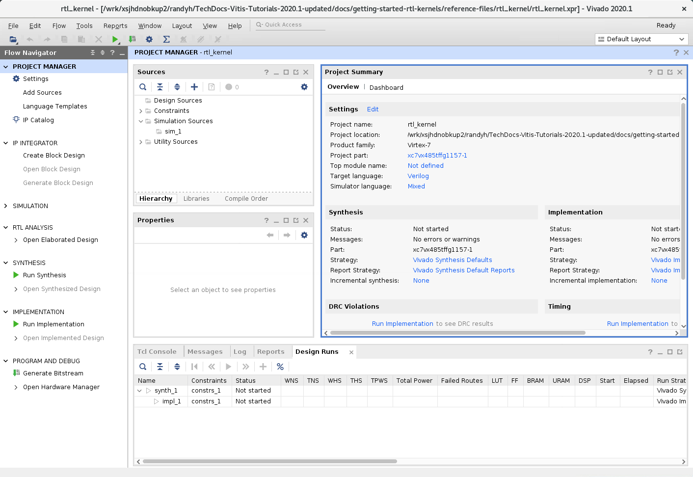
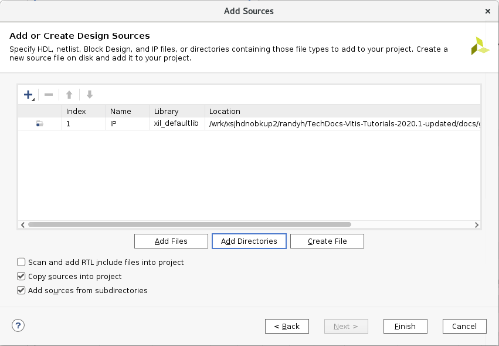
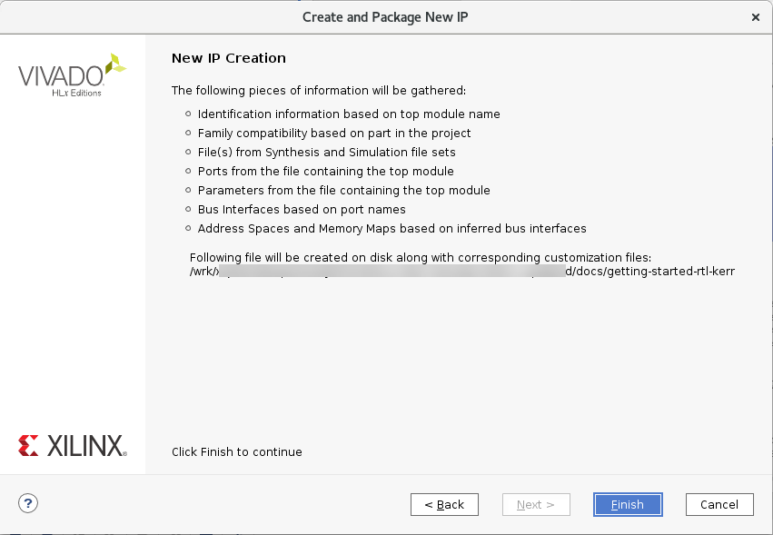
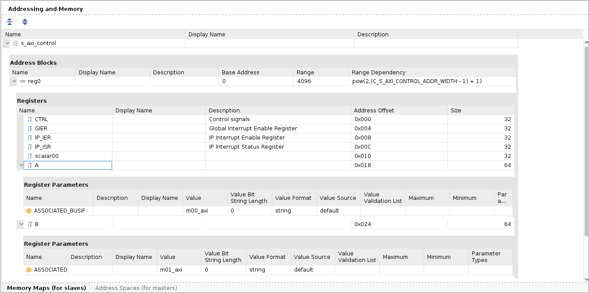
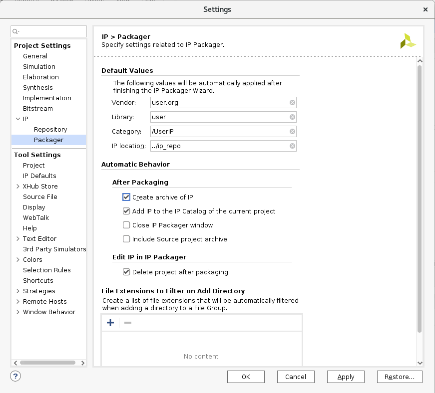

<p align="right"><a href="../../../../README.md">English</a> | <a>日本語</a></p>
<table class="sphinxhide">
 <tr>
   <td align="center"><h1>2020.2 Vitis™ アプリケーション アクセラレーション開発フロー チュートリアル</h1><a href="https://github.com/Xilinx/Vitis-Tutorials/tree/2020.1">2020.1 Vitis アプリケーション アクセラレーション開発フロー チュートリアル</a></td>
 </tr>
</table>

# IP/XO パッケージ フロー

この演習で説明するプロセスは、『Vitis 統合ソフトウェア プラットフォームの資料』 (UG1416) のアプリケーション アクセラレーション開発フローの [RTL カーネルの開発フロー](https://japan.xilinx.com/cgi-bin/docs/rdoc?v=2020.2;t=vitis+doc;d=devrtlkernel.html;a=rzv1504034325561)に説明されている IP/XO パッケージ フローに従っています。

> **重要:** チュートリアルのコマンドを実行する前に、『Vitis 統合ソフトウェア プラットフォームの資料』 (UG1416) のアプリケーション アクセラレーション開発フローの [Vitis 環境の設定](https://japan.xilinx.com/html_docs/xilinx2020_2/vitis_doc/settingupvitisenvironment.html#zks1565446519267)に説明されているように、次のコマンドを実行してツール環境を設定する必要があります。
>
> ```bash
>  #setup Xilinx Vitis tools. XILINX_VITIS and XILINX_VIVADO will be set in this step.
>  source <VITIS_install_path>/settings64.sh
>  #Setup Xilinx runtime. XILINX_XRT will be set in this step.
>  source <XRT_install_path>/setup.sh
> ```

## 新規プロジェクトの作成

1. `cd ./01-rtl_kernel_workflow` チュートリアル フォルダーに移動します。

2. ターミナル ウィンドウに `vivado` コマンドを入力して Vivado® IDE を起動します。

3. **\[Create Project]** をクリックするか、**\[File]** → **\[Project]** → **\[New]** をクリックします。

   New Project ウィザードが開きます。

4. **\[Next]** をクリックします。

5. New Project ウィザードの \[Project Name] ページで、次のように設定します。

   1. **\[Project name]** にプロジェクト名 (`rtl_kernel` など) を入力し、**\[Project location]** でプロジェクト ディレクトリを指定します。
   2. **\[Create Project subdirectory]** チェック ボックスをオンにします。
   3. **\[Next]** をクリックします。

6. \[Project Type] ページで、次のように設定します。

   1. **\[RTL Project]** をオンにします。
   2. **\[Do not specify sources at this time]** をオンにします。
   3. **\[Next]** をクリックします。

7. \[Default Part] ページで **\[Boards]** を選択し、\[Search] フィールドに「`U200`」と入力します。

   1. **\[Alveo U200 Data Center Accelerator Card]** を選択し、**\[Next]** をクリックします。

   \[New Project Summary] ページが表示されます。

8. プロジェクトの詳細を確認し、**\[Finish]** をクリックしてプロジェクトを作成します。

   Vivado IDE に作成した新規プロジェクトが開きます。

   


## カーネル ソースの追加

次に、プロジェクトに RTL ファイルを追加し、IP としてパッケージします。このチュートリアルでは RTL ファイルは提供されていますが、実際にはこの時点で独自の RTL コードを挿入します。

1. \[Sources] ウィンドウで **\[Add Sources]** ボタン () をクリックします。\[Add Sources] ダイアログ ボックスが開きますます。

2. **\[Add or create design sources]** をオンにし、**\[Next]** をクリックします。

3. **\[Add Directories]** をクリックし、`reference-files/src` の `IP` ディレクトリ (RTL ソースを含む) を選択します。

   > **注記:** ユーザーの RTL IP を追加するには、それに必要なフォルダーまたはファイルを指定します。

   

4. **\[Copy sources into project]** および **\[Add sources from subdirectories]** をオンにします。

5. **\[Finish]** をクリックします。

   ファイルがプロジェクトに追加され、Vivado Design Suite で `Vadd_A_B.v` がデザインの最上位ファイルとして認識されます。この RTL モジュールには、[概要](./README.md)で説明されている RTL カーネルの**ハードウェア インターフェイス要件**と互換性のあるインターフェイスが含まれます。これは、\[Sources] ウィンドウでファイルをダブルクリックしてコード エディター ウィンドウで開くと、`Vadd_A_B` モジュール定義に含まれます。

   ````
   module Vadd_A_B #(
     parameter integer C_S_AXI_CONTROL_ADDR_WIDTH = 12 ,
     parameter integer C_S_AXI_CONTROL_DATA_WIDTH = 32 ,
     parameter integer C_M00_AXI_ADDR_WIDTH       = 64 ,
     parameter integer C_M00_AXI_DATA_WIDTH       = 512,
     parameter integer C_M01_AXI_ADDR_WIDTH       = 64 ,
     parameter integer C_M01_AXI_DATA_WIDTH       = 512
   )
   ````

## IP パッケージャーを開く

ファイルをプロジェクトに追加したので、カーネルとして使用する IP をパッケージできます。

1. **\[Tools]** → **\[Create and Package New IP]** をクリックします。

2. **\[Next]** をクリックします。

3. **\[Package your current project]** をオンにして **\[Next]** をクリックします。

4. \[IP location] で IP がパッケージされるデフォルト ディレクトリを確認します。後の手順で `package_xo` コマンドを実行する際は、このディレクトリを変更する必要があります。

5. **\[Next]** をクリックします。サマリ ページが表示されます。

6. サマリを確認し、**\[Finish]** をクリックします。

   \[Package IP] ウィンドウが表示されます。

   ![[Package IP] ウィンドウ](./images/package_ip_interface.png)

## ポートおよびインターフェイスの編集

1. \[Packaging Steps] の下から **\[Ports and Interfaces]** を選択します。\[Ports and Interfaces] ページが表示されます。

2. `m00_axi` インターフェイスを右クリックし、**\[Associate Clocks]** をクリックします。

   \[Associate Clocks] ダイアログ ボックスが開き、使用可能なクロックのリストが表示されます。この場合、AXI インターフェイスに関連付ける `ap_clk` インターフェイスのみがリストされます。

3. `ap_clk` を選択し、**\[OK]** クリックします。

4. プロセスを繰り返し、`ap_clk` を `m01_axi` インターフェイス、`s_axi_control` インターフェイスに関連付けます。

5. **\[OK]** をクリックして、\[Edit Interface] ダイアログ ボックスを閉じます。

## 制御レジスタおよびアドレス オフセットの追加

デザインのインターフェイスには、制御レジスタとアドレス オフセットも追加する必要があります。これは、\[Package IP] ウィンドウの \[Addressing and Memory] ページで実行します。  次の属性の制御レジスタを追加する必要があります。

| 名前| 説明| オフセット| サイズ (ビット数)
|----------|----------|----------|----------
| CTRL| 制御信号| 0x000| 32
| GIER| グローバル割り込みイネーブル レジスタ| 0x004| 32
| IP\_IER| IP 割り込みイネーブル レジスタ| 0x008| 32
| IP\_ISR| IP 割り込みステータス レジスタ| 0x00C| 32
| scalar00| スカラー値| 0x010| 32
| A| ポインター引数| 0x018| 64
| B| ポインター引数| 0x024| 64

1. \[Packaging Steps] の下から **\[Addressing and Memory]** を選択します。\[Addressing and Memory] ページが表示されます。

2. \[Address Blocks] の下から **\[reg0]** を右クリックし、**\[Add Reg]** をクリックします。

3. \[Add Register] ダイアログ ボックスにレジスタ名を入力し、**\[OK]** をクリックします。

   > **ヒント:** CTRL、GIER など、上記の表にリストされているすべてのレジスタを追加する必要があります。\[Tcl Console] ウィンドウで次の Tcl コマンドを使用し、必要なレジスタを追加することもできます。

   ```
      ipx::add_register CTRL [ipx::get_address_blocks reg0 -of_objects [ipx::get_memory_maps s_axi_control -of_objects [ipx::current_core]]]
      ipx::add_register GIER [ipx::get_address_blocks reg0 -of_objects [ipx::get_memory_maps s_axi_control -of_objects [ipx::current_core]]]
      ipx::add_register IP_IER [ipx::get_address_blocks reg0 -of_objects [ipx::get_memory_maps s_axi_control -of_objects [ipx::current_core]]]
      ipx::add_register IP_ISR [ipx::get_address_blocks reg0 -of_objects [ipx::get_memory_maps s_axi_control -of_objects [ipx::current_core]]]
      ipx::add_register scalar00 [ipx::get_address_blocks reg0 -of_objects [ipx::get_memory_maps s_axi_control -of_objects [ipx::current_core]]]
      ipx::add_register A [ipx::get_address_blocks reg0 -of_objects [ipx::get_memory_maps s_axi_control -of_objects [ipx::current_core]]]
      ipx::add_register B [ipx::get_address_blocks reg0 -of_objects [ipx::get_memory_maps s_axi_control -of_objects [ipx::current_core]]]
   ```

   \[Addressing and Memory] ページでレジスタを追加したら、説明、オフセット、レジスタのサイズを追加する必要があります。

   

4. 各レジスタの **\[Description]** フィールドをクリックし、上の表に示す説明を入力します。

5. **\[Address Offset]** フィールドをクリックし、オフセットを入力します。

6. **\[Size]** フィールドをクリックし、サイズを入力します。

   > **ヒント:** 説明はオプションですが、オフセットとサイズは必須です。

   すべてのレジスタの属性を上の表に従って入力したら、各ポインター引数に M\_AXI インターフェイスを割り当てる必要があります。

7. \[Registers] の表でレジスタ `A` を右クリックし、**\[Add Register Parameter]** をクリックします。

   1. \[Add Register Parameter] ダイアログ ボックスで、ASSOCIATED\_BUSIF パラメーターを追加して **\[OK]** をクリックします。  
このパラメーターは、バス インターフェイスをレジスタに関連付けます。
   2. レジスタ `B` に対して、上記の 2 手順を繰り返します。
   3. ASSOCIATED\_BUSIF の \[Value] フィールドに、レジスタ `A` には `m00_axi`、レジスタ `B` には `m01_axi` と入力します。

## 整合性のチェック、プロパティの割り当て、および IP のパッケージ

1. \[Packaging Steps] の下から **\[Review and Package]** を選択します。\[Review and Package] ページが表示されます。

2. \[Tcl Console] ウィンドウで次のコマンドを使用してプロパティを追加します。

   ```
   set core [ipx::current_core]
   set_property sdx_kernel true $core
   set_property sdx_kernel_type rtl $core
   ```

3. これらのプロパティを追加したら、**ipx::check\_integrity** コマンドを実行します (オプション)。IP のチェックで問題は検出されないはずです。

   IP をパッケージする準備ができました。その前に、IP をパッケージしたときにアーカイブ ファイルが生成されるように設定されているかを確認します。

4. \[Review and Package] ページの **\[After Packaging]** セクションを見ます。アーカイブが生成されるように設定されていない場合は、アーカイブの生成をイネーブルにする必要があります。

5. \[Review and Package] ページで、**\[Edit packaging settings]** をクリックします。\[Settings] ダイアログ ボックスの \[IP] → \[Package] ページが表示されます。

6. \[After Packaging] セクションで **\[Create archive of IP]** をオンにし、**\[OK]** をクリックします。

   

   \[Review and Package] ページがアップデートされ、アーカイブが作成されることが示されます。

7. **\[Package IP]** をクリックします。

   IP をパッケージすると、IP が正常にパッケージ化されたことを示すダイアログボックスが表示されます。

## package\_xo を使用したカーネルの作成

Vivado IP をパッケージしたので、**package\_xo** コマンドを実行して Vitis カーネル (`.xo`) ファイルを作成できます。`package_xo` コマンドは、IP ファイルと `kernel.xml` ファイルを生成された `.xo` ファイルにパッケージします。

1. \[Tcl Console] ウィンドウに次のコマンドを入力します。

   ```
   package_xo  -force -xo_path <tutorial_path>/rtl_kernel/rtl_kernel.srcs/sources_1/imports/Vadd_A_B.xo -kernel_name Vadd_A_B -ip_directory <tutorial_path>/rtl_kernel/rtl_kernel.srcs/sources_1/imports/IP  -ctrl_protocol ap_ctrl_hs
   ```

   説明:

   * **package\_xo**: Vivado IP からコンパイル済みオブジェクト ファイル (.xo) を作成するコマンド。
   * **-force**: 同じ名前のカーネル ファイルが存在する場合に上書きします。
   * **-xo\_path**: XO ファイルのパスと名前を指定します。
   * **-kernel\_name**: 作成するカーネルの名前を指定します。RTL モジュール名と一致している必要があります。
   * **-ip\_directory**: パッケージ済み Vivado IP を検索するパスを指定します。
   * \-**ctrl\_protocol**: カーネルがインプリメントする制御プロトコルを指定します。これは、サポートされる制御プロトコルの 1 つですが、このチュートリアルでは、ap\_ctrl\_hs にする必要があります。

> **ヒント:** `package_xo` で -`kernel_xml` オプションを使用すると、必要に応じて既存の `kernel.xml` ファイルを指定できます。

2. `package_xo` コマンドが完了したら、`reference-files/rtl_kernel/rtl_kernel.srcs/sources_1/imports` フォルダーに移動して `Vadd_A_B.xo` ファイルを確認します。このファイルは、このチュートリアルの後の演習で説明するように、Vitis アプリケーション アクセラレーション フローで使用できます。

## 次の手順

次の手順では、[RTL Kernel ウィザード フロー](./vitis_ide.md)を使用します。このウィザードは先ほど作成した Vitis カーネル (`.xo`) ファイルを再作成しますが、別の方法を使用します。</br>

<hr/>
<p align="center"><sup>Copyright&copy; 2020 Xilinx</sup></p>
<p align= center class="sphinxhide"><b><a href="../../../README.md">メイン ページに戻る</a> &mdash; <a href="../../README.md/">ハードウェア アクセラレータ チュートリアルの初めに戻る</a></b></p></br>
<p align="center"><sup>この資料は 2021 年 2 月 8 日時点の表記バージョンの英語版を翻訳したもので、内容に相違が生じる場合には原文を優先します。資料によっては英語版の更新に対応していないものがあります。
日本語版は参考用としてご使用の上、最新情報につきましては、必ず最新英語版をご参照ください。</sup></p>
