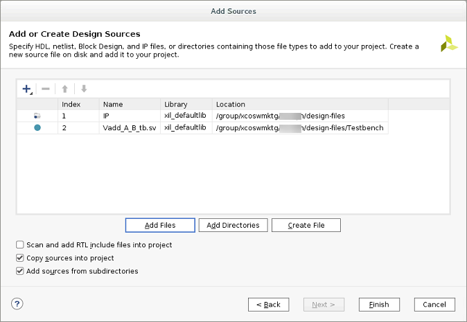
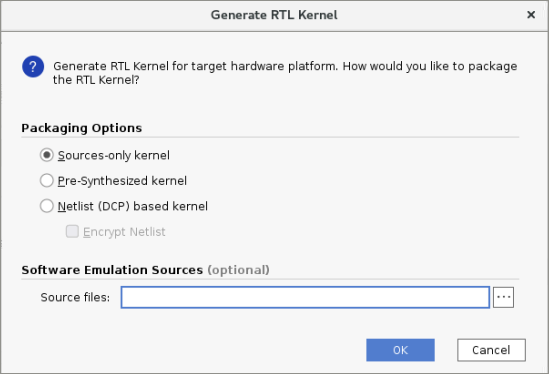

<p align="right"><a href="../../../../README.md">English</a> | <a>日本語</a></p>
<table class="sphinxhide">
 <tr>
   <td align="center"><h1>2020.2 Vitis™ アプリケーション アクセラレーション開発フロー チュートリアル</h1><a href="https://github.com/Xilinx/Vitis-Tutorials/tree/2020.1">2020.1 Vitis アプリケーション アクセラレーション開発フロー チュートリアル</a></td>
 </tr>
</table>

# Vivado Design Suite — RTL デザイン

Vivado Design Suite IDE が開くと、**\[Sources]** ウィンドウに RTL カーネル ウィザードで自動的に生成されたソース ファイルが表示されます。これらは、RTL カーネルを作成するのに必要な RTL ファイルの構造を示すプレースホルダー ファイルです。これらのサンプル ファイルを使用して独自の RTL モジュールを構築するか、既存のファイルに置き換えることができます。

## サンプル ファイルの削除

デザイン ファイルをプロジェクトに追加する前に、RTL Kernel ウィザードで生成されたサンプル デザインを削除する必要があります。

1. Vivado Design Suite IDE の \[Sources] ウィンドウで **\[Compile Order]** → **\[Synthesis]** をクリックし、\[Design Sources] ツリーを展開表示します。

2. 8 つのソース ファイルすべてを選択して右クリックし、**\[Remove File from Project]** をクリックします。

3. \[Remove Sources] ダイアログ ボックスで **\[OK]** をクリックして、プロジェクトからファイルを削除します。

   \[Invalid Top Module] ダイアログ ボックスが開きます。

4. **\[OK]** をクリックします。

5. 同じウィンドウでシミュレーションするソースを変更して、`Vadd_A_B_tb.sv` ファイルのみを削除します。

6. 手順 3 と 4 を繰り返します。

## プロジェクトへの RTL ソースの追加

> **注記**: RTL カーネル プロジェクトから自動生成された RTL ファイルを削除したら、独自の RTL IP ファイルをプロジェクトに追加できます。このチュートリアルでは RTL IP ファイルが提供されていますが、実際には独自の RTL IP ファイルとサポートされるファイル階層を挿入します。

1. **\[Design Sources]** を右クリックし、**\[Add Sources]** をクリックします。Add Sources ウィザードが開きますます。

2. **\[Add or create design sources]** をオンにし、**\[Next]** をクリックします。

3. **\[Add Directories]** をクリックし、RTL ソースを含む `reference-files`/`src`/`IP` ディレクトリ (RTL ソースを含む) を指定します。

   > **注記:** 独自 RTL IP を追加するには、その必要なフォルダーまたはファイルを指定します。

4. **\[Add Files]** をクリックし、`testbench` に含まれる **\[Vadd\_A\_B\_tb.sv]** を選択します。  



5. **\[Finish]** をクリックして、現在のプロジェクトにファイルを追加します。

6. プロジェクトの階層を確認するには、\[Sources] ウィンドウで **\[Hierarchy]** タブをクリックします。

   > **重要:** テストベンチが最上位デザイン ファイルとして選択されています。テストベンチには IP が含まれるのでこれは技術的には問題ありませんが、ここではテストベンチを RTL カーネルの最上位に指定しないでください。

7. **\[Vadd\_A\_B\_tb.sv]** を右クリックし、**\[Move to Simulation Sources]** をクリックします。

   これでテストベンチがシミュレーションで使用できるように定義され、Vivado Design Suite で `Vadd_A_B.v` がデザインの新しい最上位ファイルとして認識されるようになります。この RTL IP には、Vitis コア開発キット内で RTL カーネルの要件と互換性のあるインターフェイスが含まれます。次のコードに示すように、これはモジュール `Vadd_A_B` の定義部分に記述されています。

   ```verilog
   module Vadd_A_B #(
     parameter integer C_S_AXI_CONTROL_ADDR_WIDTH = 12 ,
     parameter integer C_S_AXI_CONTROL_DATA_WIDTH = 32 ,
     parameter integer C_M00_AXI_ADDR_WIDTH       = 64 ,
     parameter integer C_M00_AXI_DATA_WIDTH       = 512,
     parameter integer C_M01_AXI_ADDR_WIDTH       = 64 ,
     parameter integer C_M01_AXI_DATA_WIDTH       = 512
   )
   (
     input  wire                                    ap_clk               ,
     output wire                                    m00_axi_awvalid      ,
     input  wire                                    m00_axi_awready      ,
     output wire [C_M00_AXI_ADDR_WIDTH-1:0]         m00_axi_awaddr       ,
     output wire [8-1:0]                            m00_axi_awlen        ,
     output wire                                    m00_axi_wvalid       ,
     input  wire                                    m00_axi_wready       ,
     output wire [C_M00_AXI_DATA_WIDTH-1:0]         m00_axi_wdata        ,
     output wire [C_M00_AXI_DATA_WIDTH/8-1:0]       m00_axi_wstrb        ,
     output wire                                    m00_axi_wlast        ,
     input  wire                                    m00_axi_bvalid       ,
     output wire                                    m00_axi_bready       ,
     output wire                                    m00_axi_arvalid      ,
     input  wire                                    m00_axi_arready      ,
     output wire [C_M00_AXI_ADDR_WIDTH-1:0]         m00_axi_araddr       ,
     output wire [8-1:0]                            m00_axi_arlen        ,
     input  wire                                    m00_axi_rvalid       ,
     output wire                                    m00_axi_rready       ,
     input  wire [C_M00_AXI_DATA_WIDTH-1:0]         m00_axi_rdata        ,
     input  wire                                    m00_axi_rlast        ,
     // AXI4 master interface m01_axi
     output wire                                    m01_axi_awvalid      ,
     input  wire                                    m01_axi_awready      ,
     output wire [C_M01_AXI_ADDR_WIDTH-1:0]         m01_axi_awaddr       ,
     output wire [8-1:0]                            m01_axi_awlen        ,
     output wire                                    m01_axi_wvalid       ,
     input  wire                                    m01_axi_wready       ,
     output wire [C_M01_AXI_DATA_WIDTH-1:0]         m01_axi_wdata        ,
     output wire [C_M01_AXI_DATA_WIDTH/8-1:0]       m01_axi_wstrb        ,
     output wire                                    m01_axi_wlast        ,
     input  wire                                    m01_axi_bvalid       ,
     output wire                                    m01_axi_bready       ,
     output wire                                    m01_axi_arvalid      ,
     input  wire                                    m01_axi_arready      ,
     output wire [C_M01_AXI_ADDR_WIDTH-1:0]         m01_axi_araddr       ,
     output wire [8-1:0]                            m01_axi_arlen        ,
     input  wire                                    m01_axi_rvalid       ,
     output wire                                    m01_axi_rready       ,
     input  wire [C_M01_AXI_DATA_WIDTH-1:0]         m01_axi_rdata        ,
     input  wire                                    m01_axi_rlast        ,
     // AXI4-Lite slave interface
     input  wire                                    s_axi_control_awvalid,
     output wire                                    s_axi_control_awready,
     input  wire [C_S_AXI_CONTROL_ADDR_WIDTH-1:0]   s_axi_control_awaddr ,
     input  wire                                    s_axi_control_wvalid ,
     output wire                                    s_axi_control_wready ,
     input  wire [C_S_AXI_CONTROL_DATA_WIDTH-1:0]   s_axi_control_wdata  ,
     input  wire [C_S_AXI_CONTROL_DATA_WIDTH/8-1:0] s_axi_control_wstrb  ,
    input  wire                                    s_axi_control_arvalid,
    output wire                                    s_axi_control_arready,
    input  wire [C_S_AXI_CONTROL_ADDR_WIDTH-1:0]   s_axi_control_araddr ,
    output wire                                    s_axi_control_rvalid ,
    input  wire                                    s_axi_control_rready ,
    output wire [C_S_AXI_CONTROL_DATA_WIDTH-1:0]   s_axi_control_rdata  ,
    output wire [2-1:0]                            s_axi_control_rresp  ,
    output wire                                    s_axi_control_bvalid ,
    input  wire                                    s_axi_control_bready ,
    output wire [2-1:0]                            s_axi_control_bresp  ,
    output wire                                    interrupt
   )
   ```

   これで XML ファイルと RTL ソースを使用して、カーネルを XO ファイルにパッケージできるようになりました。

## RTL 検証

RTL デザインをカーネル XO ファイルとしてパッケージする前に、検証 IP、ランダムおよびプロトコル チェッカーなどの標準 RTL 検証方法を使用して、完全に検証しておきます。

このチュートリアルでは、Vector-Accumulate カーネルの RTL コードは既に検証済みです。

この手順を飛ばして RTL カーネル IP のパッケージを開始する場合は、次のセクションに進んでください。

> **注記:** Vivado IP カタログに含まれる AXI Verification IP (AXI VIP) は、AXI インターフェイスを検証するのに役立ちます。このチュートリアルに含まれるテストベンチには、この AXI VIP が組み込まれています。

このテストベンチを使用して Vector Addition カーネルを検証する手順は、次のとおりです。

1. Flow Navigator で **\[Run Simulation]** を右クリックし、**\[Simulation Settings]** をクリックします。

2. \[Settings] ダイアログ ボックスで **\[Simulation]** をクリックします。

3. 次の図に示すように **\[xsim.simulate.runtime]** 値を \[`all`] に変更します。

   ![[Simulation Settings]](./images/simulation_settings.PNG)

4. **\[OK]** をクリックします。

5. Flow Navigator で **\[Run Simulation]** → **\[Run Behavioral Simulation]** をクリックします。

   Vivado シミュレーションが実行されて終了したら、\[Tcl Console] ウィンドウに次のようなメッセージが表示されます。エラー メッセージはすべて無視します。

   `Test Completed Successfully` というメッセージで、カーネルの検証が正しく終了したことを確認できます。

   > **注記:** このメッセージを表示するため、\[Tcl Console] ウィンドウをスクロールアップする必要があることもあります。

## RTL カーネル IP のパッケージ

これで Vivado Design Suite プロジェクトをカーネル XO ファイルとしてパッケージして、Vitis IDE で使用する準備ができました。

1. Flow Navigator で **\[Generate RTL Kernel]** をクリックします。次の図に示す \[Generate RTL Kernel] ダイアログ ボックスが開きます。

   

   > **パッケージ オプションの詳細**
   >
   > - **\[Sources-only kernel]**: RTL デザイン ソースを直接使用してカーネルをパッケージします。
   > - **\[Pre-Synthesized kernel]**: RTL デザイン ソースをキャッシュされた合成済み出力を使用してパッケージします。キャッシュされた合成済み出力を使用すると、後のリンク フローででカーネルを再合成する必要がなくなり、実行時間が短縮されます。
   > - **\[Netlist (DCP) based kernel]**: カーネルの合成済み出力により生成されたネットリストを使用して、カーネルをブラック ボックスとしてパッケージします。この出力はオプションで暗号化して、IP を保護してサードパーティに提供することも可能です。
   > - **\[Software Emulation Sources]** (オプション): ソフトウェア エミュレーションで使用可能なソフトウェア モデルを使用して、RTL カーネルをパッケージします。このチュートリアルでは、ソフトウェア モデルを使用しないので、このオプションは空のままにします。

2. このチュートリアルでは、**\[Sources-only kernel]** を選択します。

3. **\[OK]** をクリックします。  
Vivado ツールで `package_xo` コマンドを使用して、XO ファイルを生成します。

   ```
   package_xo -xo_path Vadd_A_B.xo -kernel_name Vadd_A_B -kernel_xml kernel.xml -ip_directory ./ip/
   ```

   プロセスの進行状況は \[Tcl Console] ウィンドウで確認できます。

4. メッセージが表示されたら、Vivado Design Suite を終了します。

   Vivado ツールが閉じ、Vitis IDE に戻ります。RTL カーネルが開いている Vitis IDE プロジェクトにインポートされ、カーネル ウィザードのダイアログ ボックスが表示されます。

5. **\[OK]** をクリックします。

## 次の手順

Vivado IP から RTL カーネル (.xo) ファイルを作成したので、[RTL カーネルを Vitis アプリケーションでテスト](./using_the_rtl_kernel.md)します。</br>

<hr/>
<p align="center"><sup>Copyright&copy; 2020 Xilinx</sup></p>
<p align= center class="sphinxhide"><b><a href="../../../README.md">メイン ページに戻る</a> &mdash; <a href="../../README.md/">ハードウェア アクセラレータ チュートリアルの初めに戻る</a></b></p></br>
<p align="center"><sup>この資料は 2021 年 2 月 8 日時点の表記バージョンの英語版を翻訳したもので、内容に相違が生じる場合には原文を優先します。資料によっては英語版の更新に対応していないものがあります。
日本語版は参考用としてご使用の上、最新情報につきましては、必ず最新英語版をご参照ください。</sup></p>
