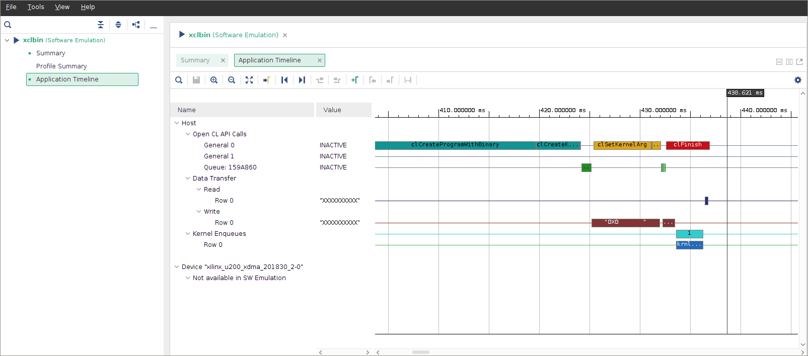
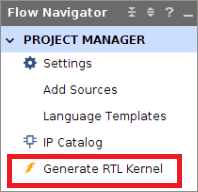
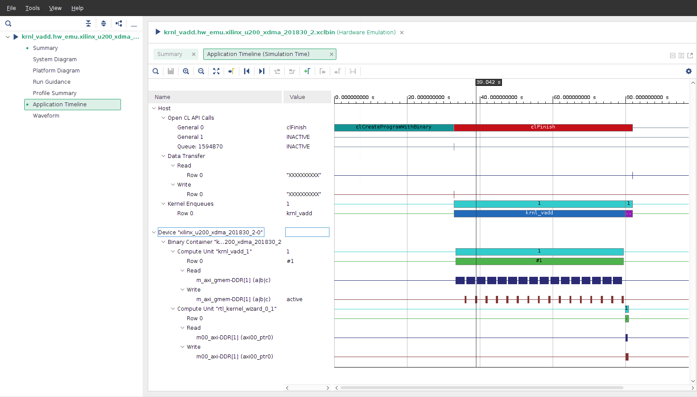

<p align="right"><a href="../../../../README.md">English</a> | <a>日本語</a></p>
<table class="sphinxhide">
 <tr>
   <td align="center"><h1>2020.2 Vitis™ アプリケーション アクセラレーション開発フロー チュートリアル</h1><a href="https://github.com/Xilinx/Vitis-Tutorials/tree/2020.1">2020.1 Vitis アプリケーション アクセラレーション開発フロー チュートリアル</a></td>
 </tr>
</table>

# C カーネルと RTL カーネルの混合

## 概要

Vitis™ コア開発キットでは、アプリケーション プログラムがホスト アプリケーションとハードウェア アクセラレーションされたカーネル間で分割されます。ホスト アプリケーションは OpenCL™ API 呼び出しを使用して C/C++ で開発されますが、ハードウェア カーネルは C/C++、OpenCL C、または RTL で開発されます。Vitis コア開発キット アプリケーションでは、異なる言語で開発したカーネルを組み合わせて使用できます。ホスト コードは、カーネルの開発方法には関係ありませんが、同じ関数呼び出しを使用します。

## チュートリアルの概要

このチュートリアルでは、C++ で設計されたカーネルと RTL で設計されたカーネルの 2 つのカーネルを使用するアプリケーションについて説明します。ホスト コードは、これらのカーネルに同じようにアクセスします。

このチュートリアルは、次の 2 つのセクションに分割されます。

- 1 つの C++ ベース カーネルを使用するアプリケーション (ホストおよびカーネル) をビルドし、カーネル関数呼び出しも含めたホスト コードを確認します。
- RTL ベースのカーネルをアプリケーションに追加し、  追加したカーネルへの関数呼び出しも含め、アップデートしたホスト コードを確認します。

どちらの手順でも、アプリケーションは makefile を使用してビルドします。ソフトウェア エミュレーションは手順 1 で、ハードウェア エミュレーションは手順 2 で実行します。どちらの手順でも、生成されたアプリケーション タイムラインを確認し、カーネルがホスト アプリケーションから呼び出されて実行されることを確認します。

ホスト コードと C++ カーネル コードは提供されています。RTL コードは RTL Kernel ウィザードで生成します。

## 開始前の確認事項

このチュートリアルでは、次を使用します。

- BASH Linux シェル コマンド。
- 2020.1 Vitis コア開発キット リリースおよび xilinx\_u200\_xdma\_201830\_2 プラットフォーム。必要であれば、ほかのバージョンおよびプラットフォームを使用するように変更することもできます。

> **重要:**
>
> * 例を実行する前に、『Vitis 統合ソフトウェア プラットフォームの資料』 (UG1416) のアプリケーション アクセラレーション開発フローの[インストール](https://japan.xilinx.com/html_docs/xilinx2020_2/vitis_doc/acceleration_installation.html#vhc1571429852245)の手順に従って、Vitis コア開発キットをインストールしてください。
> * ザイリンクス Alveo™ データセンター アクセラレータ カードでアプリケーションを実行する場合は、[Alveo ポートフォリオ](https://japan.xilinx.com/products/boards-and-kits/alveo.html) ページの手順に従って、カードとソフトウェア ドライバーを正しくインストールしてください。

サンプルを実行する前に、インストールに示すように Vitis コア開発キットをインストールしておく必要があります。

```bash
  #setup Xilinx Vitis tools, XILINX_VITIS and XILINX_VIVADO will be set in this step. source <VITIS install path>/settings64.sh. for example:
  source /opt/Xilinx/Vitis/2020.2/settings64.sh
  #Setup runtime. XILINX_XRT will be set in this step
  source /opt/xilinx/xrt/setup.sh
```

### チュートリアル リファレンス ファイルの入手

1. リファレンス ファイルを入手するには、ターミナルに `git clone https://github.com/Xilinx/Vitis-Tutorials` と入力します。
2. `Hardware_Accelerators/Feature_Tutorials/02-mixing-c-rtl-kernels` ディレクトリに移動し、`reference-files` ディレクトリにアクセスします。

## C++ ベースのカーネルを使用したアプリケーションのビルド

この手順では、makefile を使用してホスト コードと C++ カーネルを含むアプリケーションをビルドします。アプリケーションのビルドの概要は、[Vitis フロー 101 チュートリアル](https://github.com/Xilinx/Vitis-Tutorials/tree/master/Getting_Started/Vitis)にを参照してください。

### C++ ベースのカーネル

C ベースのカーネルは 2 つの入力ベクターを追加し、出力を生成します。ソース コードは、次のディレクトリに含まれます。

```
./reference-files/src/kernel_cpp/
```

makefile はこのカーネルをビルドし、ホスト コードからアクセス可能なハードウェア プラットフォーム (`xclbin`) に追加します。

### ホスト コード

手順 1 のホスト コード (`host_step1.cpp`) は、次のディレクトリに含まれます。

```
./reference-files/src/host/
```

このホスト コードは、プラットフォームを設定し、グローバル メモリ バッファーを定義してカーネルに接続します。このホスト コードには、次に説明する 4 つの OpenCL API 呼び出しがあります。`host_step1.cpp` ファイルを開いてこれらの呼び出しを表示します。

- 1 つ目は 189 ～ 191 行目のコードで、実行するプログラムを作成します。C++ ベース カーネルのみを含むバイナリ コンテナーが使用されます。

  ```
  cl::Program::Binaries bins;
  bins.push_back({buf,nb});
  cl::Program program(context, devices, bins);
  ```

- 2 つ目は 195 行目のコードで、プログラムから C++ の krnl\_vadd カーネル オブジェクトを取得し、krnl\_vector\_add という名前を付けます。これにより、ホストがカーネルを使用できるようになります。

  ```
  cl::Kernel krnl_vector_add(program,"krnl_vadd");
  ```

- 3 つ目は 213 ～ 216 行目のコードで、krnl\_vector\_add カーネル引数をバッファーに割り当てます。

  ```
  krnl_vector_add.setArg(0,buffer_a);
  krnl_vector_add.setArg(1,buffer_b);
  krnl_vector_add.setArg(2,buffer_result);
  krnl_vector_add.setArg(3,DATA_SIZE);
  ```

- 引数の番号 0、1、2、3 は、`krnl_vadd.cpp` に含まれる次の `krnl_vadd` 定義引数の順序と同じです。

  > **注記:** 引数 `a` および `b` は入力で、`c` が出力です。

  ```
  void krnl_vadd(
                int* a,
                int* b,
                int* c,
                const int n_elements)
  ```

- 4 つ目は 220 目のコードで、次の OpenCL API により krnl\_vector\_add カーネルが起動します。

  ```
  q.enqueueTask(krnl_vector_add);
  ```

ホスト コードのプログラミングの詳細は、『Vitis 統合ソフトウェア プラットフォームの資料』 (UG1416) のアプリケーション アクセラレーション開発フローの[アプリケーションの開発](https://japan.xilinx.com/cgi-bin/docs/rdoc?v=2020.2;t=vitis+doc;d=lhv1569273988420.html)を参照してください。

### アプリケーションのビルド

1. ソフトウェア エミュレーションをターゲットにするアプリケーションをビルドするには、`./reference-files/run1` ディレクトリから次の makefile コマンドを実行します。

   ```bash
   make all TARGET=sw_emu
   ```

   これで、ホスト ソフトウェアと、ソフトウェア エミュレーションをターゲットにするハードウェア バイナリの両方がビルドされます。この makefile はエミュレーション中に使用するプラットフォーム JSON エミュレーション ファイルも生成します。

### エミュレーションの実行

エミュレーション中は、ホストおよびデバイス イベントを含むアプリケーション タイムライン データが収集されます。これらのデータは、エミュレーションの終了後に確認できます。アプリケーション タイムライン データの収集は、エミュレーションを実行する前に、`xrt.ini` ファイルで timeline\_trace=true オプションを設定してイネーブルにしておく必要があります。

```
[Debug]
profile=true
timeline_trace=true
```

このファイルは既に作成されており、`run1` および `run2` ディレクトリに含まれます。

1. デザインでソフトウェア エミュレーションを実行するには、次のコマンドを実行するように XCL\_EMULATION\_MODE 環境変数を設定します。

   ```bash
   export XCL_EMULATION_MODE=sw_emu
   ```

2. `run1` ディレクトリ内からソフトウェア エミュレーションを実行するには、次のコマンドを実行します。

   ```bash
   ./host krnl_vadd.sw_emu.xilinx_u200_xdma_201830_2.xclbin
   ```

   アプリケーションが問題なく終了すると、\[Console] ウィンドウに次のメッセージが表示されます。

   `TEST WITH ONE KERNEL PASSED`

### アプリケーション タイムラインの確認

ソフトウェア エミュレーション中に生成されたアプリケーション タイムラインを開き、ホスト イベントとカーネルの実行を表示します。

1. アプリケーション タイムラインを表示するには、`run1` ディレクトリから次のコマンドを実行して Vitis アナライザーを開きます。

   ```
   vitis_analyzer xclbin.run_summary
   ```

2. 左側の **\[Application Timeline]** オプションをクリックして、アプリケーションタイムラインを表示します。 

3. 確認したら、\[Application Timeline] ビューを閉じます。

   > **注記:** 計算ユニットは、FPGA 上のカーネルのインスタンシエーションです。

#### 手順のサマリ

手順 1 では、次を実行しました。すべてのコマンドを `./reference-files/run1` ディレクトリで実行しました。

```bash
# Build the application
make all TARGET=sw_emu

# Set XCL_EMULATION_MODE environment variable for software emulation
export XCL_EMULATION_MODE=sw_emu

# Run software emulation
./host krnl_vadd.sw_emu.xilinx_u200_xdma_201830_2.xclbin

# View Application Timeline Trace in Vitis Analyzer
vitis_analyzer xclbin.run_summary
```

## C++ および RTL ベースのカーネルを使用したアプリケーションのビルド

C++ ベースのカーネルを使用してアプリケーションをビルドして実行したので、次にアプリケーションをアップデートして RTL ベースのカーネルを含めます。

前のセクションと同様、ビルドしてエミュレーションした後、生成されたアプリケーション タイムラインを確認します。カーネルがどのように設計されたかに関係なく、カーネルがビルドされた後、ホスト コードは同様の関数呼び出しを使用してカーネルにアクセスします。

### RTL ベースのカーネル

まず、RTL Kernel ウィザードを使用して RTL ベースのカーネルを作成してパッケージします。デフォルトでは、1 ずつ増加するカーネルが作成されます。このチュートリアルでは、このカーネルを使用します。ウィザードを使用すると、RTL デザインをカーネル オブジェクト ファイル (XO) にパッケージするために必要な手順が自動化されます。

RTL Kernel ウィザードの手順に従うと、RTL ベースのカーネルをすばやく生成できます。詳細は、[RTL カーネル入門](https://github.com/Xilinx/Vitis-Tutorials/tree/master/Hardware_Accelerators/Feature_Tutorials/01-rtl_kernel_workflow)チュートリアルを参照してください。詳細は、『Vitis 統合ソフトウェア プラットフォームの資料』 (UG1416) のアプリケーション アクセラレーション開発フローの [RTL カーネル](https://japan.xilinx.com/html_docs/xilinx2020_1/vitis_doc/devrtlkernel.html#qnk1504034323350)を参照してください。

#### Vitis プロジェクトの作成

1. コマンド ラインに `vitis` と入力して Vitis IDE を開きます。
2. ワークスペース ディレクトリとして **./mixing-c-rtl-kernels/workspace** を選択し、**\[Launch]** をクリックします。
3. `Welcome` 画面から **\[Create Application Project]** をクリックして `New Project` ウィザードを開始します。
4. 最初のページには、プロセスの概要が表示されます。**\[Next]** をクリックします。
5. `Platform` ページで **xilinx\_u200\_xdma\_201830\_2** プラットフォームを選択して **\[Next]** をクリックします。
6. `Application Project Details`ページで `rtl_project` プロジェクトに名前を付け、**\[Next]** をクリックします。
7. \[SW acceleration templates] の下の **\[Empty Application]** を選択し、**\[Finish]** をクリックします。これで Vitis IDE プロジェクトが作成されます。

次に、Vitis IDE 内から RTL ベースのカーネルを生成します。

1. **\[Xilinx]** → **\[Launch RTL Kernel Wizard]** → **\[rtl\_project\_kernels]** をクリックします。  RTL Kernel ウィザードの Welcome ページが開きます。
2. 最初のページは、プロセスの概要です。確認し、**\[Next]** をクリックします。
3. \[General Settings] ページで、デフォルト設定のままにして **\[Next]** をクリックします。
4. \[Scalars] ページで、スカラー引数の数を `0` に設定し、**\[Next]** をクリックします。
5. \[Global Memory] ページで、デフォルト設定のままにして **\[Next]** をクリックします。
6. \[Streaming Interfaces] ページで、デフォルト設定のままにして **\[Next]** をクリックします。  
\[Summary] ページに、RTL カーネル設定のサマリと、呼び出しが C 関数としてどのように見えるかを示す関数プロトタイプが示されます。
7. **\[OK]** をクリックします。

これで RTL カーネル ソース ファイルが作成されました。

#### Vivado Design Suite プロジェクト

この時点で、Vivado Design Suite でデフォルトの `A = A + 1` 関数に対応する生成された RTL コードを含むプロジェクトが自動的に開きます。  ソース ファイルを確認したり、RTL シミュレーションを実行したりできますが、  このチュートリアルでは、デフォルトの RTL カーネルは変更せずに、オブジェクト ファイル (`.xo`) にパッケージします。

1. Flow Navigator で **\[Generate RTL Kernel]** をクリックします。  


2. **\[Generate RTL Kernel]** ダイアログ ボックスで、パッケージ オプションに **\[Sources-only]** を選択します。

3. **\[Software Emulation Sources]** には、ソフトウェア エミュレーションで使用する RTL カーネルの C++ モデルを追加できます。

   C++ モデルは、設計エンジニアがコード記述する必要があります。通常は C++ モデルはなく、デザインのテストにはハードウェア エミュレーションが使用されます。RTL Kernel ウィザードでは vadd デザインの C++ モデルが作成されるので、このファイルを追加する手順も示します。

4. **\[Browse]** コマンド (`...`) をクリックします。

5. `imports` ディレクトリをダブルクリックします。

6. `rtl_kernel_wizard_0_cmodel.cpp` ファイルを選択して **\[OK]** をクリックします。

7. **\[OK]** をクリックして RTL カーネルを生成します。

8. RTL カーネルが生成されたら、**\[Yes]** をクリックして Vivado Design Suite を閉じ、Vitis IDE に戻ります。

9. メッセージ ウィンドウには、生成された RTL カーネルに関連する情報が表示されます。確認し、**\[OK]** をクリックします。

10. Vivado IDE を終了します。

ここまでで、RTL カーネルを次のディレクトリの `rtl_kernel_wizard_0.xo` オブジェクト ファイルにパッケージしました。

```
./02-mixing-c-rtl-kernels/workspace/rtl_project_kernels/src/vitis_rtl_kernel/rtl_kernel_wizard_0
```

#### ホスト コードのアップデート

RTL ベース カーネルにアクセスするには、ホスト コードをアップデートする必要があります。アップデートは、次のディレクトリの `host_step2.cpp` ファイルで実行しました。

```
./reference-files/src/host/
```

アップデートには、追加の OpenCL API 呼び出しが含まれます。この追加の OpenCL 呼び出しは、C++ ベース カーネルに使用されるものと同じですが、引数が RTL ベース カーネル用に変更されています。

```
cl::Program::Binaries bins;
bins.push_back({buf,nb});
cl::Program program(context, devices, bins);
```

次のコードでは、プログラムから `rtl_kernel_wizard_0` オブジェクトを取得し、198 行目で「krnl\_const\_add」という名前を割り当てています。`rtl_kernel_wizard_0` オブジェクト名は、RTL Kernel ウィザードで生成された名前と同じです。

```
cl::Kernel krnl_const_add(program,"rtl_kernel_wizard_0");
```

次に、219 行目で krnl\_const\_add カーネル引数を定義します。

> **注記:** ホスト コードでは、`buffer_result` バッファーは C カーネルから DDR を介して RTL カーネルに渡され、ホスト メモリには戻されません。

```
krnl_const_add.setArg(0,buffer_result);
```

222 行目で krnl\_const\_add カーネルを起動します。

```
q.enqueueTask(krnl_const_add);
```

#### C++ および RTL ベースのカーネルを使用したアプリケーションのビルドおよびエミュレーション

RTL ベース カーネルを追加し、ホスト コードをアップデートした状態で、`run2` ディレクトリのアップデートした makefile を使用して、ハードウェア エミュレーションをターゲットにしたアプリケーションをビルドします。makefile は、CPP と RTL ベースのカーネルをハードウェア プラットフォーム ファイル (`xclbin`) の両方を追加するようにアップデートされています。

1. `./02-mixing-c-rtl-kernels/reference-files/run2` ディレクトリに移動します。

2. `./reference-files/run2` ディレクトリから次の makefile を実行し、ハードウェア エミュレーションをターゲットにするアプリケーションをビルドします。

   ```bash
   make all TARGET=hw_emu
   ```

   前と同様、`run2` ディレクトリ内から次のコマンドを実行して、エミュレーションを実行し、アプリケーション タイムラインを生成して確認します。

3. ハードウェア エミュレーションのための XCL\_EMULATION\_MODE 環境変数を設定します。

   ```bash
   export XCL_EMULATION_MODE=hw_emu
   ```

4. ハードウェア エミュレーションを実行します。

   ```
   ./host krnl_vadd.hw_emu.xilinx_u200_xdma_201830_2.xclbin
   ```

5. Vitis アナライザーで **\[Application Timeline]** レポートを表示します。

   ```
   vitis_analyzer krnl_vadd.hw_emu.xilinx_u200_xdma_201830_2.xclbin.run_summary
   ```

6. **\[Device]** → **\[Binary Container]** の下のタイムラインをたどって拡大表示します。krnl\_vadd\_1 と rtl\_kernel\_wizard\_0\_1 の両方の計算ユニットが実行されていることがわかります。  


7. 確認したら \[Application Timeline] を閉じて、Vitis アナライザーを終了します。

Vitis コア開発キット アプリケーションは、開発した言語に関係なく、どの組み合わせのカーネルでも使用できます。

RTL Kernel ウィザードを使用することにより CPP エミュレーション ファイルが RTL カーネルと一緒にパッケージされたので、ソフトウェア エミュレーションも実行できます。  ソフトウェア エミュレーションは、次の手順で実行できます。

```bash
# Build the application
make all TARGET=sw_emu

# Set XCL_EMULATION_MODE environment variable for software emulation
export XCL_EMULATION_MODE=sw_emu

# Run software emulation
./host krnl_vadd.sw_emu.xilinx_u200_xdma_201830_2.xclbin

# Open Vitis analyzer and view the timeline waveform
vitis_analyzer xclbin.run_summary
```

## 次の手順

Vitis コンパイラがさまざまなビルド ソースのカーネルを使用できることを理解したので、次は Vitis アプリケーション アクセラレーション開発フローを使用してインプリメンテーションされたデザインを確認してみます。[ハードウェア アクセラレータの設計チュートリアル](https://github.com/Xilinx/Vitis-Tutorials/tree/master/Hardware_Accelerators/Design_Tutorials)に進んでください。

</br><hr/>
<p align="center"><sup>Copyright&copy; 2020 Xilinx</sup></p>
<p align= center class="sphinxhide"><b><a href="../../../README.md">メイン ページに戻る</a> &mdash; <a href="../../README.md/">ハードウェア アクセラレータ チュートリアルの初めに戻る</a></b></p></br>
<p align="center"><sup>この資料は 2021 年 2 月 8 日時点の表記バージョンの英語版を翻訳したもので、内容に相違が生じる場合には原文を優先します。資料によっては英語版の更新に対応していないものがあります。
日本語版は参考用としてご使用の上、最新情報につきましては、必ず最新英語版をご参照ください。</sup></p>
