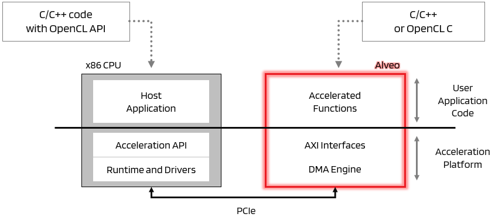

<a href="../../../../README.md">English</a> | <a>日本語</a>

<table width="100%">
 <tr width="100%">
    <td align="center"><h1>2020.1 Vitis™ - セクション 1 - ワークフロー</h1><a href="https://japan.xilinx.com/products/design-tools/vitis.html">xilinx.com の Vitis™ 開発環境を参照</a></td>
 </tr>
</table>

> **このセクション**では、Vitis フローの概要とホスト/カーネルの実例を簡単に説明します。

#### Vitis フロー

ハードウェア アクセラレーションを有効にするため、コードはホストと 1 つまたは複数のカーネルに分割されます。  C/C++ で記述されたホスト プログラムは、OpenCL などの API 抽象化を使用して、ホスト プロセッサ (エンベデッド プラットフォームの場合は x86 サーバーまたは Arm プロセッサ) 上で動作します。  ハードウェア アクセラレーション カーネルは、ザイリンクス デバイスのプログラマブル ロジック上で動作します。

ザイリンクス ランタイム (XRT) で処理される API 呼び出しは、ホスト プログラムとハードウェア アクセラレータ (カーネル) の間のトランザクションを処理します。制御およびデータの転送を含むホストとカーネルの間の通信には、PCIe® バスまたはエンベデッド プラットフォームの AXI バスを使用します。

典型的なアプリケーションでは、まずホストがカーネルで実行されるデータをホスト メモリからグローバル メモリに転送します。その後カーネルがデータを処理し、結果をグローバル メモリに格納します。カーネルが処理を終了すると、ホストが結果をホスト メモリに戻します。ホストとグローバル メモリ間のデータ転送によりレイテンシが発生し、アクセラレーション全体に悪影響を及ぼすことがあります。実際のシステムでアクセラレーションを達成するには、ハードウェア アクセラレーション カーネルで達成される利点がこれらのデータ転送のレイテンシを上回る必要があります。

Vitis™ コア開発をフローを使用すると、ホスト アプリケーションとハードウェア アクセラレーションされたカーネルを管理、コンフィギュレーション、ビルド、実行しやすくなります。

- ホスト アプリケーションは OpenCL™ API 呼び出しを使用して C/C++ で開発されますが、
- ハードウェア カーネルは C/C++、OpenCL C、または RTL で開発できます。

Alveo アクセラレーション カードに接続された x86 サーバーに関連する機能ブロックの図を次に示します。

次の[**セクション**](../02-System_Setup/README.md)では、チュートリアルを実行するための環境を準備する方法を学びます。

 

Copyright&copy; 2020 Xilinx

<b><a href="../../../README.md">メイン ページに戻る</a> &mdash; <a href="../../README.md/">ハードウェア アクセラレータ チュートリアルの初めに戻る</a></b>
 

この資料は 2021 年 2 月 8 日時点の表記バージョンの英語版を翻訳したもので、内容に相違が生じる場合には原文を優先します。資料によっては英語版の更新に対応していないものがあります。
日本語版は参考用としてご使用の上、最新情報につきましては、必ず最新英語版をご参照ください。

