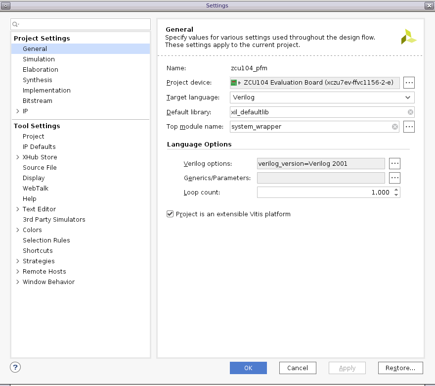
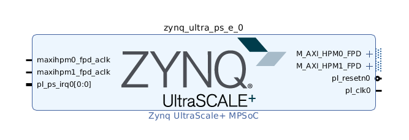
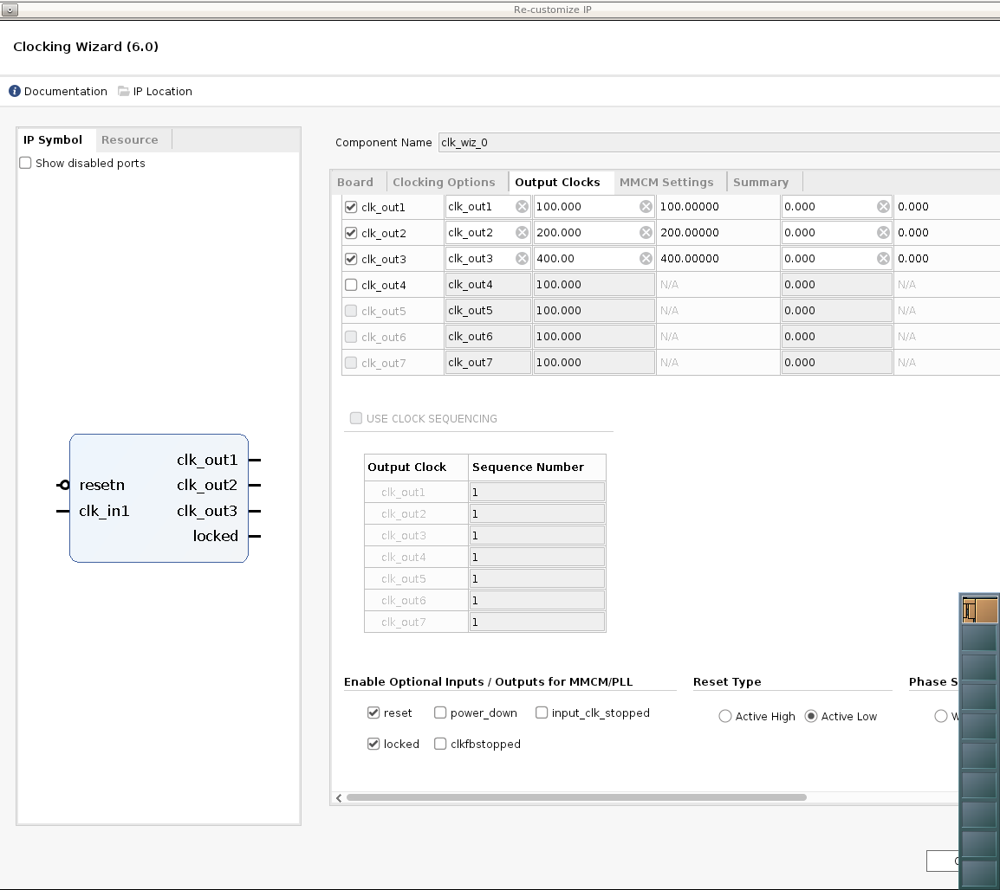
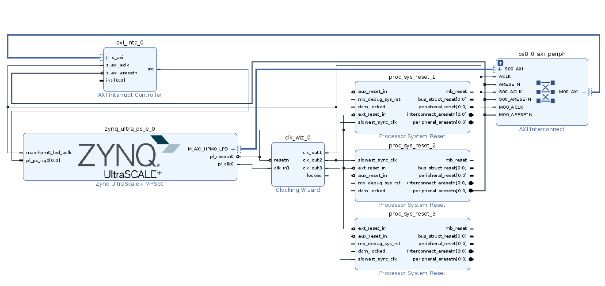
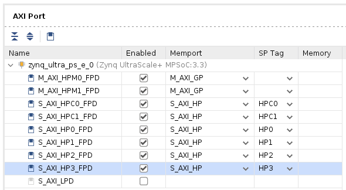

<!--
# Copyright 2020 Xilinx Inc.
#
# Licensed under the Apache License, Version 2.0 (the "License");
# you may not use this file except in compliance with the License.
# You may obtain a copy of the License at
#
#     http://www.apache.org/licenses/LICENSE-2.0
#
# Unless required by applicable law or agreed to in writing, software
# distributed under the License is distributed on an "AS IS" BASIS,
# WITHOUT WARRANTIES OR CONDITIONS OF ANY KIND, either express or implied.
# See the License for the specific language governing permissions and
# limitations under the License.
-->
<p align="right"><a href="../../../README.md">English</a> | <a>日本語</a></p>

## 手順 1: Vivado ハードウェア デザインの作成および XSA の生成

この手順では、ZCU104 Vitis アクセラレーション プラットフォームのハードウェア デザインを作成します。ZCU104 のプリセット デザインから開始し、プラットフォームに必要なペリフェラルを追加して設定します。すべてを設定したら、ハードウェア デザインを XSA にエクスポートします。

### プリセットからのベース Vivado プロジェクトの作成

1. Vivado の起動

   Linux コンソールで次のコマンド実行します。

   ```bash
   source <Vitis_Install_Directory>/settings64.sh
   vivado &
   ```

2. **zcu104\_custom\_platform** という Vivado プロジェクトを作成します。

   - **\[File] → \[Project] → \[New]** をクリックし、**\[Next]** をクリックします。
   - \[Project Name] ページで \[Project name] に **zcu104\_custom\_platform** と入力します。**\[Next]** をクリックします。
   - **\[Project is an extensible Vitis platform]** をオンにします。**\[Next]** をクリックします。

   

   - \[Default Part] ページの **\[Boards]** タブで **\[Zynq UltraScale+ ZCU104 Evaluation Board]** を選択します。**\[Next]** をクリックします。
   - プロジェクト サマリを確認し、**\[Finish]** をクリックします。

   **注記**: 既存の Vivado プロジェクトをエクステンシブル プラットフォーム プロジェクトに変更する必要がある場合は、開いている Vivado デザインの **Flow Navigator** で **\[Settings]** をクリックし、**\[General]** ページで **\[Project is an extensible Vitis platform]** をオンにします。

   

3. ブロック デザインを作成します。

   - **Flow Navigator** で **\[IP INTEGRATOR]** → **\[Create Block Design]** をクリックします。
   - (オプション) デザイン名を **system** に変更します。
   - **\[OK]** をクリックします。

4. MPSoC IP を追加し、ブロック オートメーションを実行して設定します。

   - \[Diagram] ウィンドウを右クリックし、**\[Add IP]** をクリックします。

   - `zynq` を検索し、IP の検索結果から **\[Zynq UltraScale+ MPSoC]** をダブルクリックします。

   - **\[Run Block Automation]** リンクをクリックしてボード プリセットを適用します。\[Run Block Automation] ダイアログ ボックスで次がオンになっていることを確認します。

     - \[All Automation]
     - \[zynq\_ultra\_ps\_e\_0]
     - \[Apply Board Presets]

   - **\[OK]** をクリックします。MPSoC ブロックは次のようになります。

   

**ここまでの結果**

Zynq UltraScale+ MPSoC ブロックを追加し、Vivado のブロック オートメーションを使用して ZCU104 のボード プリセットを適用しました。プリセットには、MPSoC PS ブロックの設定およびピンの割り当てが含まれています。

**カスタム ボードの場合の操作**

カスタム ボードの場合は、MPSoC ブロックをダブルクリックして、ボードのハードウェアに応じてパラメーターを設定します。次に、IP ブロックとメタデータを追加して、アクセラレーション カーネルをサポートするベース ハードウェア デザインを作成します。

### システム デザインのクロックおよびリセットのカスタマイズ

v++リンカーを使用すると、カーネルとプラットフォームの間のクロック信号を自動的にリンクできます。プラットフォームで使用可能なクロック信号は、**PFM.CLK** プロパティでエクスポートされます。

単純なデザインでは、割込み信号はプロセッサの **pl\_clk** で供給できます。ただし、プロセッサには最大 4 つの pl\_clk しかなく、それらの位相は揃っていません。

より多くの割り込み信号を供給、または位相を揃えたクロックを供給するには、**Clocking Wizard** を使用します。

ブロック図に **Clocking Wizard** を追加して、プラットフォームのクロック信号をイネーブルにします。詳しい手順は次のとおりです。

1. Clocking Wizard ブロックを追加し、3 つのクロックを生成するよう設定します。

   - \[Diagram] ウィンドウを右クリックし、**\[Add IP]** をクリックします。

   - IP の検索ボックスで **Clocking Wizard** を検索して追加します。

   - **clk\_wiz\_0** IP ブロックをダブルクリックして、\[Re-Customize IP] ダイアログ ボックスを開きます。

   - **\[Output Clocks]** タブをクリックします。

   - \[Output Clock] 列の \[clk\_out1] から \[clk\_out3] までのチェック ボックスをオンにします。\[Output Freq] の **\[Requested]** を次のように設定します。

     - **\[clk\_out1]** を **\[100]** MHz に設定します。
     - **\[clk\_out2]** を **\[200]** MHz に設定します。
     - **\[clk\_out3]** を **\[400]** MHz に設定します。

   - ダイアログ ボックスの下部にある **\[Reset Type]** で **\[Active Low]** をオンにします。

   

   - **\[OK]** をクリックしてダイアログ ボックスを閉じます。

   **注記**: これで、デザインのクロック システムを設定できました。Clocking Wizard では、pl\_clk が入力クロックとして使用され、ロジック デザイン全体に必要なクロックが生成されます。この単純なデザインでは、100 MHz クロックが axi\_lite の制御バス クロックとして使用されます。200 MHz および 400 MHz のクロックは、デザインのリンク段階で DPU AXI インターフェイス クロックおよび DPU コア クロックとして使用されます。作成するデザインに合わせて、クロックの数および周波数を自由に変更できます。クロックのエクスポートは後で設定します。その前に、各クロックのリセット信号を作成する必要があります。リセット信号は、クロックのエクスポート設定で必要です。

2. これらの 3 つのクロックに対応する 3 つの Processor System Reset ブロックを追加します。

   - \[Diagram] ウィンドウを右クリックし、**\[Add IP]** をクリックします。
   - IP の検索ダイアログ ボックスで **Processor System Reset** を検索して追加します。
   - リセット モジュールとクロック信号の関係がわかりやすいように、リセット ブロックの名前を **proc\_sys\_reset\_1** に変更します。
   - **proc\_sys\_reset\_1** ブロックを選択し、Ctrl + C キーを押してから Ctrl + V キーを押し、モジュールを 2 つ複製します。これらのブロックには、デフォルトで **proc\_sys\_reset\_2** および **proc\_sys\_reset\_3** という名前が付けられます。

3. クロックとリセットを接続します。

   - **\[Run Connection Automation]** をクリックします。開いたダイアログ ボックスで、proc\_sys\_reset ブロックを Clocking Wizard のクロック出力に接続するよう設定します。

   - \[Run Connection Automation] ダイアログ ボックスの左側で \[All Automation] をオンにします。

   - clk\_wiz\_0 の **\[clk\_in1]** を選択し、\[Clock Source] を **\[/zynq\_ultra\_ps\_e\_0/pl\_clk0]** に設定します。

   - 各 **proc\_sys\_reset** インスタンスの **slowest\_sync\_clk** を選択し、\[Clock Source] を次のように設定します。

     - **proc\_sys\_reset\_1** には **\[/clk\_wiz\_0/clk\_out1]**
     - **proc\_sys\_reset\_2** には **\[/clk\_wiz\_0/clk\_out2]**
     - **proc\_sys\_reset\_3** には **\[/clk\_wiz\_0/clk\_out3]**

   - 各 proc\_sys\_reset インスタンスの **\[ext\_reset\_in]** を選択し、**\[Board Part Interface]** を **\[Custom]**、**\[Select Manual Source]** を **\[/zynq\_ultra\_ps\_e\_0/pl\_resetn0]** に設定します。

   - すべてのチェック ボックスがオンになっていることを確認し、**\[OK]** をクリックしてダイアログ ボックスを閉じ、接続を作成します。

   - 各 proc\_sys\_reset インスタンスの **dcm\_locked** 信号をすべて **clk\_wiz\_0** の locked 信号に接続します。

   

4. プラットフォームのクロックをイネーブルにします。

   - **\[Platform Setup]** ウィンドウをクリックします。
   - このウィンドウが開いていない場合は、**\[Window] → \[Platform Setup]** をクリックします。
   - **\[Clock]** を選択します。
   - \[clk\_wiz\_0] の下のすべてのクロック (**\[clk\_out1]**、**\[clk\_out2]**、**\[clk\_out3]**) をオンにします。
   - これらのクロックの ID を **0**、**1**、および **2** に変更します。
   - **\[Is Default]** 列で **\[clk\_out2]** をオンにします。
   - これらすべてを設定すると、右下のボックスに「**Info: No problem with Clock interface**」と表示され、問題がないことが示されます。

   ![[Platform Setup] ウィンドウでのクロック設定](images/platform_clock.png)

   **注記:**

   - クロック ID は、0 から開始する必要があります。クロックが 2 つの場合は、ID は 0 と 1 にします。この要件は、v++ リンカーからのものです。
   - プラットフォームには、デフォルト クロックが 1 つのみ必要です。ユーザー割り当てがない場合、v++ リンカーによりデフォルト クロックを使用して IP ブロックが接続されます。

### 割り込みサポートの追加

v++リンカーを使用すると、カーネルとプラットフォームの間の割り込み信号を自動的にリンクできます。プラットフォームで使用可能な割り込み信号は、**PFM.IRQ** プロパティでエクスポートされます。

単純なデザインでは、割り込み信号はプロセッサの **pl\_ps\_irq** で供給できます。ただし、供給できる割り込み信号は 16 個までです。より多くの割り込み信号を供給するには、**AXI Interrupt Controller** を使用できます。**AXI Interrupt Controller** を制御する **AXI HPM0 LPD** をイネーブルにし、**AXI Interrupt Controller** を追加して割り込み信号 **Pfm.IRQ** をイネーブルにします。詳しい手順は次のとおりです。

1. **AXI Interrupt Controller** を制御する **AXI HPM0 LPD** をイネーブルにします。

   - ブロック図で **Zynq UltraScale+ MPSoC** ブロックをダブルクリックします。
   - **\[PS-PL Configuration] → \[PS-PL Interfaces] → \[Master Interface]** をクリックします。
   - **\[AXI HPM0 LPD]** をオンにします。
   - **\[AXI HPM0 LPD]** を展開します。**\[AXI HPM0 LPD Data width]** がデフォルトの **32** であることを確認します。
   - **\[AXI HPM0 FPD]** および **\[AXI HPM1 FPD]** をオフにします。
   - **\[OK]** をクリックして設定を終了します。

   **注記:**

   - **AXI HPM0 LPD** は、主に制御用に使用します。32 ビット制御レジスタの読み出し/書き込みのみが必要です。
   - **AXI HPM0 FPD** および **AXI HPM1 FPD** は、カーネルで使用するために予約します。ブロック図からこれらを無効にすると、自動接続されるのを回避できます。未使用の AXI インターフェイスは、\[Platform Setup] でエクスポートできます。

2. **AXI Interrupt Controller** を追加して設定します。

   - \[Diagram] ウィンドウを右クリックして **\[Add IP]** をクリックし、**AXI Interrupt Controller** IP を追加します。**axi\_intc\_0** としてインスタンシエートされます。
   - AXI Interrupt Controller ブロックをダブルクリックし、**\[Interrupt Output Connection]** を **\[Single]** に変更します。
   - **\[OK]** をクリックします。

3. axi\_intc\_0 の AXI インターフェイスを PS の AXI HPM0 LPD に接続します。

   - \[Run Connection Automation] をクリックします。
   - 設定を確認します。**\[axi\_intc\_0]** がオン、**\[s\_axi]** は **/zynq\_ultra\_ps\_e\_0/M\_AXI\_HPM0\_LPD** に接続されます。
   - **\[Clock source for Slave interface]** および **\[Clock source for Master interface]** を **\[/clk\_wiz\_0/clk\_out2 (200 MHz)]** に設定します。
   - **\[OK]** をクリックします。

   **注記**:

   - 割り込みコントローラーとほとんどのカーネル IRQ 信号を 1 クロックに同期させるようにします。これが安定性のためベストです。カーネルが異なるクロックで動作している場合は、非同期 IRQ を心配する必要はありません。割り込みコントローラーでは、レベル割り込み信号を使用して非同期 IRQ も処理できます。

4. 割り込みコントローラーの irq を接続します。

   - axi\_inTC\_0.irq を zynq\_ultra\_ps\_e\_0.pl\_ps\_irq\[0:0] に接続します。

   **注記**:

   - PS の pl\_ps\_irq に接続する irq 信号が複数ある場合は、**concat** IP を使用してそれらをバスに連結し、そのバスを pl\_ps\_irq に接続します。

5. プラットフォームの割り込み信号をイネーブルにします。

   - \[Platform Setup] ウィンドウをクリックします。
   - \[Interrupt] を選択します。
   - \[axi\_intc\_0] の下の \[intr] をオンにします。
   - \[Tcl Console] ウィンドウにこの設定に対応する Tcl コマンドが表示されます。

   ```
   set_property PFM.IRQ {intr { id 0 range 32 }} [get_bd_cells /axi_intc_0]
   ```

IP インテグレーター デザインの接続は次のようになります。



### プラットフォームでの AXI インターフェイスのイネーブル

1. PS から AXI マスター インターフェイスをイネーブルにします。

   - \[Platform Setup] ウィンドウをクリックします。
   - \[AXI Port] を選択します。
   - \[zynq\_ultra\_ps\_e\_0] の下で **\[M\_AXI\_HPM0\_FPD]** および **\[M\_AXI\_HPM1\_FPD]** をオンにします。\[Memport] 列はデフォルトの \[M\_AXI\_GP]、\[SP Tag] 列は空のままにします。

   **注記**:

   - M\_AXI\_GP は、汎用 AXI マスター インターフェイスです。
   - SP タグは、AXI スレーブ インターフェイスにのみ適用されます。
   - v++ リンカーにより AXI Interconnect が自動的にインスタンシエートされ、PS の AXI マスター インターフェイスとアクセラレーション カーネルのスレーブ インターフェイス間が接続されます。1 つの AXI マスター インターフェイスは、最大 16 個のカーネルに接続できます。

2. AXI Interconnect で AXI マスター インターフェイスをイネーブルにします。

   - \[ps8\_0\_axi\_periph] の下で、\[M01\_AXI] を選択して Shift キーを押しながら \[M07\_AXI] をクリックし、\[M01\_AXI] から \[M07\_AXI] までのマスター インターフェイスを選択します。
   - 選択項目を右クリックし、\[Enable] をクリックします。
   - \[Memport] 列はデフォルトの \[M\_AXI\_GP]、\[SP Tag] 列は空のままにします。

   **注記**:

   - AXI マスター インターフェイスが AXI Interconnect IP からエクスポートされている場合は、v++ では AXI Interconnect の別の段がカスケード接続されることはありません。
   - PS の AXI マスター インターフェイスと AXI Interconnect は、プラットフォームにとっては機能的に同等です。
   - 通常は、プラットフォーム設計者は必要な数の AXI インターフェイスをプラットフォームにエクスポートする必要があります。使用するインターフェイスは、アプリケーション開発者が決定する必要があります。

3. PS から AXI スレーブ インターフェイスをイネーブルにし、カーネルが DDR メモリにアクセスできるようにします。

   - \[zynq\_ultra\_ps\_e\_0] の下で、**Ctrl** キーを押しながら **\[S\_AXI\_HPC0\_FPD]**、**\[S\_AXI\_HPC1\_FPD]**、**\[S\_AXI\_HP0\_FPD]**、**\[S\_AXI\_HP1\_FPD]**、**\[S\_AXI\_HP2\_FPD]**、**\[S\_AXI\_HP3\_FPD]** をクリックします。
   - 選択項目を右クリックし、**\[Enable]** をクリックします。
   - **\[S\_AXI\_HPC0\_FPD]** および **\[S\_AXI\_HPC1\_FPD]** の \[Memport] を \[S\_AXI\_HP] に変更します。これらのインターフェイスのコヒーレンシ機能は使用しません。
   - リンク段階で v++ により選択できるように、\[SP Tag] に **HPC0**、**HPC1**、**HP0**、**HP1**、**HP2**、**HP3** を入力します。

   

### エミュレーション設定 (オプション)

この手順は、エミュレーション可能なプラットフォームを作成する場合にのみ必要です。

コンポーネントに複数のタイプのシミュレーション モデルがある場合、SystemC TLM (トランザクション レベル モデリング) モデルを選択すると、RTL モデルよりもかなり高速に実行されます。Processing System コンポーネントでは、ハードウェア エミュレーションに TLM を使用する必要があります。

1. PS シミュレーション モデルを tlm に変更します

   - ブロック図で PS インスタンス **zynq\_ultra\_ps\_e\_0** を選択します
   - **\[Block Properties]** ウィンドウを確認します。
   - **\[Properties]** ビューに \[`ALLOWED_SIM_MODELS=tlm,rtl`] が表示されます。これは、このコンポーネントで 2 つのタイプのシミュレーション モデルがサポートされるということです。
   - \[`SELECTED_SIM_MODEL`] プロパティまでスクロールします。**\[rtl]** を **\[tlm]** に変更し、TLM モデルが使用されるようにします。
   - \[Tcl Console] ウィンドウに対応する Tcl コマンドが表示されます。

   ```tcl
   set_property SELECTED_SIM_MODEL tlm [get_bd_cells /zynq_ultra_ps_e_0]
   ```

### ハードウェア XSA のエクスポート

1. ブロック デザインを検証します。

   - \[Diagram] ウィンドウで **\[Validate Design]** ボタンをクリックします。

   **注記:** 検証中、Vivado から **/axi\_intc\_0/intr** が接続されていないというクリティカル警告が表示されます。v++ リンカーによりカーネルの割り込み信号がこの intr 信号に接続されるので、この警告は無視しても問題ありません。

   ```
   CRITICAL WARNING: [BD 41-759] The input pins (listed below) are either not connected or do not have a source port, and they don't have a tie-off specified. These pins are tied-off to all 0's to avoid error in Implementation flow.
   Please check your design and connect them as needed:
   /axi_intc_0/intr
   ```

2. ブロック デザインの最上位ラッパーを作成します。

   - **\[Sources]** ウィンドウで、\[Design Sources] フォルダーに含まれる **\[system.bd]** を右クリックします。
   - **\[Create HDL Wrapper]** をクリックします。
   - **\[Let Vivado manage wrapper and auto-update]** をオンにします。
   - **\[OK]** をクリックしてブロック デザインのラッパーを生成します。

3. 合成前のデザインを生成します。

   - Flow Navigator で **\[Generate Block Design]** をクリックします。
   - **\[Synthesis Options]** で **\[Global]** をオンにします。これにより、生成中の IP 合成がスキップされます。
   - **\[Generate]** をクリックします。

4. プラットフォームをエクスポートします。

   - **\[File] → \[Export] → \[Export Platform]** をクリックし、**\[Export Hardware Platform]** ウィザードを起動します。このウィザードは、**Flow Navigator** または **\[Platform Setup]** ウィンドウの **\[Export Platform]** ボタンをクリックして起動することもできます。
   - 最初の情報ページで \[Next] をクリックします。
   - \[Platform Type] ページで **\[Hardware and hardware emulation]** をオンにし、\[Next] をクリックします。前のエミュレーション設定手順をスキップした場合は、**\[Hardware]** をオンにします。
   - \[Platform State] ページで **\[Pre-synthesis]** をオンにし、\[Next] をクリックします。
   - \[Platform Properties] ページでプラットフォーム プロパティを指定し、**\[Next]** をクリックします。次に例を示します。
     - \[Name]: zcu104\_custom\_platform
     - \[Vendor]: xilinx
     - \[Board]: zcu104
     - \[Version]: 0.0
     - \[Description]: This platform provides high PS DDR bandwidth and three clocks: 100 MHz, 200 MHz and 400 MHz.
   - \[XSA file name] に「**zcu104\_custom\_platform**」と入力し、\[Export to] はデフォルトのエクスポート ディレクトリのままにします。
   - **\[Finish]** をクリックします。
   - **zcu104\_custom\_platform.xsa** が生成されます。\[Tcl Console] ウィンドウにエクスポート パスが表示されます。

   上記のエクスポートは、Tcl スクリプトで実行することもできます。

   ```tcl
   # Setting platform properties
   set_property platform.default_output_type "sd_card" [current_project]
   set_property platform.design_intent.embedded "true" [current_project]
   set_property platform.design_intent.server_managed "false" [current_project]
   set_property platform.design_intent.external_host "false" [current_project]
   set_property platform.design_intent.datacenter "false" [current_project]
   # Write pre-synthesis expandable XSA
   write_hw_platform -force -file ./zcu104_custom_platform.xsa
   ```

**ハードウェア プラットフォームの作成フローが終了しました。[手順 2: ソフトウェア プラットフォームの作成](./step2.md)に進みます。**

### スクリプトを使用した実行

プロジェクトを再作成し、出力を生成するスクリプトが提供されています。これらのスクリプトを使用するには、次の手順を実行します。

1. ビルドを実行します。

   ```
   # cd to the step directory, e.g.
   cd step1_vivado
   make
   ```

2. 生成されたファイルをクリーンアップするには、次を実行します。

   ```bash
   make clean
   ```

<p align="center"><sup>Copyright&copy; 2020 Xilinx</sup></p>
<p align="center"><sup>この資料は 2021 年 2 月 8 日時点の表記バージョンの英語版を翻訳したもので、内容に相違が生じる場合には原文を優先します。資料によっては英語版の更新に対応していないものがあります。
日本語版は参考用としてご使用の上、最新情報につきましては、必ず最新英語版をご参照ください。</sup></p>
