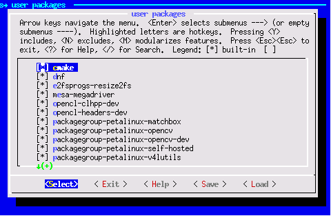

<!--
# Copyright 2020 Xilinx Inc.
#
# Licensed under the Apache License, Version 2.0 (the "License");
# you may not use this file except in compliance with the License.
# You may obtain a copy of the License at
#
#     http://www.apache.org/licenses/LICENSE-2.0
#
# Unless required by applicable law or agreed to in writing, software
# distributed under the License is distributed on an "AS IS" BASIS,
# WITHOUT WARRANTIES OR CONDITIONS OF ANY KIND, either express or implied.
# See the License for the specific language governing permissions and
# limitations under the License.
-->
<p align="right"><a href="../../../README.md">English</a> | <a>日本語</a></p>

## 手順 2: PetaLinux でのソフトウェア コンポーネントの作成

Vitis プラットフォームには、ソフトウェア コンポーネントが必要です。ザイリンクスでは、簡単に評価できるようにするため共通ソフトウェア イメージを提供しています。ここでは、ソフトウェア環境のカスタマイズについて説明するため、PetaLinux ツールを使用して XRT サポートを含む Linux イメージと sysroot を作成し、高度な調整を実行します。カスタマイズの中で、XRT のインストールと ZOCL デバイス ツリーのセットアップは必須です。その他のカスタマイズはオプションです。カスタマイズの目的は説明されています。必要に応じて自由にカスタマイズを選択してください。

PetaLinux と同じ Linux 出力ファイルが生成されるのであれば、Yocto やサードパーティの Linux 開発ツールを使用することもできます。

### PetaLinux プロジェクトの作成

1. PetaLinux 環境を設定します。

   ```bash
   source <petaLinux_tool_install_dir>/settings.sh
   ```

2. **zcu104\_custom\_plnx** という名前の PetaLinux プロジェクトを作成し、前の手順で作成した XSA ファイルを使用してハードウェアを設定します。

   ```bash
   petalinux-create --type project --template zynqMP --name zcu104_custom_plnx
   cd zcu104_custom_plnx
   petalinux-config --get-hw-description=<vivado_design_dir>
   ```

   この手順の後、ディレクトリ階層は次のようになります。

   ```
   - zcu104_custom_platform # Vivado Project Directory
   - zcu104_custom_plnx     # PetaLinux Project Directory
   ```

3. petalinux-config メニューが表示されます。この設定ウィンドウで ZCU104 デバイス ツリーが使用されるよう設定します。

   - **\[DTG Settings] → \[MACHINE\_NAME]** を選択します。
   - `zcu104-revc` に変更します。
   - **\[OK] → \[Exit] → \[Exit] → \[Yes]** を選択してこのウィンドウを閉じます。

   **注記**:

   - ザイリンクス開発ボードを使用している場合は、ボード コンフィギュレーションが DTS 自動生成に含まれるようにするため、マシン名を変更することをお勧めします。
   - カスタム ボードを使用している場合は、**system-user.dtsi** で関連の設定 (PHY 情報 DTS ノードなど) を手動で指定する必要があります。
   - デバイス ツリーは、組み込み Linux の汎用テクノロジです。詳細は、インターネットで検索してください。

### ルート ファイル システム、カーネル、デバイス ツリー、および U-Boot のカスタマイズ

1. ユーザー パッケージを追加します。

   - **\<your\_petalinux\_project\_dir>/project-spec/meta-user/conf/user-rootfsconfig** ファイルに下に示す CONFIG\_x 行を追加します。

   **注記**: この手順は必須ではありませんが、次の手順で必要なパッケージをすべて見つけやすくなります。この手順をスキップする場合は、次の手順で必要なパッケージを 1 つずつイネーブルにしてください。

   ベース XRT サポート用のパッケージ:

   ```
   CONFIG_packagegroup-petalinux-xrt
   ```

   - Vitis アクセラレーション フローには、packagegroup-petalinux-xrt が必要です。XRT と ZOCL が含まれます。
   - xrt-dev は、2020.1 では開発環境を作成しない場合でも必要です。これは、運用環境に必要なソフト リンクがパッケージされるという既知の問題があるからです。XRT 2020.2 では、この問題は修正されています。

   システム管理を容易にするパッケージ:

   ```
   CONFIG_dnf
   CONFIG_e2fsprogs-resize2fs
   CONFIG_parted
   CONFIG_resize-part
   ```

   - dnf はパッケージ管理用です。
   - parted、e2fsprogs-resize2fs、resize-part は、ext4 パーティションのサイズ変更に使用できます。これは、[手順 4](./step4.md) で Vitis AI テスト ケースを実行するときに、SD カード サイズ全体を使用できるよう ext4 パーティションを拡張するために使用します。

   Vitis AI 依存サポート用のパッケージ:

   ```
   CONFIG_packagegroup-petalinux-vitisai
   ```

   ターゲット ボード上に Vitis AI アプリケーションをネイティブにビルドするためのパッケージ:

   ```
   CONFIG_packagegroup-petalinux-self-hosted
   CONFIG_cmake
   CONFIG_packagegroup-petalinux-vitisai-dev
   CONFIG_xrt-dev
   CONFIG_opencl-clhpp-dev
   CONFIG_opencl-headers-dev
   CONFIG_packagegroup-petalinux-opencv
   CONFIG_packagegroup-petalinux-opencv-dev
   ```

   GUI で Vitis AI デモ アプリケーションを実行するためのパッケージ:

   ```
   CONFIG_mesa-megadriver
   CONFIG_packagegroup-petalinux-x11
   CONFIG_packagegroup-petalinux-v4lutils
   CONFIG_packagegroup-petalinux-matchbox
   ```

2. 選択した rootfs パッケージをイネーブルにします。

   - `petalinux-config -c rootfs` を実行します。
   - **\[user packages]** を選択します。
   - 上記すべての rootfs ライブラリの名前を選択します。

   

   注記: 手順 1 をスキップした場合は、対応するパッケージをイネーブルにしてください。

3. OpenSSH をイネーブルにし、Dropbear をディスエーブルにします (オプション)。

   Dropbear は、Vitis ベース エンベデッド プラットフォームのデフォルトの SSH ツールです。Dropbear の代わりに OpenSSH を使用する場合は、システムで SSH よりも 4 倍のデータ転送速度を実現できます (1 Gbps イーサネット環境でテスト済み)。Vitis AI アプリケーションでは、リモート表示機能を使用して機械学習結果を表示できるので、OpenSSH を使用すると表示を向上できます。\*

   - RootFS 設定メニューで、**\[Exit]** を一度選択してルート ディレクトリに移動します。
   - **\[Image Features]** を選択します。
   - **\[ssh-server-dropbear]** をオフにし、**\[ssh-server-openssh]** をオンにして、\[Exit] を選択します。

   

   - **\[Filesystem Packages] → \[misc] → \[packagegroup-core-ssh-dropbear]** を選択し、**\[packagegroup-core-ssh-dropbear]** をオフにします。
   - \[Exit] を 2 回選択して **\[Filesystem Packages]** に戻ります。
   - **\[console] → \[network] → \[openssh]** を選択し、**\[openssh]**、**\[openssh-sftp-server]**、**\[openssh-sshd]**、**\[openssh-scp]** をオンにします。
   - **\[Exit]** を 4 回選択してルート レベルに戻ります。

4. パッケージ管理をイネーブルにします。

   パッケージ管理機能を使用すると、ボード上でソフトウェア パッケージのインストールおよびアップグレードをオンザフライで実行できます。

   - RootFS 設定メニューで **\[Image Features]** を選択し、**\[package-management]** および **\[debug\_tweaks]** をオンにします。
   - **\[OK]** を選択し、**\[Exit]** を 2 回選択し、**\[Yes]** を選択して変更を保存します。

5. カーネル設定で CPU アイドル機能をディスエーブルにします (オプション)。

   CPU アイドル機能は、プロセッサが使用されていないときに、プロセッサをアイドル状態 (WFI) にします。JTAG が接続されている場合、ホスト マシン上のハードウェア サーバーはプロセッサと定期的に通信します。アイドル状態のプロセッサと通信すると、AXI トランザクションが完了しないためシステムがハングします。そのため、プロジェクト開発段階では CPU アイドル機能をディスエーブルにすることをお勧めします。デザインが完成した後、最終製品の消費電力を節約するために、再度イネーブルにできます。

   - `petalinux-config -c kernel` を実行してカーネル設定を起動します。
   - [ ]メニュー選択で N を押して、次の項目を**オフ**にします。
     - **\[CPU Power Mangement] → \[CPU Idle] → \[CPU idle PM support\[**
     - **\[CPU Power Management] → \[CPU Frequency scaling] → \[CPU Frequency scaling]**
   - 終了して保存します。

### デバイス ツリーのアップデート

デバイス ツリーは、システムのハードウェア コンポーネントを記述します。ザイリンクスのデバイス ツリー ジェネレーター (DTG) では、XSA ファイルからのハードウェアの構成に従ってデバイス ツリーを生成できます。対応するハードウェアのないドライバー ノードがある場合や、DTG で自動生成された設定を上書きする必要がある場合など、XSA に含まれていない設定があれ場合は、PetaLinux の system-user.dtsi にカスタム設定を追加する必要があります。

ZOCL ドライバー モジュールは、関連するハードウェアのないモジュールですが、Vitis アクセラレーション フローで必要です。これは、ザイリンクス ランタイム (XRT) の一部です。これを system-user.dtsi に追加します。

また、XSA では割り込みコントローラーに何も接続されていので、axi\_intc\_0 のパラメーター割り込み入力の数を 0 から 32 に変更します。これは、v++ でカーネルをリンクした後に実行します。

1. **project-spec/meta-user/cetie-bsp/device-tree/files/system-user.dtsi** ファイルに次の内容を追加します。

   ```
   &amba {
       zyxclmm_drm {
           compatible = "xlnx,zocl";
           status = "okay";
           interrupt-parent = <&axi_intc_0>;
           interrupts = <0  4>, <1  4>, <2  4>, <3  4>,
                    <4  4>, <5  4>, <6  4>, <7  4>,
                    <8  4>, <9  4>, <10 4>, <11 4>,
                    <12 4>, <13 4>, <14 4>, <15 4>,
                    <16 4>, <17 4>, <18 4>, <19 4>,
                    <20 4>, <21 4>, <22 4>, <23 4>,
                    <24 4>, <25 4>, <26 4>, <27 4>,
                    <28 4>, <29 4>, <30 4>, <31 4>;
       };
   };

   &axi_intc_0 {
         xlnx,kind-of-intr = <0x0>;
         xlnx,num-intr-inputs = <0x20>;
   };

   &sdhci1 {
         no-1-8-v;
         disable-wp;
   };

   ```

   - **zyxclmm\_drm** ノードは ZOCL ドライバーに必要です。
   - **axi\_intc\_0** ノードは、割り込み入力の数を 0 から 32 に変更し、割り込みのタイプをレベル High に設定します。
   - **sdhci1** ノードは、ZCU104 ボードでのカードの互換性を向上させるため、SD カードの速度を下げます。これは、ZCU104 にのみ関連します。Vitis アクセラレーション プラットフォーム要件の一部ではありません。

   **注記:** [ref\_files/step2\_petalinux/system-user.dtsi](ref_files/step2_petalinux/system-user.dtsi) にファイル例があります。

### EXT4 rootfs サポートの追加 (オプションだが推奨)

Vitis アクセラレーション デザインには、EXT4 を使用することをお勧めします。PetaLinux では、デフォルトで rootfs に initramfs フォーマットを使用するので、ランタイムに rootfs の変更を保持できません。initramfs は、rootfs の内容を DDR に保持するので、ユーザーが使用可能な DDR メモリが減少します。ルート ファイル システムの変更を保持し、使用可能な DDR メモリを最大限に利用できるようにするため、2 つ目のパーティションの rootfs には EXT4 フォーマットを使用し、1 つ目のパーティションは FAT32 にしてブート ファイルを格納します。

Vitis AI アプリケーションは、追加のソフトウェア パッケージをインストールします。Vitis AI アプリケーションを実行する場合は、EXT4 rootfs を使用してください。initramfs を使用する場合は、すべての Vitis AI 依存を initramfs に追加してください。

1. PetaLinux で EXT4 rootfs を生成します。

   - `petalinux-config` を実行します。
   - **\[Image Packaging Configuration]** を選択します。
   - **\[Root File System Type]** に **\[EXT4]** を選択します。
   - **\[Root File System Formats]** に `ext4` を追加します。
   - 終了して保存します。

   

2. Linux でブート時に EXT4 rootfs が使用されるようにします。

   ブート時に使用する rootfs の設定は、**bootargs** で制御されます。bootargs の設定を変更して Linux が EXT4 パーティションから起動するようにします。bootargs をアップデートする方法は複数あります。次のいずれかの方法を使用してください。

   方法 A: PetaLinux の設定

   - `petalinux-config` を実行します。
   - **\[DTG settings] → \[Kernel Bootargs] → \[generate boot args automatically]** を NO に変更し、**\[User Set Kernel Bootargs]** を `earlycon console=ttyPS0,115200 clk_ignore_unused root=/dev/mmcblk0p2 rw rootwait cma=512M` に変更します。\[OK] を選択し、\[Exit] を 3 回選択して保存します。

   方法 B: デバイス ツリー

   - **system-user.dtsi** をアップデートします。
   - このファイルに、前述の変更に加え、ルートに `chosen` ノードを追加します。

   ```
   /include/ "system-conf.dtsi"
   / {
       chosen {
       	bootargs = "earlycon console=ttyPS0,115200 clk_ignore_unused root=/dev/mmcblk0p2 rw rootwait cma=512M";
       };
   };
   ```

   **注記**:

   - **root=/dev/mmcblk0p2** は、SD カードの 2 つ目のパーティション (EXT4 パーティション) を使用することを意味します。
   - bootargs では、次のオプションも設定します。
     - **clk\_ignore\_unused**: このクロックが使用されていない場合でも、Linux カーネルがクロックをオフにしないよう指定します。PL カーネルはデバイス ツリーには含まれないので、これは PL カーネルのみを駆動するのに便利なクロックです。
     - **cma=512M**: CMA は、PS と PL カーネル間でデータを交換するために使用されます。CMA のサイズは、PL カーネル要件によって決まります。Vitis AI/DPU には、512 MB 以上の CMA が必要です。

### PetaLinux イメージのビルド

1. PetaLinux プロジェクト内の任意のディレクトリから、PetaLinux プロジェクトをビルドします。

   ```
   petalinux-build
   ```

   PetaLinux イメージが <PetaLinux Project>/images/linux ディレクトリに生成されます。

2. ターゲット Linux システム用の sysroot セルフインストーラーを作成します。

   ```
   petalinux-build --sdk
   ```

   生成された sysroot パッケージ **sdk.sh** は、<PetaLinux Project>linux/image ディレクトリにあります。これを、次の手順で抽出します。

**注記**: ハードウェア プラットフォームとソフトウェア プラットフォームがすべて生成されます。次に、[Vitis プラットフォームをパッケージ](step3.md)します。

### スクリプトを使用した実行

PetaLinux プロジェクトを再作成し、出力を生成するスクリプトが提供されています。これらのスクリプトを使用するには、次の手順を実行します。

1. ビルドを実行します。

   ```
   # cd to the step directory, e.g.
   cd step2_petalinux
   make all
   ```

2. 生成されたファイルをクリーンアップするには、次を実行します。

   ```bash
   make clean
   ```

**注記**: スクリプトは、sysroot を <PetaLinux Project>/images/linux ディレクトリに抽出します。スクリプト記述のため、上記の詳細な手順とは異なります。

<p align="center"><sup>Copyright&copy; 2020 Xilinx</sup></p>
<p align="center"><sup>この資料は 2021 年 2 月 8 日時点の表記バージョンの英語版を翻訳したもので、内容に相違が生じる場合には原文を優先します。資料によっては英語版の更新に対応していないものがあります。
日本語版は参考用としてご使用の上、最新情報につきましては、必ず最新英語版をご参照ください。</sup></p>
