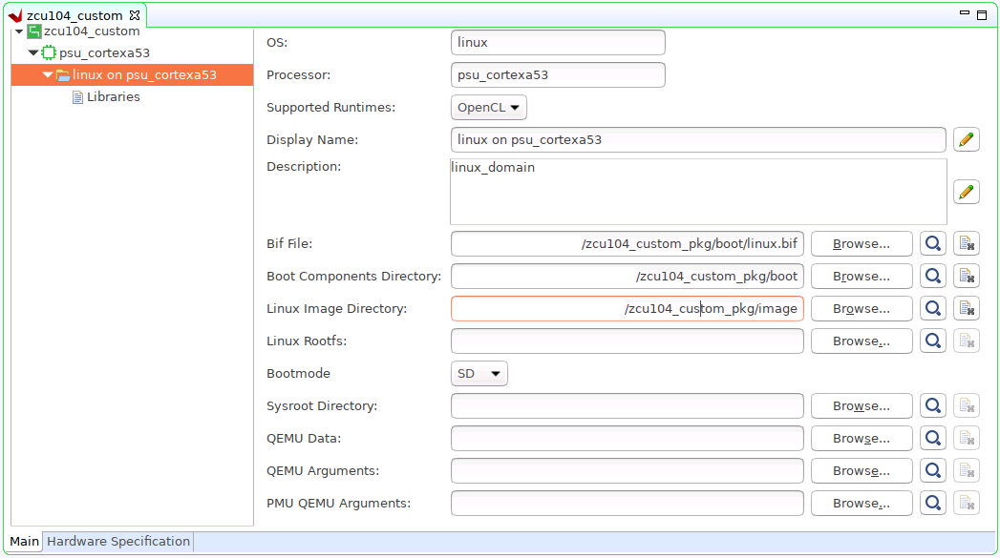

<!--
# Copyright 2020 Xilinx Inc.
#
# Licensed under the Apache License, Version 2.0 (the "License");
# you may not use this file except in compliance with the License.
# You may obtain a copy of the License at
#
#     http://www.apache.org/licenses/LICENSE-2.0
#
# Unless required by applicable law or agreed to in writing, software
# distributed under the License is distributed on an "AS IS" BASIS,
# WITHOUT WARRANTIES OR CONDITIONS OF ANY KIND, either express or implied.
# See the License for the specific language governing permissions and
# limitations under the License.
-->
<p align="right"><a href="../../../README.md">English</a> | <a>日本語</a></p>

## 手順 3: Vitis プラットフォームの作成

### プラットフォーム パッケージ用のファイルの準備

1. Vitis プラットフォームの作成フローに必要なすべてのファイルを保存します。`zcu104_custom_pkg` という名前を付けます。そして、その中にプラットフォーム作成ソース コンポーネントを格納する `pfm` フォルダーを作成します。

   ```
   mkdir zcu104_custom_pkg
   cd zcu104_custom_pkg
   mkdir pfm
   ```

   この手順の後、ディレクトリ階層は次のようになります。

   ```
   - zcu104_custom_platform # Vivado Project Directory
   - zcu104_custom_plnx     # PetaLinux Project Directory
   - zcu104_custom_pkg      # Platform Packaging Directory
     - pfm                  # Platform Packaging Sources
   ```

2. sysroot をインストールします。

   - <PetaLinux Project>/images/linux ディレクトリに移動します。
   - `./sdk.sh -d <Install Target Dir>` と入力して PetaLinux SDK をインストールします。`-d` オプションを使用して、出力ディレクトリ **zcu104\_custom\_pkg/pfm** (この例の場合) への完全パス名を指定します。
   - 注記: このコマンドを実行する際、環境変数 **LD\_LIBRARY\_PATH** は設定しないでください。

   テスト段階で、この rootfs に Vitis AI ライブラリと DNNDK をインストールします。

3. pfm ディレクトリ内に `boot` ディレクトリと imag ディレクトリを作成します。

   ```bash
   cd zcu104_custom_pkg/pfm
   mkdir boot
   mkdir image
   ```

   この手順の後、ディレクトリ階層は次のようになります。

   ```
   - zcu104_custom_platform # Vivado Project Directory
   - zcu104_custom_plnx     # PetaLinux Project Directory
   - zcu104_custom_pkg      # Platform Packaging Directory
     - sysroots             # Extracted Sysroot Directory
     - pfm                  # Platform Packaging Sources
       - boot               # Platform boot components
       - image              # Files to be put in FAT32 partition
   ```

   BIF ファイルと参照されるファイルを **boot** ディレクトリに、FAT32 パーティションに必要なすべてのファイルを **image** ディレクトリに準備します。

4. Bootgen のブート コンポーネント構造を記述する BIF (linux.bif) を作成します。

   - 次の内容を含む BIF ファイル (linux.bif) を **\<full\_pathname\_to\_zcu104\_custom\_pkg>/pfm/boot** ディレクトリに追加します。
   - ファイル名は、ブート ディレクトリの内容と同じにする必要があります。プラットフォームの sw ディレクトリに相対するこれらのパス名は、Vitis ツールにより v++ リンク時または SD カードの生成時に展開されます。ただし、bootgen コマンドを直接使用して BIF ファイルから BOOT.BIN を作成する場合は、BIF ファイルに完全なパス名が必要です。Bootgen は、\<> シンボル間の名前を展開しません。

   ```
   /* linux */
   the_ROM_image:
   {
      [fsbl_config] a53_x64
      [bootloader] <fsbl.elf>
      [pmufw_image] <pmufw.elf>
      [destination_device=pl] <bitstream>
      [destination_cpu=a53-0, exception_level=el-3, trustzone] <bl31.elf>
      [destination_cpu=a53-0, exception_level=el-2] <u-boot.elf>
   }
   ```

   - `<>` のファイル名はプレースホルダーです。Vitis は、プラットフォームをパッケージするときに、プレースホルダーをプラットフォームへの相対パスに置き換えます。最終的なアプリケーションのビルド時に実行される v++ パッケージャーは、これをイメージをパッケージするときに完全パスに展開します。
   - ファイル名プレースホルダーは、boot ディレクトリ内のファイルを指定します。boot ディレクトリ内のファイル名は、BIF ファイル内のプレースホルダーと同じである必要があります。
   - `<bitstream>` は、予約済みのキーワードです。v++ パッケージャーは、これを最終的なシステム BIT ファイルに置き換えます。
   - v++ パッケージャーには、`<fsbl.elf>` の FSBL のみが認識されるという既知の問題があります。そのため、MPSoC では、PetaLinux で生成された `zynqmp_fsbl.elf` を image ディレクトリの `fsbl.elf` にコピーする必要があります。この問題は、2020.2 で修正されています。

5. ブート コンポーネントを準備します。

   生成された Linux ソフトウェア ブート コンポーネントを **\<yo\_petalinux\_dir>/images/linux** ディレクトリから **\<full\_pathname\_to\_zcu104\_custom\_pkg>/pfm/boot** ディレクトリにコピーして、Vitis プラットフォームのパッケージ フローを実行する準備をします。

   <!--TODO: Update file name. Vitis knonw issue is resolved.-->
   - zynqmp\_fsl.elf: Vitis の既知の問題の回避策として、**fsbl.elf という名前に変更**します。
   - pmufw.elf
   - bl31.elf
   - u-boot.elf

   注記: これらのファイルは、linux.bif に記載されている BOOT.BIN を作成するソースです。linux.bif 内のビットストリーム コンポーネントは、v++ リンカーで生成されるので、現時点ではまだ使用できません。これは、v++ パッケージャーにより自動的に処理されます。

6. **image** ディレクトリを準備します。このディレクトリの内容は、v++ パッケージ ツールにより FAT32 パーティションにパッケージされます。

   - 生成された Linux ソフトウェアコンポーネントを **\<yo\_petalinux\_dir>/images/linux** ディレクトリから **\<full\_pathname\_to\_zcu104\_custom\_pkg>/pfm/image** ディレクトリにコピーします。

     - boot.scr: u-boot 初期化用のスクリプト。
     - system.dtb: U-Boot がシステム設定を判断するためにブート中に読み取るデバイス ツリー blob。

   注記:

   - Vitis 2020.1 では、XRT で環境変数を設定するため image ディレクトリに init.sh と platform\_desc.txt が必要です。XRT 2020.2 では必要ありません。

### Vitis プラットフォームの作成

まず、手順 1 で Vivado により生成された XSA ファイルを使用して、Vitis プラットフォーム プロジェクトを作成します。

1. Vitis IDE を起動します。

   - 作成した **zcu104\_custom\_pkg** フォルダーに移動します。

   ```
   cd <full_pathname_to_zcu104_custom_pkg>
   ```

   - コンソールに `vitis &` と入力して Vitis を起動します。
   - ワークスペース ディレクトリとして **zcu104\_custom\_pkg** フォルダーを選択します。

2. 新しいプラットフォーム プロジェクトを作成します。

   - **\[File] → \[New] → \[Platform Project]** をクリックし、プラットフォーム プロジェクトを作成します。<br />
   - プロジェクト名を入力します。この例では、「`zcu104_custom`」と入力します。**\[Next]** をクリックします。
   - \[Platform] ページで次を実行します。
     - **\[Browse]** ボタンをクリックし、Vivado で生成された XSA ファイルを選択します。この例では `zcu104_custom_platform.xsa` です。</br>
     - \[Operating system]: **\[Linux]**</br>
     - \[Processor]: **\[psu\_cortexa53]**</br>
     - \[Architecture]: **\[64-bit]**</br>
     - **\[Generate boot components]**: **オフ**。ここでは、PetaLinux で生成されたブートコンポーネントを使用します。</br>
     - **\[Finish]** をクリックします。

3. \[Platform Settings] ビューでソフトウェア設定を指定します。

   - **\[linux on psu\_cortexa53]** ドメインを選択し、\[Browse] ボタンを使用して次のようにファイルおよびディレクトリを選択します。

   - **\[Bif File]**: **zcu104\_custom\_pkg/pfm/boot/linux.bif** ファイルを選択し、\[OK] をクリックします。

   - **\[Boot Components Directory]**: **zcu104\_custom\_pkg/pfm/boot** を選択し、\[OK] をクリックします。

   - **\[Linux Image Directory]**: **zcu104\_custom\_pkg/pfm/image** を選択し、\[OK] をクリックします。

   

   注記:

   - Vitis 2020.2 では、デフォルトの QEMU 引数を設定して Vitis プラットフォーム エミュレーションをイネーブルにします。QEMU 設定が追加されている場合は、独自の qemu\_args.txt を作成し、**\[QEMU Arguments]** フィールドにファイル名を設定してください。

4. Vivado の \[Explorer] ビューで **zcu102\_min** プロジェクトを選択し、**\[Build]** ボタンをクリックしてプラットフォームを生成します。

   

   **注記: 生成されたプラットフォームがエクスポート ディレクトリに保存されます。FSBL および PMU を再構築するのに必要な場合は、BSP およびソース ファイルも提供され、プラットフォームと関連付けられます。プラットフォームがアプリケーション開発に使用できるようになりました。**

   

   このプラットフォームと同じワークスペースで Vitis アプリケーションを作成した場合は、\[New Platform Project] ウィザードの \[Platform] ページにこのプラットフォームを選択できます。このプラットフォームを別のワークスペースで再利用するには、Vitis GUI を起動する前にこのパスを PLATFORM\_REPO\_PATHS 環境変数に追加するか、Vitis GUI のプラットフォーム選択ページで \[Add] ボタンをクリックしてパスを追加します。

**次に、[このプラットフォーム上でいくつかのアプリケーションをビルドし、テスト](./step4.md)します。**

### スクリプトを使用した実行

Vitis プラットフォームを作成するスクリプトが提供されています。これらのスクリプトを使用するには、次の手順を実行します。

1. ビルドを実行します。

   ```
   # cd to the step directory, e.g.
   cd step3_pfm
   make all
   ```

2. 次を実行して、生成されたファイルをクリーンアップします。

   ```bash
   make clean
   ```

<p align="center"><sup>Copyright&copy; 2020 Xilinx</sup></p>
<p align="center"><sup>この資料は 2021 年 2 月 8 日時点の表記バージョンの英語版を翻訳したもので、内容に相違が生じる場合には原文を優先します。資料によっては英語版の更新に対応していないものがあります。
日本語版は参考用としてご使用の上、最新情報につきましては、必ず最新英語版をご参照ください。</sup></p>
