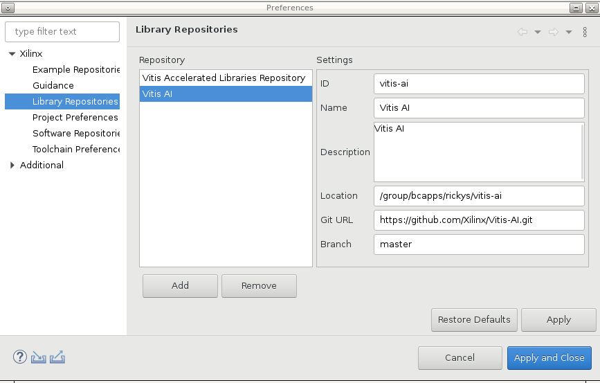
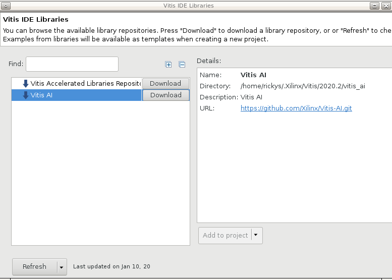

<!--
# Copyright 2020 Xilinx Inc.
#
# Licensed under the Apache License, Version 2.0 (the "License");
# you may not use this file except in compliance with the License.
# You may obtain a copy of the License at
#
#     http://www.apache.org/licenses/LICENSE-2.0
#
# Unless required by applicable law or agreed to in writing, software
# distributed under the License is distributed on an "AS IS" BASIS,
# WITHOUT WARRANTIES OR CONDITIONS OF ANY KIND, either express or implied.
# See the License for the specific language governing permissions and
# limitations under the License.
-->
<p align="right"><a href="../../../README.md">English</a> | <a>日本語</a></p>

- [手順 4: プラットフォームのテスト](#step-4-test-the-platform)
  - [テスト 1: プラットフォーム情報の読み込み](#test-1-read-platform-info)
  - [テスト 2: Vector Addition アプリケーション](#test-2-run-vector-addition-application)
  - [テスト 3: Vitis AI デモの実行](#test-3-run-a-vitis-ai-demo)
    - [デザインの作成](#create-the-design)
    - [ボード上でのアプリケーションの実行](#run-application-on-board)
  - [まとめ](#congratulations)

## 手順 4: プラットフォームのテスト

### テスト 1: プラットフォーム情報の読み込み

Vitis 環境設定では、**platforminfo** ツールで XPFM プラットフォーム情報をレポートできます。

<details>
<summary><strong>詳細なログ</strong></summary>

```bash
# in zcu104_custom_pkg directory
platforminfo ./zcu104_custom/export/zcu104_custom/zcu104_custom.xpfm
==========================
Basic Platform Information
==========================
Platform:           zcu104_custom_platform
File:               <your path to>/zcu104_custom_platform.xpfm
Description:        
A custom platform ZCU104 platform

=====================================
Hardware Platform (Shell) Information
=====================================
Vendor:                           xilinx
Board:                            zcu104_custom_platform
Name:                             zcu104_custom_platform
Version:                          0.0
Generated Version:                2020.2
Hardware:                         1
Software Emulation:               1
Hardware Emulation:               1
Hardware Emulation Platform:      0
FPGA Family:                      zynquplus
FPGA Device:                      xczu7ev
Board Vendor:                     xilinx.com
Board Name:                       xilinx.com:zcu104:1.1
Board Part:                       xczu7ev-ffvc1156-2-e

=================
Clock Information
=================
  Default Clock Index: 1
  Clock Index:         0
    Frequency:         100.000000
  Clock Index:         1
    Frequency:         200.000000
  Clock Index:         2
    Frequency:         400.000000


==================
Memory Information
==================
  Bus SP Tag: HP0
  Bus SP Tag: HP1
  Bus SP Tag: HP2
  Bus SP Tag: HP3
  Bus SP Tag: HPC0
  Bus SP Tag: HPC1

=============================
Software Platform Information
=============================
Number of Runtimes:            1
Default System Configuration:  zcu104_custom_platform
System Configurations:
  System Config Name:                      zcu104_custom_platform
  System Config Description:               zcu104_custom_platform
  System Config Default Processor Group:   xrt
  System Config Default Boot Image:        standard
  System Config Is QEMU Supported:         1
  System Config Processor Groups:
    Processor Group Name:      xrt
    Processor Group CPU Type:  cortex-a53
    Processor Group OS Name:   linux
  System Config Boot Images:
    Boot Image Name:           standard
    Boot Image Type:           
    Boot Image BIF:            zcu104_custom_platform/boot/linux.bif
    Boot Image Data:           zcu104_custom_platform/xrt/image
    Boot Image Boot Mode:      sd
    Boot Image RootFileSystem:
    Boot Image Mount Path:     /mnt
    Boot Image Read Me:        zcu104_custom_platform/boot/generic.readme
    Boot Image QEMU Args:      zcu104_custom_platform/qemu/pmu_args.txt:zcu104_custom_platform/qemu/qemu_args.txt
    Boot Image QEMU Boot:      
    Boot Image QEMU Dev Tree:  
Supported Runtimes:
  Runtime: OpenCL
```

</details>
クロック情報とメモリ情報が正しく設定されていることを確認できます。

### テスト 2: Vector Addition アプリケーション

ベクター加算は、最も単純なアクセラレーション PL カーネルです。Vitis では、このアプリケーションを自動的に作成できます。このテストを実行すると、プラットフォームの AXI 制御バス、メモリ インターフェイス、および割り込み設定が正しく機能しているかどうかを確認できます。

1. Vector Addition アプリケーションの作成

   - 以前使用していた Vitis ワークスペースを開きます。
   - **\[File] → \[New] → \[Application Project]** をクリックします。
   - **\[Next]** をクリック
   - プラットフォームとして **zcu104\_custom** を選択し、**\[Next]** をクリックします。
   - プロジェクトの名前を **vadd** に設定し、**\[Next]** をクリックします。
   - ドメインを **linux on psu\_cortexa53** に設定し、**\[Sysroot path]** を `<full_pathname_to_zcu104_custom_pkg>/pfm/sysroots/aarch64-xilinx-linux` **sdk.sh** を実行して作成) に設定します。**\[Root FS]** を rootfs.ext4 に、**\[Kernel Image]** を \[Image] に設定します。これらのファイルは、手順 2 で生成された `zcu104_custom_plnx/images` ディレクトリにあります。**\[Next]** をクリックします。
   - **\[System Optimization Examples] → \[Vector Addition]** をクリックし、**\[Finish]** をクリックしてアプリケーションを生成します。
   - \[Explorer] ビューで **vadd.prj** ファイルをダブルクリックして開き、**\[Active build configuration]** を **\[Emulation-SW]** から **\[Hardware]** に変更します。
   - \[Explorer] ビューで **vadd\_system** を選択し、ツールバーの **\[Build]** ボタンをクリックします。

   **注記**: 作成した **zcu104\_custom** プラットフォームが表示されない場合は、\[New Application Project] ウィザードで \[Add] ボタンをクリックしてプラットフォーム リストに追加し、**zcu104\_custom\_pkg/zcu104\_custom** ディレクトリを指定します。

   **注記:** このアプリケーションをエミュレーション モードでテストする場合は、手順 8 で **\[Active build configuration]** を **\[Emulation-SW]** から **\[Emulation-HW]** に変更します。

2. ボード上での Vector Addition アプリケーションの実行

   - Vitis がリモート サーバーで実行されている場合は、**zcu104\_custom\_pkg /vadd\_system/Hardware/package/sd\_card.img** をローカルにコピーします。
   - SD カード イメージライター アプリケーション (Windows では Etcher、Linux では dd など) を使用して **sd\_card.img** を SD カードに書き込みます。
   - SD ブート モードで ZCU104 ボードを SD カードを使用してブートします。
   - 自動マウントされた FAT32 パーティションに移動します

   ```bash
   cd /mnt/sd-mmcblk0p1
   ```

   - vadd アプリケーションを実行します

   ```bash
   ./vadd vadd.xclbin
   ```

   - プログラムの結果と XRT のデバッグ情報が表示されます。

   ```
   TEST PASSED
   ```

3. エミュレーション モードでのベクター加算アプリケーションのテスト (オプション)

   - QEMU を起動するには、Vitis メニューから **\[Xilinx]** → **\[Start/Stop Emulator]** をクリックします。プロジェクトは vadd で、コンフィギュレーションは \[Emulation - HW] です。\[Start] をクリックします。Linux が起動するまで待ちます。root/root でログインします。
   - **vadd** プロジェクト (vadd\_system システム プロジェクトではない) を右クリックし、**\[Run]** → **\[Launch on Emulator]** をクリックします。

   結果が \[Console] タブに表示されます。

   ```
   Loading: './binary_container_1.xclbin'
   TEST PASSED
   ```

### テスト 3: Vitis AI デモの実行

このテストでは、DPU-TRD で Vitis AI テスト アプリケーションを実行し、カスタム プラットフォームで DPU 機能を検証します。次の手順のほとんどは、[ Vitis-AI DPU-TRD](https://github.com/Xilinx/Vitis-AI/tree/master/dsa/DPU-TRD/prj/Vitis#6-gui-flow) に準拠しています。

#### デザインの作成

1. Vitis IDE に Vitis AI リポジトリを追加します。

   - Vitis IDE をまだ起動していない場合は、起動します。vadd アプリケーションのワークスペースは再利用できます。
   - \[Window] → \[Preferences] をクリックします。
   - \[Library Repository] タブをクリックします。
   - Vitis AI を追加します。
     - \[Add] ボタンをクリックします。
     - \[Input ID]: vitis-ai
     - \[Name]: Vitis AI
     - \[Location]: 空のままにするか、ダウンロードするディレクトリを指定します。
     - \[Git URL]: https://github.com/Xilinx/Vitis-AI.git
     - \[Branch]: v1.3

   

   注記: **\[Location]** が空の場合、Vitis IDE は git repo を `~/.Xilinx` ディレクトリにクローンします。この例では、ホーム ディレクトリにはサイズに制限があるので、容量の大きなディレクトリに設定します。

2. Vitis AI ライブラリをダウンロードします。

   - \[Xilinx] → \[Libraries] をクリックします。
   - 先ほど追加した Vitis-AI エントリを検索します。\[Download] ボタンをクリックします。
   - Vitis-AI リポジトリのダウンロードが完了するまで待ちます。
   - \[OK] をクリックしてこのウィンドウを閉じます。

   

   Vitis IDE は、各リポジトリのアップストリーム ステータスをチェックします。アップデートがある場合、ソース URL がリモート Git リポジトリであれば、ユーザーがそのアップデートをダウンロードできるようになります。

3. zcu104\_custom\_platform で Vitis-AI デザインを作成します。

   - **\[File]** -→ **\[New]** -→ **\[Application Project]** をクリックします。
   - \[Welcome] ページで **\[Next]** をクリックします。
   - **zcu104\_custom\_platform** プラットフォームを選択します。\[Next] をクリックします。
   - プロジェクトの名前を **dpu\_trd** に設定し、**\[Next]** をクリックします。
   - ドメインを **linux on psu\_cortexa53** に設定し、**\[Sysroot path]** を `<full_pathname_to_zcu104_custom_pkg>/pfm/sysroots/aarch64-xilinx-linux` **sdk.sh** を実行して作成) に設定します。**\[Root FS]** を rootfs.ext4 に、**\[Kernel Image]** を \[Image] に設定します。これらのファイルは、手順 2 で生成された `zcu104_custom_plnx/images` ディレクトリにあります。**\[Next]** をクリックします。
   - **\[dsa]** → **\[DPU Kernel (RTL Kernel)]** をクリックし、\[Finish] をクリックしてアプリケーションを生成します。 

4. ZCU104 の DPU 設定を確認してアップデートします。デフォルトで作成されるデザインには、ZCU102 の DPU 設定があります。

   - **dpu\_trd\_kernels/src/prj/Vitis** ディレクトリから **dpu\_conf.vh** を開きます。
   - 37 行目の `URAM_DISABLE` を `URAM_ENABLE` に変更します。
   - Ctrl + S キーを押して変更を保存します。

   **注記**: ZCU104 には ZU7EV デバイスが搭載されています。ZCU102 の ZU9EG よりも BRAM は少ないですが、URAM を含みます。URAM サポートをオンにすると、DPU によるオンチップ メモリ要件を満たすことができます。

5. system\_hw\_link をアップデートして、カーネルが適切にインスタンシエーションされるようにします。

   DPU カーネルには、1x クロックと 2x クロックの 2 つの位相の揃えられたクロックが必要です。コンフィギュレーションは **dpu\_trd/src/prj/Vitis/config\_file/prj\_config\_gui** に保存されます。DPU カーネルとプラットフォーム間のクロックおよび AXI インターフェイス接続が設定されます。このコンフィギュレーション ファイルは、タイミング クロージャに適したインプリメンテーション ストラテジも設定します。

   次は、これをプロジェクトで使用する方法です。

   - dpu\_trd\_system\_hw\_link.prj をダブルクリックします。
   - **\[Hardware Functions]** ウィンドウで dpu というバイナリ コンテナーを右クリックし、**\[Edit V++ Options]** をクリックします。
   - `--config ../../dpu_trd/src/prj/Vitis/config_file/prj_config_gui` と入力します。\[OK] をクリックします。

   ZCU104 は ZCU102 よりも LUT リソースが少ないため、ZCU102 のような PL に Softmax IP を含めると、タイミング クロージャの目標を満たすのが困難になり、インプリメンテーションにはかなり時間がかかります。Vitis-AI DPU-TRD デザインでは、ZCU104 のハードウェアの Softmax IP が削除されます。ホスト アプリケーションは、ハードウェアで Softmax IP を検出しない場合、ソフトウェアを使用してソフトマックスを計算します。結果は同じですが、計算時間は異なります。ここではプラットフォームの検証を目的としているので、テスト アプリケーションでソフトマックス カーネルを削除します。

   - **sfm\_xrt\_top** インスタンスを右クリックで **\[Remove]** をクリックして削除します。

6. ホスト コードのビルド オプションをアップデートします。

   - dpu\_trd\_system.sprj システム プロジェクト ファイルをダブルクリックします。
   - \[Active Build Configuration] を **\[Hardware]** に変更します。
   - dpu\_trd ホスト アプリケーションを右クリックし、\[C/C++ Build Settings] をクリックします。
   - **\[GCC Host Linker]** → **\[Libraries]** タブをクリックします。
   - **\[Library Search Path (-L)]** で + ボタンをクリックします。
   - ワークスペースをクリックし、**\[dpu\_trd/src/app/samples/lib]** を選択します。
   - \[OK] をクリックします。`${workspace_loc:/${ProjName}/src/app/samples/lib}` パスが生成されます。
   - \[OK] をクリックします。
   - 検索順序を調整して、追加されたパスが SYSROOT パスの上にあることを確認します。
   - \[Apply] をクリックして \[Close] をクリックします。

   注記: DPU デザイン テンプレートは、C++ 規格を c++17 に自動的に設定し、リンクするライブラリを追加します。ライブラリ検索パスは、ユーザーが手動で設定する必要があります。src/app/samples/lib のライブラリは、rootfs にインストールされている VART ライブラリと同じです。

7. パッケージ オプションをアップデートして、モデルを SD カードに追加します。

   - dpu\_trd\_system.sprj をダブルクリックします。
   - \[Package options] の \[...] ボタンをクリックします。
   - `--package.sd_dir=../../dpu_trd/src/app` と入力します。
   - \[OK] をクリックします。

   `--package.sd_dir` で割り当てられたディレクトリ内のすべての内容が sd\_card.img の FAT32 パーティションに追加されます。検証用にサンプルとモデルがパッケージにされます。

   パス名の dpu\_trd は、この例のアプリケーション プロジェクト名です。プロジェクト名が異なる場合は、プロジェクト名を適宜アップデートしてください。

8. ハードウェア デザインを構築します。

   - dpu\_trd\_system システム プロジェクトを選択します。
   - ハンマー ボタンをクリックして、システム プロジェクトをビルドします。
   - 生成された SD カード イメージは、 **dpu\_trd\_system/Hardware/package/sd\_card.img** にあります。

**注記**: Vitis-AI プロジェクト作成フローの詳細は、[Vitis-AI の資料](https://github.com/Xilinx/Vitis-AI/tree/master/dsa/DPU-TRD/prj/Vitis#6-gui-flow)を参照してください。

#### ボード上でのアプリケーションの実行

1. イメージを SD へ書き込みます。

   - sd\_card.img を、ローカルのワークステーションまたは SD カード リーダーを搭載したラップトップにコピーします。
   - この画像を [balena Etcher](https://www.balena.io/etcher/) または同様のツールを使用する SD カードに書き込みます。

2. ボードをブートします。

   - SD カードを ZCU104 に挿入します。
   - ブート モードを SD boot に設定します。
   - USB UART ケーブルを接続します。
   - ボードに電源を投入します。1 分で Linux が正しく起動するはずです。

3. ext4 パーティションのサイズを変更します。

   - UART コンソールが接続されていない場合は接続します。
   - ZCU104 ボードの UART コンソールで、`df .` を実行して現在使用可能なディスク サイズを確認します。

   ```bash
   root@petalinux:~# df .
   Filesystem           1K-blocks      Used Available Use% Mounted on
   /dev/root               564048    398340    122364  77% /
   ```

   - `resize-part /dev/mmcblk0p2` を実行して、ext4 パーティションのサイズを変更します。**Yes** と \*\*100% \*\* を入力して、残りの SD カードすべてを使用するようにサイズが変更されたことを確認します。

   ```bash
   root@petalinux:~# resize-part /dev/mmcblk0p2
   /dev/mmcblk0p2
   Warning: Partition /dev/mmcblk0p2 is being used. Are you sure you want to continue?
   parted: invalid token: 100%
   Yes/No? yes
   End?  [2147MB]? 100%
   Information: You may need to update /etc/fstab.

   resize2fs 1.45.3 (14-Jul-2019)
   Filesystem at /dev/mmcblk0p2 is mounted on /media/sd-mmcblk0p2; o[   72.751329] EXT4-fs (mmcblk0p2): resizing filesystem from 154804 to 1695488 blocks
   n-line resizing required
   old_desc_blocks = 1, new_desc_blocks = 1
   [   75.325525] EXT4-fs (mmcblk0p2): resized filesystem to 1695488
   The filesystem on /dev/mmcblk0p2 is now 1695488 (4k) blocks long.
   ```

   - 使用可能なサイズを再度チェックして、ext4 パーティション サイズが拡大されたことを確認します。

   ```bash
   root@petalinux:~# df . -h
   Filesystem                Size      Used Available Use% Mounted on
   /dev/root                 6.1G    390.8M      5.4G   7% /
   ```

   **注記**: 使用可能なサイズは、SD カードのサイズによって異なります。

   **注記**: **resize-part** は、[手順 2](./step2.md) で追加したスクリプトです。Linux ユーティリティの **parted** と **resize2fs** を呼び出して、ext4 パーティションを拡張して残りの SD カードが入るようにします。

4. 依存ファイルをホーム フォルダーにコピーします。

   ```bash
   # Libraries
   root@petalinux:~# cp -r /mnt/sd-mmcblk0p1/app/samples/ ~
   # Model
   root@petalinux:~# cp /mnt/sd-mmcblk0p1/app/model/resnet50.xmodel ~
   # Host app
   root@petalinux:~# cp /mnt/sd-mmcblk0p1/dpu_trd .
   # Image to test
   root@petalinux:~# wget https://github.com/Xilinx/Vitis-AI/raw/v1.1/DPU-TRD/app/img/bellpeppe-994958.JPEG
   ```

5. アプリケーションを実行します。

   ```bash
   env LD_LIBRARY_PATH=samples/lib XLNX_VART_FIRMWARE=/mnt/sd-mmcblk0p1/dpu.xclbin ./dpu_trd bellpeppe-994958.JPEG
   ```

   bell pepper の可能性が最も高いことが表示されます。

   ```bash
   score[945]  =  0.992235     text: bell pepper,
   score[941]  =  0.00315807   text: acorn squash,
   score[943]  =  0.00191546   text: cucumber, cuke,
   score[939]  =  0.000904801  text: zucchini, courgette,
   score[949]  =  0.00054879   text: strawberry,
   ```

<details>
<summary><strong>詳細な結果表示</strong></summary>

```bash
[  196.247066] [drm] Pid 948 opened device
[  196.250926] [drm] Pid 948 closed device
[  196.254833] [drm] Pid 948 opened device
[  196.258679] [drm] Pid 948 closed device
[  196.269515] [drm] Pid 948 opened device
[  196.273384] [drm] Pid 948 closed device
[  196.277243] [drm] Pid 948 opened device
[  196.281076] [drm] Pid 948 closed device
[  196.285073] [drm] Pid 948 opened device
[  196.288984] [drm] Pid 948 closed device
[  196.293230] [drm] Pid 948 opened device
[  196.297096] [drm] Pid 948 closed device
[  196.300963] [drm] Pid 948 opened device
[  196.307660] [drm] zocl_xclbin_read_axlf The XCLBIN already loaded
[  196.307672] [drm] zocl_xclbin_read_axlf 1cdede23-0755-458e-8dac-7ef1b3845fa4 ret: 0
[  196.317747] [drm] bitstream 1cdede23-0755-458e-8dac-7ef1b3845fa4 locked, ref=1
[  196.325431] [drm] Reconfiguration not supported
[  196.337206] [drm] bitstream 1cdede23-0755-458e-8dac-7ef1b3845fa4 unlocked, ref=0
[  196.337361] [drm] Pid 948 opened device
[  196.348581] [drm] Pid 948 closed device
[  196.352580] [drm] Pid 948 opened device
[  196.356638] [drm] bitstream 1cdede23-0755-458e-8dac-7ef1b3845fa4 locked, ref=1
[  196.356659] [drm] Pid 948 opened device
[  196.367712] [drm] Pid 948 closed device
[  196.371560] [drm] Pid 948 opened device
[  196.375507] [drm] bitstream 1cdede23-0755-458e-8dac-7ef1b3845fa4 locked, ref=2
[  196.375539] [drm] Pid 948 opened device
[  196.386590] [drm] Pid 948 closed device
[  196.390439] [drm] Pid 948 opened device
[  196.394331] [drm] bitstream 1cdede23-0755-458e-8dac-7ef1b3845fa4 locked, ref=3
[  196.394822] [drm] Pid 948 opened device
[  196.405867] [drm] Pid 948 closed device
[  196.409717] [drm] Pid 948 opened device
score[945]  =  0.992235     text: bell pepper,
score[941]  =  0.00315807   text: acorn squash,
score[943]  =  0.00191546   text:[  196.413579] [drm] bitstream 1cdede23-0755-458e-8dac-7ef1b3845fa4 locked, ref=4
cucumber, cuke,
score[939]  =  0.000904801  text: zucchini, co[  197.997865] [drm] bitstream 1cdede23-0755-458e-8dac-7ef1b3845fa4 unlocked, ref=3
urgette,
score[949]  =  0.00054879   text: strawberry,
[  198.010569] [drm] Pid 948 closed device
[  198.032534] [drm] bitstream 1cdede23-0755-458e-8dac-7ef1b3845fa4 unlocked, ref=2
[  198.032546] [drm] Pid 948 closed device
[  198.229797] [drm] bitstream 1cdede23-0755-458e-8dac-7ef1b3845fa4 unlocked, ref=0
[  198.229803] [drm] Pid 948 closed device
[  198.241056] [drm] bitstream 1cdede23-0755-458e-8dac-7ef1b3845fa4 unlocked, ref=0
[  198.241059] [drm] Pid 948 closed device
[  198.252434] [drm] Pid 948 closed device
```

アプリケーションを起動する前に `echo 6 > /proc/sys/kernel/printk` を実行すると、XRT で結果は表示されなくなります。

</details>

### まとめ

カスタム プラットフォームを最初から作成し、簡単な vadd アプリケーションと比較的複雑な Vitis-AI ユース ケースを使用して検証しました。

このリポジトリに含まれるほかのチュートリアルも参照してください。

<p align="center"><sup>Copyright&copy; 2020 Xilinx</sup></p>
<p align="center"><sup>この資料は 2021 年 2 月 8 日時点の表記バージョンの英語版を翻訳したもので、内容に相違が生じる場合には原文を優先します。資料によっては英語版の更新に対応していないものがあります。
日本語版は参考用としてご使用の上、最新情報につきましては、必ず最新英語版をご参照ください。</sup></p>
