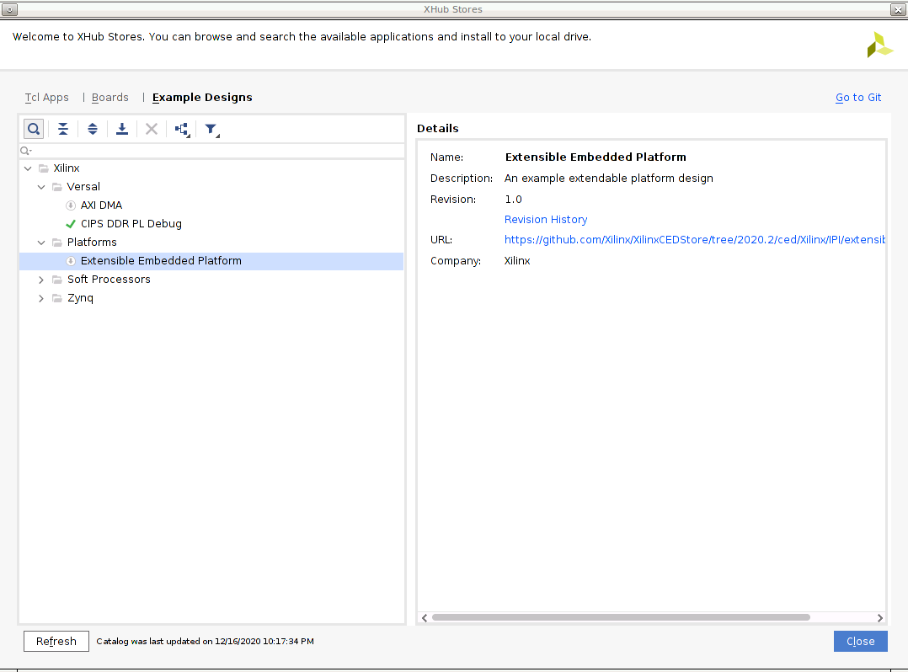
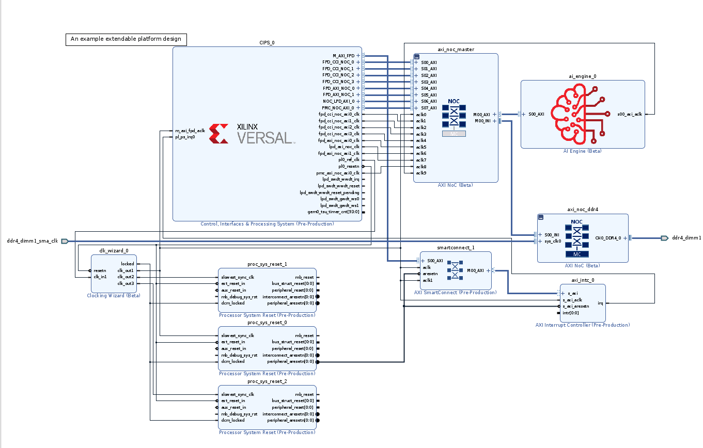

<!--
# Copyright 2020 Xilinx Inc.
#
# Licensed under the Apache License, Version 2.0 (the "License");
# you may not use this file except in compliance with the License.
# You may obtain a copy of the License at
#
#     http://www.apache.org/licenses/LICENSE-2.0
#
# Unless required by applicable law or agreed to in writing, software
# distributed under the License is distributed on an "AS IS" BASIS,
# WITHOUT WARRANTIES OR CONDITIONS OF ANY KIND, either express or implied.
# See the License for the specific language governing permissions and
# limitations under the License.
-->
<p align="right"><a href="../../../README.md">English</a> | <a>日本語</a></p>

<table width="100%">
 <tr width="100%">
    <td align="center"><h1>Versal カスタム プラットフォーム作成チュートリアル</h1>
    </td>
 </tr>
</table>

## 手順 0: VCK190 用のベースのブータブル デザインの作成

手順 0 では、プラットフォーム作成のベースラインの提供を目的とします。

Versal デザインの開始点には、さまざまな作成方法があります。このチュートリアルでは、Vivado プリセットを使用して CIPS ブロックと NOC ブロックをコンフィギュレーションします。PDI (プログラム デバイス イメージ) をテストし、Fixed XSA (拡張不可、エンベデッド ソフトウェア開発のみ) を生成し、これを使用して PetaLinux プロジェクトを作成してボードをブートします。

プリセット コンフィギュレーションがないカスタム ボードの場合に何を実行する必要があるかについても説明します。

これらの最初の立ち上げおよびテスト手順を実行すると、次のプラットフォーム作成手順でエラーが発生した場合に問題を簡単に特定できます。

### VCK190 ES1 設定: Versal ES デバイスのイネーブル

**注記**: VCK190 プロダクション ボードを使用している場合は、この手順を飛ばしてください。

`<Vivado_Installation_Path>/scripts/Vivado_init.tcl` および `<Vivado_Installation_Path>/scripts/hls_init.tcl` に次の行を追加します。

```
enable_beta_device xcvc*
```

### VCK190 ES1 設定: VCK190 ES1 ボード ファイルのダウンロード

**注記**: VCK190 プロダクション ボードを使用している場合は、この手順を飛ばしてください。

1. Vivado の起動

   - `source <Vitis_Install_Directory>/settings64.sh` を実行して、Vivado 実行環境を設定します。
   - コンソールに `vivado` と入力して Vivado を実行します。

2. VCK190 ES1 ボード ファイルをダウンロードします。

   - **\[Tools]** → **\[XHUB Store]** をクリックします。
   - **\[OK]** をクリックして同意します。
   - **\[Board]** タブをクリックします。
   - **\[Evaluation Boards]** を展開します。
   - **\[Versal VCK190 ES1 Evaluation Platform]** をクリックします。
   - **\[Install]** ボタンをクリックします。
   - **\[Close]** をクリックしてウィンドウを閉じます。

### Versal エクステンシブル エンベデッド プラットフォームのデザイン例

1. Vivado を起動していない場合は、起動します

   - `source <Vitis_Install_Directory>/settings64.sh` を実行して、Vivado 実行環境を設定します。
   - コンソールに `vivado` と入力して Vivado を実行します。

2. サンプル プロジェクトを作成します。

   - **\[File]** → **\[Project]** → **\[Open Example]** をクリックします。
   - \[Create an Example Project] ウィンドウで **\[Next]** をクリックします。
   - 右上の **\[Install/Update Example Designs]** ボタンをクリックします。
   - **\[OK]** をクリックして、ウェブからオープンソースのサンプルのダウンロードに同意します。
   - **\[Platform]** → **\[Extensible Embedded Platform]** をクリックし、ツールバーのダウンロード ボタンをクリックします。
   - インストールが終了したら **\[Close]** をクリックします。

   

   - \[Select Project Template] ウィンドウで **\[Extensible Embedded Platform]** をオンにします。
   - **\[Project Name]** および **\[Project location]** を入力します。**\[Create project subdirectory]** はオンのままにします。**\[Next]** をクリックします。
   - \[Default Part] ページでターゲット ボードを選択します。この例では、**\[Versal VCK190 ES1 Evaluation Platform]** を使用します。**\[Next]** をクリックします。
   - DDR4 に加えて LPDDR4 コンフィギュレーションをイネーブルにするかどうかを選択します。この例の場合は、このオプションをオフにして **\[Next]** をクリックします。
   - 新しいプロジェクト サマリを確認し、**\[Finish]** をクリックします。
   - しばらくすると、デザイン例が生成されたことがわかります。

   生成されたデザインでは AI エンジンがインスタンシエートされ、DDR4 コントローラーがイネーブルになり、CIPS に接続されます。また、1 つの割り込みコントローラー、3 つのクロック、および関連する同期リセット信号も提供されます。

   

**注記**: この段階で、Vivado ブロック オートメーションにより、CIPS (Control、Interface \& Processing System) ブロック、AXI NOC ブロック、AI エンジン、およびすべてのサポート ロジック ブロックを図に追加し、VCK190 のすべてのボード プリセットを適用しました。このデザインは既に検証済みなので、[手順 1: Vitis プラットフォームのハードウェア設定](step1.md)に進んで、プラットフォーム設定を確認または更新し、次の検証は飛ばします。

**カスタムボードの場合、プラットフォーム開発者は CIPS と NOC をコンフィギュレーションして、プロセッサおよび DDR を設定する必要があります。次の手順に進む前に、次のテストを実行してください。**

### カスタム ボードの注意点

カスタム ボード用にプラットフォームを設計する場合、次のパラメーターはユーザーが設定する必要があります。

Vivado プロジェクトで次を実行します。

- ボード タイプではなく、シリコン モデルに基づいてデザインを作成します。
- クロック入力パラメーターはハードウェア設定と同じになるようにします。
- PS ペリフェラル (UART、SD カード、QSPI など) を設定します。
- クロック、リセット、DDR などを含む XDC ファイルにピン配置を記述します。

PetaLinux デザインの場合は、次を実行します。

- 引き続きデフォルトの **MACHINE\_NAME** を使用します。
- イーサネットや EEPROM などのペリフェラルをイネーブルにするには、**system\_user.dtsi** にボード固有のデバイス ツリーを記述します。

### (オプション) PDI (デバイス イメージ) および XSA の生成

<details>
  <summary><b>詳細な手順を表示</b></summary>
1. ブロック デザインを検証します。

   - ブロック図のツールバーの **\[Validate Design (F6)]** ボタンをクリックします

2. HDL ラッパーを作成します。

   - \[Sources] タブで system.bd を右クリックし、**\[Create HDL Wrapper]** をクリックします。ポップアップ ウィンドウで、\[Let Vivado Manage] を選択します。

3. デバイス イメージを生成します。

   - Flow Navigator で **\[Generate Device Image]** をクリックします。

   - 「No Implementation Results Available」というメッセージが表示されたら **\[Yes]** をクリックします。

   

   - \[Launch Runs] ダイアログ ボックスのオプションはデフォルトのままで **\[OK]** をクリックします。

   ブロック図を生成し、インプリメンテーション全体を実行するには時間がかかります。

   PDI は `vck190_custom_platform.runs/impl_1/` に生成されます。

4. PetaLinux プロジェクト作成用に Fixed XSA をエクスポートします。

   a) **\[File] → \[Export] → \[Hardware]** をクリックし、\[Next] をクリックします。

   b) \[Output] を **\[Include Device Image]** にします。\[Next] をクリックします。

   c) 出力 XSA ファイル名とディレクトリを設定します。\[Next] をクリックします。

   \[Finish] をクリックします。

</details>

### (オプション) ハードウェアの PDI の検証

<details>
  <summary><b>詳細な手順を表示</b></summary>
1. XSCT でハードウェア サーバーを接続します。

   ```tcl
   # If JTAG cable is connected locally
   connect

   # If JTAG cable is connected on another server, launch hw_server on that server then connect to that remote hardware server
   connect -url TCP:<SERVER NAME or IP>:3121
   ```

2. XSCT で PDI をダウンロードします。

   ```tcl
   device program <PDI file>
   ```

   PDI プログラムはエラーなくダウンロードする必要があります。XSCT コンソールでエラーが発生した場合は、ブロック デザインの設定を確認してください。

   VCK190 ボードの UART コンソールに次の例のように表示されます。

<details>
  <summary><b>ログを表示</b></summary>

```
[8.716546]****************************************
[10.387178]Xilinx Versal Platform Loader and Manager
[15.181959]Release 2020.2   Nov 30 2020  -  07:20:11
[19.889662]Platform Version: v1.0 PMC: v1.0, PS: v1.0
[24.684093]BOOTMODE: 0, MULTIBOOT: 0x0
[28.172159]****************************************
[32.817343] 28.506881 ms for PrtnNum: 1, Size: 2224 Bytes
[37.939565]-------Loading Prtn No: 0x2
[41.975581] 0.531603 ms for PrtnNum: 2, Size: 48 Bytes
[46.307975]-------Loading Prtn No: 0x3
[153.848428] 104.031565 ms for PrtnNum: 3, Size: 57168 Bytes
[156.392071]-------Loading Prtn No: 0x4
[159.994956] 0.012506 ms for PrtnNum: 4, Size: 2512 Bytes
[165.110546]-------Loading Prtn No: 0x5
[168.715028] 0.014362 ms for PrtnNum: 5, Size: 3424 Bytes
[173.831756]-------Loading Prtn No: 0x6
[177.430206] 0.007693 ms for PrtnNum: 6, Size: 80 Bytes
[182.427400]+++++++Loading Image No: 0x2, Name: pl_cfi, Id: 0x18700000
[188.652918]-------Loading Prtn No: 0x7
[1564.072421] 1371.823162 ms for PrtnNum: 7, Size: 707472 Bytes
[1566.876806]-------Loading Prtn No: 0x8
[1956.351062] 385.792100 ms for PrtnNum: 8, Size: 365712 Bytes
[1959.102465]+++++++Loading Image No: 0x3, Name: fpd, Id: 0x0420C003
[1965.172668]-------Loading Prtn No: 0x9
[1969.287834] 0.436437 ms for PrtnNum: 9, Size: 992 Bytes
[1974.032078]***********Boot PDI Load: Done*************
[1979.057962]55080.597596 ms: ROM Time
[1982.528018]Total PLM Boot Time
```

</details>
PDI が正常にロードできない場合は、CIPS 設定を確認してください。

</details>

### (オプション) PetaLinux プロジェクトの作成

<details>
  <summary><b>詳細な手順を表示</b></summary>
カスタム デザインでは、独自の CIPS、NOC、および AI エンジンの接続とプロパティを設計した場合、このハードウェア デザインで Linux を問題なく起動できることを確認してから先に進むことをお勧めします。

この手順で簡単に確認するには、VCK190 のプリビルドのデバイス ツリーを使用します。イーサネット MAC の PHY アドレスなどのペリフェラル プロパティを設定しやすくなっています。これらの設定はボードによって異なります。カスタム ボードのボード立ち上げ段階中に BSP エンジニアが開発する必要があります。

1. XSA を使用して PetaLinux プロジェクトを作成します。

   ```bash
   petalinux-create -t project --template versal --force -n petalinux
   cd petalinux
   petalinux-config --get-hw-description=<path to xsa directory> --silentconfig
   ```

   - 作成される PetaLinux プロジェクト名は **petalinux** です。PetaLinux プロジェクト名は **petalinux-create -n** オプションで自由に変更できます。

2. VCK190 デバイス ツリーを適用します。

   - `petalinux-config` を実行します。
   - **\[DTG Settings]** をクリックします。
   - **MACHINE\_NAME** オプション (CONFIG\_SUBSYSTEM\_MACHINE\_NAME) に **versal-vck190-reva-x-ebm-02-reva** を入力します。

   **注記**: このプリセット デバイス設定により、デバイス ツリーにイーサネット PHY 情報が追加されます。[デバイス ツリーのソース コード][1]が PetaLinux プロジェクトに適用されます。

[1]: https://github.com/Xilinx/u-boot-xlnx/blob/master/arch/arm/dts/versal-vck190-revA-x-ebm-02-revA.dts ""
3. PetaLinux イメージのビルド

   ```bash
   petalinux-build
   petalinux-package --boot --u-boot
   ```

   **BOOT.BIN**、**boot.scr**、**image.ub** 出力ファイルは ***images/linux*** ディレクトリに含まれます。

</details>

### (オプション) ボードの PetaLinux イメージの検証

<details>
  <summary><b>詳細な手順を表示</b></summary>

1. **build/petalinux/images/linux** ディレクトリから **BOOT.BIN**、**image.ub**、および **boot.scr** を SD カード (fat32 パーティション) にコピーします。
2. SD カードを VCK190 に挿入し、ブート モードを SD boot (0001) に設定して、ボードを起動します。
3. Linux が正常に起動することを確認します。ユーザー名 root、パスワード root でログインします。

<details>
  <summary><b>ログを表示</b></summary>

  ``` root@petalinux:~# [391.115631]**************************************** [392.964450]Xilinx Versal Platform Loader and Manager [397.854212]Release 2020.2 Nov 30 2020 - 08:35:24 [402.657115]Platform Version: v1.0 PMC: v1.0, PS: v1.0 [407.546118]BOOTMODE: 14, MULTIBOOT: 0xF0000000 [411.825475]**************************************** [416.562993] 27.536159 ms for PrtnNum: 1, Size: 2224 Bytes [421.778446]-------Loading Prtn No: 0x2 [425.913643] 0.539328 ms for PrtnNum: 2, Size: 48 Bytes [430.334103]-------Loading Prtn No: 0x3 [460.345490] 26.411068 ms for PrtnNum: 3, Size: 55792 Bytes [462.806209]-------Loading Prtn No: 0x4 [469.349675] 2.942065 ms for PrtnNum: 4, Size: 6032 Bytes [471.634443]-------Loading Prtn No: 0x5 [475.247578] 0.018731 ms for PrtnNum: 5, Size: 80 Bytes PSM Firmware version: 2020.2 [Build: Nov 30 2020 08:35:39 ] [485.617643]+++++++Loading Image No: 0x2, Name: pl_cfi, Id: 0x18700000 [491.879575]-------Loading Prtn No: 0x6 [12215.749846] 11720.267596 ms for PrtnNum: 6, Size: 707472 Bytes [12218.734381]-------Loading Prtn No: 0x7 [12409.592215] 187.084284 ms for PrtnNum: 7, Size: 365712 Bytes [12412.438018]+++++++Loading Image No: 0x3, Name: fpd, Id: 0x0420C003 [12418.595431]-------Loading Prtn No: 0x8 [12425.245950] 2.878087 ms for PrtnNum: 8, Size: 992 Bytes [12427.832593]+++++++Loading Image No: 0x4, Name: apu_subsyste, Id: 0x1C000000 [12434.597334]-------Loading Prtn No: 0x9 [12451.208925] 12.838115 ms for PrtnNum: 9, Size: 24752 Bytes [12453.843937]-------Loading Prtn No: 0xA [12483.552243] 25.934581 ms for PrtnNum: 10, Size: 59360 Bytes [12486.274409]-------Loading Prtn No: 0xB [12875.033006] 384.984465 ms for PrtnNum: 11, Size: 883968 Bytes N[12877.994431]***** ** **Bont PDr Load:lDone***A****** ** [1i88a.177003]4t0.8 5415 ms: ROMOTime [12886.560593]cotal P M BootOTime BL31: Non secure code at 0x8000000 NOTICE: BL31: v2.2(debug):xilinx_rebase_v2.2_2020.1-10-ge6eea88b1 NOTICE: BL31: Built : 08:34:09, Nov 30 2020 INFO: GICv3 with legacy support detected. ARM GICv3 driver initialized in EL3 INFO: BL31: Initializing runtime services WARNING: BL31: cortex_a72: CPU workaround for 859971 was missing! INFO: BL31: cortex_a72: CPU workaround for cve_2017_5715 was applied INFO: BL31: cortex_a72: CPU workaround for cve_2018_3639 was applied INFO: BL31: Preparing for EL3 exit to normal world INFO: Entry point address = 0x8000000 INFO: SPSR = 0x3c9
U-Boot 2020.01 (Nov 30 2020 - 08:35:27 +0000)

Model: Xilinx Versal vck190 Eval board revA (EMMC) DRAM:  2 GiB EL Level:       EL2 MMC:   sdhci@f1040000: 1, sdhci@f1050000: 0 In:    serial@ff000000 Out:   serial@ff000000 Err:   serial@ff000000 Bootmode: LVL\_SHFT\_SD\_MODE1 Net: ZYNQ GEM: ff0c0000, mdio bus ff0c0000, phyaddr 1, interface rgmii-id

Warning: ethernet@ff0c0000 (eth0) using random MAC address - d6:20:82:36:90:32 eth0: ethernet@ff0c0000 ZYNQ GEM: ff0d0000, mdio bus ff0c0000, phyaddr 2, interface rgmii-id

Warning: ethernet@ff0d0000 (eth1) using random MAC address - 2a:64:10:c2:a6:be , eth1: ethernet@ff0d0000 Hit any key to stop autoboot:  0 switch to partitions #0, OK mmc0 is current device Scanning mmc 0:1... Found U-Boot script /boot.scr 2007 bytes read in 17 ms (115.2 KiB/s)

## Executing script at 20000000

17065984 bytes read in 1372 ms (11.9 MiB/s)

## Loading kernel from FIT Image at 10000000 ...

Using 'conf@system-top.dtb' configuration Trying 'kernel@1' kernel subimage Description:  Linux kernel Type:         Kernel Image Compression:  gzip compressed Data Start:   0x100000f8 Data Size:    8341982 Bytes = 8 MiB Architecture: AArch64 OS:           Linux Load Address: 0x00080000 Entry Point:  0x00080000 Hash algo:    sha256 Hash value:   2f80978de5abed593d2caad4b8322d21400424d2510173d49fa04f0d78e8b83f Verifying Hash Integrity ... sha256+ OK

## Loading ramdisk from FIT Image at 10000000 ...

Using 'conf@system-top.dtb' configuration Trying 'ramdisk@1' ramdisk subimage Description:  petalinux-image-minimal Type:         RAMDisk Image Compression:  uncompressed Data Start:   0x107fad60 Data Size:    8697128 Bytes = 8.3 MiB Architecture: AArch64 OS:           Linux Load Address: unavailable Entry Point:  unavailable Hash algo:    sha256 Hash value:   89c3603e8057b56af941cb225c0859d3e57fe2d6e04f0856a4dce74c41855e2e Verifying Hash Integrity ... sha256+ OK

## Loading fdt from FIT Image at 10000000 ...

Using 'conf@system-top.dtb' configuration Trying 'fdt@system-top.dtb' fdt subimage Description:  Flattened Device Tree blob Type:         Flat Device Tree Compression:  uncompressed Data Start:   0x107f4be8 Data Size:    24741 Bytes = 24.2 KiB Architecture: AArch64 Hash algo:    sha256 Hash value:   e3695fb8926b53c44738ceb4be473cef2bd53d6aaa49fd9c695af71d5ca3a80a Verifying Hash Integrity ... sha256+ OK Booting using the fdt blob at 0x107f4be8 Uncompressing Kernel Image Loading Ramdisk to 787b4000, end 78fff528 ... OK Loading Device Tree to 000000000fff6000, end 000000000ffff0a4 ... OK

Starting kernel ...

(skipping very long Linux boot log)

\[    6.149369] Run /init as init process INIT: version 2.88 booting Starting udev \[    6.229790] udevd\[264]: starting version 3.2.8 \[    6.234535] random: udevd: uninitialized urandom read (16 bytes read) \[    6.241009] random: udevd: uninitialized urandom read (16 bytes read) \[    6.247486] random: udevd: uninitialized urandom read (16 bytes read) \[    6.257326] udevd\[265]: starting eudev-3.2.8 \[    6.615105] random: fast init done \[    6.655502] EXT4-fs (mmcblk1p2): recovery complete \[    6.659634] FAT-fs (mmcblk1p1): Volume was not properly unmounted. Some data may be corrupt. Please run fsck. \[    6.660306] EXT4-fs (mmcblk1p2): mounted filesystem with ordered data mode. Opts: (null) Configuring packages on first boot.... (This may take several minutes. Please do not power off the machine.) Running postinst /etc/rpm-postinsts/100-sysvinit-inittab... update-rc.d: /etc/init.d/run-postinsts exists during rc.d purge (continuing) INIT: Entering runlevel: 5 Configuring network interfaces... \[    6.965895] pps pps0: new PPS source ptp0 \[    6.969920] macb ff0c0000.ethernet: gem-ptp-timer ptp clock registered. udhcpc: started, v1.31.0 udhcpc: sending discover udhcpc: sending discover udhcpc: sending discover udhcpc: no lease, forking to background done. Starting haveged: haveged: listening socket at 3 haveged: haveged starting up

Starting Dropbear SSH server: Generating 2048 bit rsa key, this may take a while... haveged: haveged: ver: 1.9.5; arch: generic; vend: ; build: (gcc 9.2.0 CTV); collect: 128K

haveged: haveged: cpu: (VC); data: 16K (D); inst: 16K (D); idx: 11/40; sz: 15456/64452

haveged: haveged: tot tests(BA8): A:1/1 B:1/1 continuous tests(B):  last entropy estimate 7.9996

haveged: haveged: fills: 0, ge\[   16.670222] random: crng init done nerated: 0

\[   16.675530] random: 7 urandom warning(s) missed due to ratelimiting Public key portion is: ssh-rsa AAAAB3NzaC1yc2EAAAADAQABAAABAQClK2Vcoh4YaCLp+s+owIWrtsm5rSzDMAd28vfmHU6grRmr+MQDpbZGelx8FW+7eOffSAbbfiVjrLNuiIP77neX3bfKir8Am6c4YTQCLUc06Mgao52pL0w2Vu+oa/DikBfR9iDkYBpQeO66eEnS3VXH8FwParDcwG475juQ06WO0PgbQh2PghNkW13yJF8vfk/hS9ZXn0MNbn96x+MVe6b70HZFmOllriJeEQj3eVgKKBaZZAYwEW24ynpCM0bWnFSzyohc3ZYTqRnOqXe9bie/Pr18vZs7kqkVUSKhuxstAGG/oRJAM46ODQNwLT8HzMSGnmXsN3pnW8XwFlMNMHHp root@petalinux Fingerprint: sha1!! 14:87:a7:46:70:bf:0e:a7:cb:75:fd:80:b9:79:e4:ce:7a:1b:25:f7 dropbear. Starting internet superserver: inetd. Starting syslogd/klogd: done Starting tcf-agent: OK

PetaLinux 2020.2 petalinux /dev/ttyAMA0

petalinux login:

```
</details>

</details>

### ファースト トラック

プロジェクトを作成して各手順の出力を生成するスクリプトがあります。これらのスクリプトを使用するには、次の手順を実行します。

1. ビルドを実行します。

   ```bash
   # cd to the step directory, e.g.
   cd step0_bootable_design
   make all
   ```

2. 次を実行して生成されたファイルをクリーンアップします。

   ```bash
   make clean
   ```

このスクリプトは、VCK190 ES1 ボードのサポートと Versal Extensible Design の例をローカル リポジトリにダウンロードし、デザイン例を作成し、ブロック図を生成して XSA をエクスポートします。

最上位のオールインワン ビルド スクリプトも提供されています。1 つのコマンドですべてをビルド (手順 0 から手順 3) するには、**ref\_files** ディレクトリに移動して実行します。

```bash
make all
```

生成されたファイルすべてを一掃するには、次を実行します。

```bash
make clean
```

**これで、ベースとなるブータブル デザインができました。次に、[手順 1](./step1.md) に進み、ハードウェア プラットフォーム要件に合わせて Vivado デザインをアップデートします。**

## 参考資料

https://github.com/Xilinx/XilinxBoardStore/wiki/Accessing-the-Board-Store-Repository

<p align="center"><sup>Copyright&copy; 2020 Xilinx</sup></p>
<p align="center"><sup>この資料は 2021 年 2 月 8 日時点の表記バージョンの英語版を翻訳したもので、内容に相違が生じる場合には原文を優先します。資料によっては英語版の更新に対応していないものがあります。
日本語版は参考用としてご使用の上、最新情報につきましては、必ず最新英語版をご参照ください。</sup></p>
