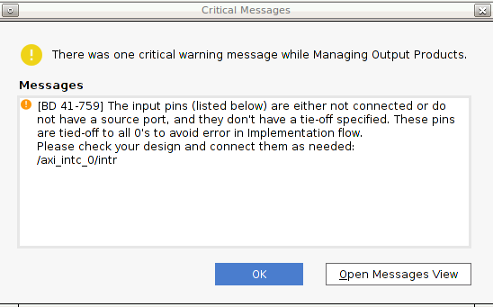

<!--
# Copyright 2020 Xilinx Inc.
#
# Licensed under the Apache License, Version 2.0 (the "License");
# you may not use this file except in compliance with the License.
# You may obtain a copy of the License at
#
#     http://www.apache.org/licenses/LICENSE-2.0
#
# Unless required by applicable law or agreed to in writing, software
# distributed under the License is distributed on an "AS IS" BASIS,
# WITHOUT WARRANTIES OR CONDITIONS OF ANY KIND, either express or implied.
# See the License for the specific language governing permissions and
# limitations under the License.
-->
<p align="right"><a href="../../../README.md">English</a> | <a>日本語</a></p>
<table width="100%">
 <tr width="100%">
    <td align="center"><h1>Versal カスタム プラットフォーム作成チュートリアル</h1>
    </td>
 </tr>
</table>

## 手順 1: Vitis プラットフォームのハードウェア設定

Versal エクステンシブル プラットフォームの例では、プラットフォームのプロパティを設定しています。この手順では、これらのプロパティを確認します。

カスタム ボード プラットフォームの場合は、これらのプロパティを手動で設定する必要があります。GUI または Tcl で設定できます。設定フローについては詳しく説明します。

### Versal エクステンシブル プラットフォーム例のプラットフォーム設定

1. Vivado を起動して、手順 0 で作成したデザインを開いていない場合は開きます。

   - ブロック デザインが開いていることを確認します。開いていない場合、**Flow Navigator** で **\[Open Block Design]** をクリックします。

2. Tcl コマンドをクロスチェックするブロック図 Tcl をエクスポートします。

   - **\[File]** → **\[Export]** → **\[Export Block Diagram]** をクリックします。
   - Tcl ファイルのディレクトリを確認し、**\[OK]** をクリックします。
   - エクスポートした Tcl ファイルを開きます。

3. \[Platform Setup] タブをクリックします。

   - このタブが開いていない場合は、\[Window] → \[Platform Setup] クリックして開きます。

4. AXI ポート設定を確認します。

   - axi\_noc\_ddr4 で S01\_AXI から S27\_AXI がイネーブルになっているはずです。**\[SP Tag\[** は **\[DDR]** に設定されています。

   ![[Vivado Platform Setup]: axi\_noc\_ddr4 AXI Slave](images/step1/vivado_platform_setup.png)

   次は Tcl でこれに該当する設定です。

   ```tcl
   set_property PFM.AXI_PORT {S00_AXI {memport "S_AXI_NOC" sptag "DDR"} S01_AXI {memport "S_AXI_NOC" sptag "DDR"} S02_AXI {memport "S_AXI_NOC" sptag "DDR"} S03_AXI {memport "S_AXI_NOC" sptag "DDR"} S04_AXI {memport "S_AXI_NOC" sptag "DDR"} S05_AXI {memport "S_AXI_NOC" sptag "DDR"} S06_AXI {memport "S_AXI_NOC" sptag "DDR"} S07_AXI {memport "S_AXI_NOC" sptag "DDR"} S08_AXI {memport "S_AXI_NOC" sptag "DDR"} S09_AXI {memport "S_AXI_NOC" sptag "DDR"} S10_AXI {memport "S_AXI_NOC" sptag "DDR"} S11_AXI {memport "S_AXI_NOC" sptag "DDR"} S12_AXI {memport "S_AXI_NOC" sptag "DDR"} S13_AXI {memport "S_AXI_NOC" sptag "DDR"} S14_AXI {memport "S_AXI_NOC" sptag "DDR"} S15_AXI {memport "S_AXI_NOC" sptag "DDR"} S16_AXI {memport "S_AXI_NOC" sptag "DDR"} S17_AXI {memport "S_AXI_NOC" sptag "DDR"} S18_AXI {memport "S_AXI_NOC" sptag "DDR"} S19_AXI {memport "S_AXI_NOC" sptag "DDR"} S20_AXI {memport "S_AXI_NOC" sptag "DDR"} S21_AXI {memport "S_AXI_NOC" sptag "DDR"} S22_AXI {memport "S_AXI_NOC" sptag "DDR"} S23_AXI {memport "S_AXI_NOC" sptag "DDR"} S24_AXI {memport "S_AXI_NOC" sptag "DDR"} S25_AXI {memport "S_AXI_NOC" sptag "DDR"} S26_AXI {memport "S_AXI_NOC" sptag "DDR"} S27_AXI {memport "S_AXI_NOC" sptag "DDR"}} [get_bd_cells /axi_noc_ddr4]
   ```

   **注記**: Vitis エミュレーション自動スクリプトを実行するには、Versal プラットフォーム上の AXI スレーブ インターフェイスに、**DDR** または **LPDDR** のいずれかが SP タグに設定されている必要があります。

   **注記**: memport プロパティの **S\_AXI\_NOC** が **MIG** として表示されるのは GUI 表示の問題です。さらに多くの AXI スレーブ ポートをイネーブルにするには、S\_AXI\_NOC を使用してください。

   - smartconnect\_1 で M01\_AXI から M15\_AXI がイネーブルになっているはずです。memport は M\_AXI\_GP に設定されています。\[SP Tag] は空です。これらのポートは、PL カーネルの制御に使用されます。

   ![[Vivado Platform Setup]: AXI Master](images/step1/vivado_platform_setup_axi_master.png)

   次は Tcl でこれに該当する設定です。

   ```tcl
   set_property PFM.AXI_PORT {M01_AXI {memport "M_AXI_GP" sptag "" memory ""} M02_AXI {memport "M_AXI_GP" sptag "" memory ""} M03_AXI {memport "M_AXI_GP" sptag "" memory ""} M04_AXI {memport "M_AXI_GP" sptag "" memory ""} M05_AXI {memport "M_AXI_GP" sptag "" memory ""} M06_AXI {memport "M_AXI_GP" sptag "" memory ""} M07_AXI {memport "M_AXI_GP" sptag "" memory ""} M08_AXI {memport "M_AXI_GP" sptag "" memory ""} M09_AXI {memport "M_AXI_GP" sptag "" memory ""} M10_AXI {memport "M_AXI_GP" sptag "" memory ""} M11_AXI {memport "M_AXI_GP" sptag "" memory ""} M12_AXI {memport "M_AXI_GP" sptag "" memory ""} M13_AXI {memport "M_AXI_GP" sptag "" memory ""} M14_AXI {memport "M_AXI_GP" sptag "" memory ""} M15_AXI {memport "M_AXI_GP" sptag "" memory ""}} [get_bd_cells /smartconnect_1]
   ```

   **注記**: AXI マスターの \[SP Tag] は何の効果もありません。

5. クロック設定を確認します。

   - \[Clock] タブで clk\_wizard\_0 から tab, clk\_out1、clk\_out2、clk\_out3 を id {1,0,2}、frequency {99.999MHz, 149.999MHz, 299.999MHz} を使用してイネーブルにします。
   - clk\_out2 がデフォルトのクロックです。リンク設定でクロックが指定されていない場合、V++ リンカーはこのクロックを使用してカーネルを接続します。
   - \[Proc Sys Reset] プロパティは、このクロックに割り当てられた同期リセット信号に設定されます。

   ![[Vivado Platform Setup]: Clock](./images/step1/vivado_platform_setup_clock.png)

   次は Tcl でこれに該当する設定です。

   ```tcl
   set_property PFM.CLOCK {clk_out1 {id "1" is_default "false" proc_sys_reset "proc_sys_reset_0" status "fixed"} clk_out2 {id "0" is_default "true" proc_sys_reset "/proc_sys_reset_1" status "fixed"} clk_out3 {id "2" is_default "false" proc_sys_reset "/proc_sys_reset_2" status "fixed"}} [get_bd_cells /clk_wizard_0]
   ```

6. \[Interrupt] タブを確認します。

   - \[Interrupt] タブでは、axi\_intc\_0 の intr ポートがオンです。

   ![[Vivado Platform Setup]: Interrupt](./images/step1/vivado_platform_setup_irq.png)

   次は Tcl でこれに該当する設定です。

   ```tcl
   set_property PFM.IRQ {intr {id 0 range 32}} [get_bd_cells /axi_intc_0]
   ```

### シミュレーション モデルの確認

Versal エクステンシブル プラットフォームの例では、各 IP の類似モデルが適切に設定されています。このセッションでは、その設定を確認します。ブロック デザインをご自身で作成した場合は、プラットフォームでエミュレーションを実行する前に、これらの設定が適用されていることを確認してください。

ブロック デザインのブロックの中には、複数タイプのシミュレーション モデルを含むものもあります。Vitis エミュレーションでは、SystemC TLM (トランザクション レベルのモデリング) モデルが使用可能な場合、これらのブロックを使用する必要があります。TLM は、Vivado 2020.2 の CIPS、NOC、および AI エンジンのデフォルトのシミュレーション モデルです。ハードウェアをエクスポートする前に、これらが正しいかどうかを確認してください。

1. CIPS シミュレーション モデルの設定を確認します。

   - Vivado GUI で、CIPS インスタンスを選択します。
   - **\[Block Properties]** ウィンドウを確認します。
   - **\[Properties]** タブには、**ALLOWED\_SIM\_MODELS** が `tlm,rtl`、**SELECTED\_SIM\_MODEL** が `tlm` と表示されます。つまり、このブロックでは 2 つのタイプのシミュレーション モデルがサポートされます。このチュートリアルでは、`tlm` モデルを使用するように選択しました。

   

2. ブロック図で NOC および AI エンジンのシミュレーション モデル プロパティを確認します。

### ハードウェア XSA のエクスポート

1. ブロック図を生成します。

   - Flow Navigator で **\[Generate Block Diagram]** をクリックします。

   

   - **\[Synthesis Options]** を **\[Global]** にして、生成時間を短縮します。

   

   - **\[Generate]** ボタンをクリックします。

   **注記**: 合成のデフォルト オプションの **\[Out of context per IP]** を使用すると、ブロック図の各 IP が合成されます。合成前の XSA は次の手順で使用するので、これらの IP を合成する必要はありません。

   **注記**: このクリティカル警告は無視しても問題ありません。今後、この信号は Vitis で接続されるようになる予定です。

   

2. 次のスクリプトを使用してプラットフォームをエクスポートします。

   - **\[File]** → **\[Export]** → **\[Export Platform]** をクリックします。これには、**Flow Navigator** で **\[IP Integrator]** → **\[Export Platform]**、または **\[Platform Setup]** タブの下部にある **\[Export Platform]** ボタンを使用することもできます。
   - \[Export Hardware Platform] ページで \[Next] をクリックします。
   - Vivado デザインにはシミュレーション不可能な IP がないので、**\[Hardware and Hardware Emulation]** を選択します。\[Next] をクリックします。
   - DFX プラットフォームを作成するわけではないので、**\[Pre-synthesis]** を選択します。\[Next] をクリックします。
   - \[Input Name] に **VCK190\_Custom\_Platform** と入力して \[Next] をクリックします。
   - ファイル名を **vck190\_custom** にアップデートし、\[Next] をクリックします。
   - サマリを確認します。\[Finish] をクリックします。

   エクスポートは、次のコマンドでも実行できます。

   ```tcl
   # Setting platform properties
   set_property pfm_name {xilinx:vck190_es:VCK190_Custom_Platform:0.0} [get_files -norecurse *.bd]
   # Platform properties are set by Platform Setup GUI. If you haven't used Platform Setup GUI, please setup these properties manually.
   set_property platform.default_output_type "sd_card" [current_project]
   set_property platform.design_intent.embedded "true" [current_project]
   set_property platform.design_intent.server_managed "false" [current_project]
   set_property platform.design_intent.external_host "false" [current_project]
   set_property platform.design_intent.datacenter "false" [current_project]
   # Export Expandable XSA with PDI
   write_hw_platform -force ./vck190_custom.xsa
   ```

**ハードウェア プラットフォームの作成フローが終了しました。[手順 2: ソフトウェア プラットフォームの作成](./step2.md)に進みます。**

## 参考資料

[AR#72033: Vivado 環境にボードやデザイン例を追加する方法](https://japan.xilinx.com/support/answers/72033.html)

<p align="center"><sup>Copyright&copy; 2020 Xilinx</sup></p>
<p align="center"><sup>この資料は 2021 年 2 月 8 日時点の表記バージョンの英語版を翻訳したもので、内容に相違が生じる場合には原文を優先します。資料によっては英語版の更新に対応していないものがあります。
日本語版は参考用としてご使用の上、最新情報につきましては、必ず最新英語版をご参照ください。</sup></p>
