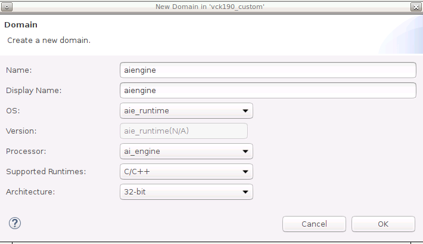
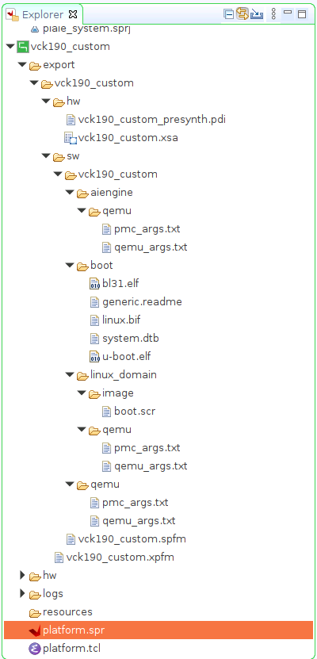

<!--
# Copyright 2020 Xilinx Inc.
#
# Licensed under the Apache License, Version 2.0 (the "License");
# you may not use this file except in compliance with the License.
# You may obtain a copy of the License at
#
#     http://www.apache.org/licenses/LICENSE-2.0
#
# Unless required by applicable law or agreed to in writing, software
# distributed under the License is distributed on an "AS IS" BASIS,
# WITHOUT WARRANTIES OR CONDITIONS OF ANY KIND, either express or implied.
# See the License for the specific language governing permissions and
# limitations under the License.
-->
<p align="right"><a href="../../../README.md">English</a> | <a>日本語</a></p>
<table width="100%">
 <tr width="100%">
    <td align="center"><h1>Versal カスタム プラットフォーム作成チュートリアル</h1>
    </td>
 </tr>
</table>

## 手順 3: Vitis プラットフォームの作成

Vitis プラットフォームは、Vitis GUI または XSCT コマンド ラインを使用して作成できます。このチュートリアルでは、GUI フローに焦点を当てます。

### プラットフォーム パッケージの準備

Vitis プラットフォームの作成フローに必要なすべてのファイルを 1 つのディレクトリに保存します。

| コンポーネント| 従来のパスまたはファイル名| 内容
|----------|----------|----------
| BIF ファイル| boot/linux.bif| ブート イメージ生成記述ファイル
| BOOT.BIN 内のブートコンポーネント| boot/bl31.elf</br>boot/u-boot.elf</br>boot/system.dtb| linux.bif で参照されるすべてのコンポーネントは、このフォルダーに含まれます。
| FAT32 パーティションのブート コンポーネント| image/boot.scr| U-Boot コンフィギュレーション ファイル

Vitis アプリケーションをビルドする際には、Linux カーネル イメージ、ルート ファイル システム、sysroot などのソフトウェア コンポーネントも必要です。では、こららをすべて準備します。

Vitis プラットフォームの作成フローに必要なすべてのファイルを保存します。このディレクトリを **step3\_pfm** ディレクトリと呼びます。サンプル ファイルは、このリポジトリの **ref\_files/step3\_pfm** ディレクトリにあります。

1. 次の内容を含む BIF ファイル (linux.bif) を **step3\_pfm/boot** ディレクトリに追加します。ファイル名は、ブート ディレクトリの内容と同じにする必要があります。

   ```
   /* linux */
   the_ROM_image:
   {
   { load=0x1000, file=<system.dtb> }
   { load=0x8000000, file=<u-boot.elf> }
   { core=a72-0, exception_level=el-3, trustzone, file=<bl31.elf> }
   }
   ```

2. **linux.bif** で参照されるすべてのファイルが同じディレクトリに保存されていることを確認します。これらは PetaLinux によって生成され、もともと **\<your\_petalinux\_dir>/images/linux** ディレクトリにあります。理解しやすいように、これらのファイルを **step3\_Pfm/boot** にコピーしておきます。ここでは、これらのファイルを **\<your\_petalinux\_dir>/images/linux** ディレクトリに保存しています。これは、PetaLinux 設定をアップデートして PetaLinux をビルドし直す必要がある場合は、プラットフォームをクリーンにして Vitis でビルドし直し、新しいプラットフォームを生成する必要があるからです。毎回手動でコピーする必要はありません。これらのファイルは、アプリケーションをパッケージする際に最終的な BOOT.BIN を作成するためのソースです。プラットフォームを作成すると、これらのファイルはプラットフォーム出力ディレクトリにコピーされます。この例の場合、これらのファイルは BIF ファイルで参照されます。

   - bl31.elf
   - u-boot.elf
   - system.dtb

3. **step3\_pfm/image** ディレクトリを準備します。このディレクトリの内容は、v++ パッケージ ツールにより、SD カード イメージの FAT32 パーティションにパッケージされます。

   - **\<your\_petalinux\_dir>/images/linux** ディレクトリの **boot.scr** を **step3\_pfm/image** ディレクトリにコピーします。これは、U-Boot を初期化するスクリプトです。U-Boot は、ブート プロセス中に fat32 パーティションから読み出されます。

4. アプリケーション作成用のソフトウェア コンポーネントを準備します。プラットフォーム パッケージでは、これらを追加したり除外したりできます。これらのコンポーネントは、ソフトウェア コンポーネントのサイズにより通常はプラットフォーム外に保持されるので、同じアーキテクチャを持つ複数のプラットフォーム間で再利用できます。

   ```bash
   # Create sw_comp directory
   cd step3_pfm
   mkdir sw_comp
   cd sw_comp
   # Copy Linux kernel image
   cp <your_petalinux_dir>/images/linux/Image .
   # Copy EXT4 Root Filesystem
   cp <your_petalinux_dir>/images/linux/rootfs.ext4 .
   # Install sysroot to this directory
   <your_petalinux_dir>/images/linux/sdk.sh -d ./ -y
   ```

### プラットフォーム パッケージ

まず、Vivado で生成された **XSA ファイル**を使用して、**Vitis プラットフォーム プロジェクト**を作成します。

1. Vitis を起動します。

   ```bash
   source <Vitis_Install_Directory>/settings64.sh
   cd pfm
   vitis -workspace ./platform_repo &
   ```

2. プラットフォーム プロジェクトを作成します。

   - Vitis IDE で **\[File]** → **\[New]** → **\[Platform Project]** をクリックして、プラットフォーム プロジェクトを作成します。
   - プロジェクト名を入力します。この例では、`vck190_custom` と入力して **\[Next]** をクリックします。
   - \[Platform] ページで **\[Browse]** ボタンをクリックし、Vivado で生成された XSA ファイルを選択します。この場合、`vivado/vck190_custom.xsa` にあります。\[Next] をクリックします。
   - オペレーティング システムに **\[linux]** を設定します。
   - プロセッサに **\[psv\_cortexa72]** を設定します。
   - **\[Finish]** をクリックします。

   

3. \[Platform Settings] ビューで Linux ドメイン設定を指定します。

   - **\[linux on psv\_cortexa72]** ドメインをクリックします。
   - **\[Bif file]**: **\[step3\_pfm/boot/linux.bif]** ファイルを選択して \[OK] をクリックします。
   - **\[Boot Components Directory]**: **step3\_pfm/boot/** を選択し、\[OK] をクリックします。
   - **\[Linux Image Directory]**: **step3\_pfm/image** を選択し、\[OK] をクリックします。

   **注記**: **\[Linux Rootfs]** と **\[Sysroot Directory]** はオプションです。これらは、プラットフォームまたはアプリケーションのいずれかで提供できます。このチュートリアルでは、アプリケーション作成段階で追加します。これにより、複数のプラットフォーム間での再利用が容易になります。

4. (オプション) Linux ドメイン エミュレーションを設定します。

   - \[QEMU Arguments] および \[PMC QEMU Arguments] 設定が、 Vitis インストールディレクトリ内のファイルに設定されていることを確認します。これらのデフォルト設定はそのまま使用できます。引数をアップデートする必要がある場合は、引数をローカルにコピーし、その新しいパスを Linux ドメイン コンフィギュレーションで設定できます。
   - \[QEMU Data] を **step3\_pfm/boot** ディレクトリに変更します。

5. AI エンジン ドメインを追加します。

   - \[Add domain] アイコンをクリックします。

   

   - \[Name] を aiengine に設定します。
   - OS を **aie\_runtime** に変更します。
   - ほかの設定をデフォルトのままにして、**\[OK]** をクリックします。

   

   **注記**: Vitis IDE と XSCT は AI エンジン ドメイン用の QEMU 引数を自動的に追加します。

6. Vivado の \[Explorer] ビューで **vck190\_custom** プロジェクトを選択し、**\[Build]** ボタンをクリックしてプラットフォームを生成します。


**注記**: 生成されたプラットフォームがエクスポート ディレクトリに保存されます。FSBL および PMU を再構築するのに必要な場合は、BSP およびソース ファイルも提供され、プラットフォームと関連付けられます。プラットフォームがアプリケーション開発に使用できるようになりました。



### スクリプトを使用した実行

Vitis プラットフォームをパッケージするスクリプトが提供されています。

これらのスクリプトを使用するには、次の手順を実行します。

1. ビルドを実行します。

   ```
   # cd to the step directory, e.g.
   cd step3_pfm
   make
   ```

2. 生成されたファイルをクリーンアップするには、次を実行します。

   ```bash
   make clean
   ```

**次に、[手順 4 に進んで、このプラットフォーム上でいくつかのアプリケーションをビルドし、テスト](./step4.md)します。**

<p align="center"><sup>Copyright&copy; 2020 Xilinx</sup></p>
<p align="center"><sup>この資料は 2021 年 2 月 8 日時点の表記バージョンの英語版を翻訳したもので、内容に相違が生じる場合には原文を優先します。資料によっては英語版の更新に対応していないものがあります。
日本語版は参考用としてご使用の上、最新情報につきましては、必ず最新英語版をご参照ください。</sup></p>
